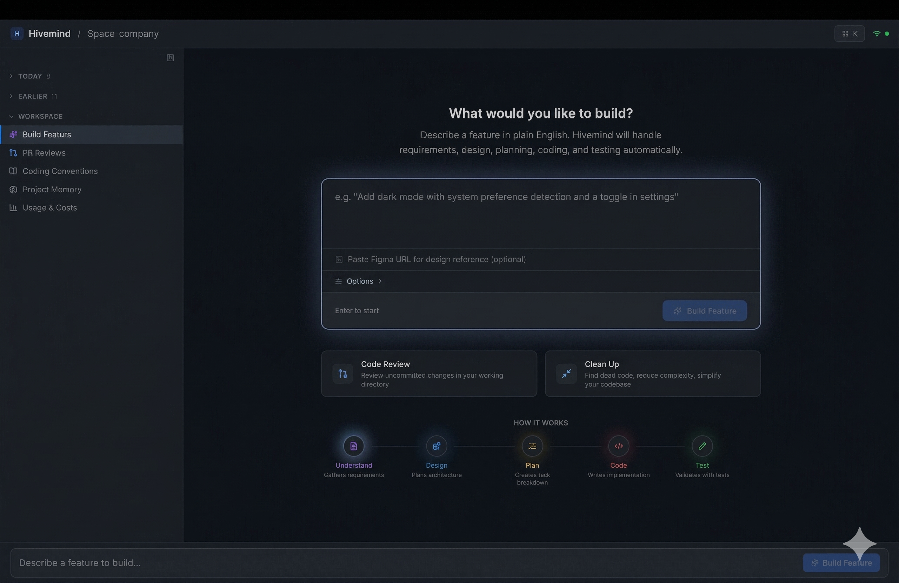

<p align="center">
  
</p>

<h1 align="center">Hivemind</h1>

<p align="center">
  <strong>Describe a feature. Get working, tested code.</strong><br/>
  Hivemind orchestrates Claude Code agents through a 5-stage pipeline — from requirements to passing tests — while you watch.
</p>

<p align="center">
  <a href="#quick-start">Quick Start</a> &bull;
  <a href="#how-it-works">How It Works</a> &bull;
  <a href="#commands">Commands</a> &bull;
  <a href="#dashboard">Dashboard</a> &bull;
  <a href="#configuration">Configuration</a>
</p>

<p align="center">
  
  
  
  
</p>

<p align="center">
  
</p>

---

## What is Hivemind?

Hivemind is a CLI tool and web dashboard that turns a plain-English feature request into working, tested code. It spawns specialized Claude Code sub-agents — each with a focused role and strict boundaries — and orchestrates them through a structured pipeline.

```
You: "Add dark mode with system preference detection"

Hivemind:
  1. Requirements  → REQUIREMENTS.md (user stories, acceptance criteria)
  2. Design        → SPEC.md (architecture, component design, ADRs)
  3. Tasks         → TASKS.md (parallelizable work items with IDs)
  4. Code          → Implementation (multiple agents in parallel)
  5. Test          → TESTPLAN.md + automated test execution

  If tests fail → intelligent fix loop (targets specific failures, avoids regressions)
```

**No copy-pasting. No context-switching. You describe what you want, and Hivemind builds it.**

---

## Quick Start

### Prerequisites

- **Node.js** >= 18
- **Claude Code CLI** installed and authenticated (`claude` command available)

### Install

```bash
git clone https://github.com/esanmohammad/swarm.git
cd swarm
npm install
npm run build
```

Add the CLI alias to your shell:

```bash
echo 'alias hivemind="node '$(pwd)'/packages/cli/dist/bin/swarm.js"' >> ~/.zshrc
source ~/.zshrc
```

### First Run

```bash
cd your-project
hivemind init                    # Initialize Hivemind in your project
hivemind "add a login page"      # Build a feature end-to-end
```

That's it. Hivemind will analyze your codebase, create a plan, write the code, and run tests.

---

## How It Works

### The 5-Stage Pipeline

Every feature goes through five stages, each handled by a specialized AI agent:

| Stage | Agent | Produces | Role Boundary |
|-------|-------|----------|---------------|
| **Requirements** | Analyst | `REQUIREMENTS.md` | No architecture, no code |
| **Design** | Architect | `SPEC.md` | No code, no task breakdown |
| **Tasks** | Lead | `TASKS.md` | No code, no architecture changes |
| **Code** | Engineer(s) | Implementation | Full file access |
| **Test** | Tester | `TESTPLAN.md` | No source code changes |

Each agent gets a **stack-specific system prompt** (React, Node, Go, Python, Rust, Swift) and strict role boundaries to prevent scope creep.

### Intelligent Fix Loop

When tests fail, Hivemind doesn't just retry blindly:

- **Per-failure targeting** — fixes each failing test individually
- **Regression detection** — ensures fixes don't break other tests
- **Fix history** — tracks what was tried so it doesn't repeat failed approaches
- **Budget-aware** — downgrades models at 80/90% budget, pauses (not kills) at 100%

### Context Preservation

When resuming from a failed step, Hivemind passes all prior artifacts (REQUIREMENTS.md, SPEC.md, TASKS.md) as context so the agent doesn't deviate from the original plan.

---

## Commands

### Core Workflows

```bash
hivemind "your feature request"     # Full pipeline (shorthand)
hivemind fix "describe the bug"     # Fix a specific bug
hivemind review                     # Review uncommitted changes
hivemind review 123                 # Review PR #123
hivemind spike "how does X work?"   # Quick research investigation
hivemind refactor "extract auth"    # Restructure without behavior change
hivemind dashboard                  # Open the web UI
```

### Pipeline Control

```bash
hivemind init                       # Initialize in current project
hivemind init --stack react         # Initialize with specific stack
hivemind status                     # Show pipeline state
hivemind mayday --resume            # Resume an interrupted pipeline
hivemind mayday --from-stage build  # Retry from a specific stage
```

### Workspace Tools

```bash
hivemind learn                      # Scan codebase to learn conventions
hivemind stats                      # Show cost and usage statistics
hivemind audit                      # View structured event log
hivemind doctor                     # Check system health
```

### Advanced

```bash
hivemind pr --reviewers --risk      # Create PR with risk scores
hivemind autopilot start            # Auto-process labeled GitHub issues
hivemind watch "npm test"           # Re-run on file changes with auto-fix
hivemind mentor "explain auth flow" # Ask questions about your codebase
```

---

## Dashboard

The web dashboard provides a real-time view of everything Hivemind is doing.

```bash
hivemind dashboard
```

### Features

- **Activity Feed** — See all running and completed tasks in one place
- **Live Output** — Stream agent output with markdown rendering and syntax highlighting
- **Pipeline Progress** — Stage-by-stage progress with "step 2 of 5" indicators
- **GitHub-Style Diff Viewer** — Unified and split views of code changes
- **PR Reviews** — Review PRs by link, number, or scan all open PRs
- **Coding Conventions** — Scan and edit your project's coding patterns
- **Project Memory** — Add, filter, and manage things Hivemind remembers
- **Usage & Costs** — Deep analytics with token usage, activity breakdown, cost by stage
- **Stop / Resume / Retry** — Full control over running and failed pipelines
- **Budget Management** — Set limits, get prompted to increase (agents pause, not die)
- **Keyboard Navigation** — Arrow keys / j/k to browse, Cmd+K command palette
- **Model Selection** — Choose Opus, Sonnet, or Haiku per run
- **Lean Mode** — Use Haiku for doc stages, save ~60% on early pipeline stages

### Build Feature Options

| Option | Description |
|--------|-------------|
| **Model** | Opus (best quality), Sonnet (balanced), Haiku (fastest/cheapest) |
| **Mode** | Full (best models throughout) or Lean (haiku for docs, default for code) |
| **Figma URL** | Paste a Figma design link for visual reference |
| **Budget** | Set a dollar limit — you'll be prompted to increase, never surprise-killed |

---

## Configuration

### Project Config (`.swarm/config.yaml`)

```yaml
stack: react                    # Tech stack (react, node, go, python, rust, swift)
model: sonnet                   # Default model for all stages
maxBudgetUsd: 20                # Global budget limit (null = no limit)

# Per-stage model overrides
models:
  analyst: haiku                # Cheaper model for requirements
  architect: sonnet             # Balanced for design
  engineer: opus                # Best for code generation
  tester: sonnet                # Balanced for test planning

# Parallel build agents
parallel: 3                     # Number of concurrent engineers in build stage
```

### Custom Personas

Drop YAML files in `.swarm/personas/` to customize agent behavior:

```yaml
# .swarm/personas/strict-reviewer.yaml
name: strict-reviewer
persona: engineer
systemPrompt: |
  You are an extremely thorough code reviewer.
  Flag any potential security issues, performance problems, or maintainability concerns.
  Always suggest specific improvements with code examples.
```

### Guardrails (`.swarm/guardrails.yaml`)

```yaml
rules:
  - name: requirements-has-user-stories
    stage: analyze
    check: pattern-match
    pattern: "As a .+ I want"
    file: REQUIREMENTS.md
    severity: warning

  - name: spec-has-data-model
    stage: architect
    check: section-exists
    section: "Data Model"
    file: SPEC.md
    severity: error
```

---

## Architecture

```
hivemind CLI ──→ Pipeline ──→ AgentManager ──→ AgentProcess (claude subprocess)
                                                     │
                                                     ├── content events → output + WS broadcast
                                                     ├── result event → cost tracking
                                                     └── exit event → error handling

StateManager ──events──▶ WebSocket Server ──▶ Dashboard (React)
```

### Tech Stack

| Component | Technology |
|-----------|-----------|
| CLI | TypeScript, Commander.js |
| Dashboard | React 19, Vite, Tailwind CSS |
| Agent Runtime | Claude Code CLI (`claude` subprocess) |
| Communication | WebSocket (real-time state sync) |
| State | JSON file with backup-before-write |
| Prompts | 30 stack-specific markdown files (5 personas x 6 stacks) |

### Project Structure

```
packages/
  cli/              # CLI tool (TypeScript, Commander.js)
    bin/            # Entry point
    src/
      commands/     # CLI commands (50+)
      core/         # Pipeline, AgentManager, WebSocket server, CostTracker
  dashboard/        # Web UI (React 19, Vite, Tailwind)
    src/
      components/   # Feed, Canvas, ActionBar, DiffViewer, OutputPanel
      store/        # Feed selection state
      theme/        # Design tokens (single dark theme)
prompts/            # 30 persona system prompts
.github/actions/    # GitHub Action for CI/CD integration
```

---

## GitHub Action

Run Hivemind in CI/CD:

```yaml
- uses: ./.github/actions/swarm
  with:
    prompt: "Implement the feature described in this issue"
    stack: react
    model: sonnet
```

---

## Supported Stacks

| Stack | Personas | Test Framework |
|-------|----------|---------------|
| React | All 5 | Jest / Vitest |
| Node | All 5 | Jest / Vitest |
| Go | All 5 | go test |
| Python | All 5 | pytest |
| Rust | All 5 | cargo test |
| Swift | All 5 | XCTest |

---

## FAQ

**Q: Does Hivemind write directly to my files?**
A: Yes. Engineers have full file access. Use `--approval-required` to review each stage before it proceeds.

**Q: What happens if I run out of budget mid-pipeline?**
A: Agents pause and you're prompted to increase the budget. They're never killed without your consent.

**Q: Can I resume a failed pipeline?**
A: Yes. Click "Retry from Failed Step" in the dashboard, or run `hivemind mayday --resume`. All prior artifacts are preserved as context.

**Q: How much does a typical feature cost?**
A: Depends on complexity. A simple feature with Sonnet costs ~$1-3. Complex features with Opus can cost $5-15. Lean mode saves ~60% on early stages.

**Q: Can I use my own models?**
A: Hivemind uses Claude Code under the hood. Any model available through your Claude Code setup works.

---

## License

[Business Source License 1.1](LICENSE)

---

<p align="center">
  Built by <a href="https://github.com/esanmohammad">Esan Mohammad</a><br/>
  <sub>Hivemind orchestrates AI agents so you can focus on what matters.</sub>
</p>
