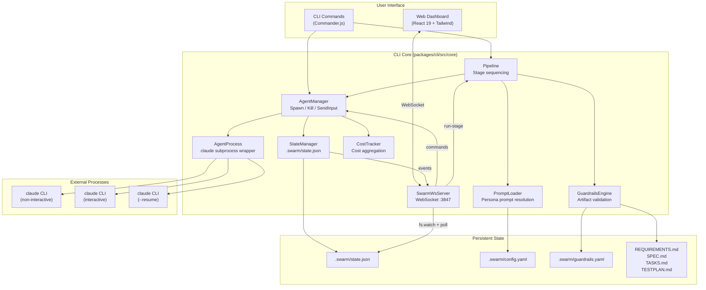
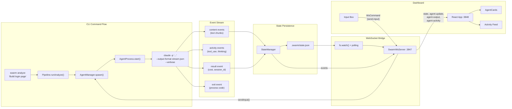
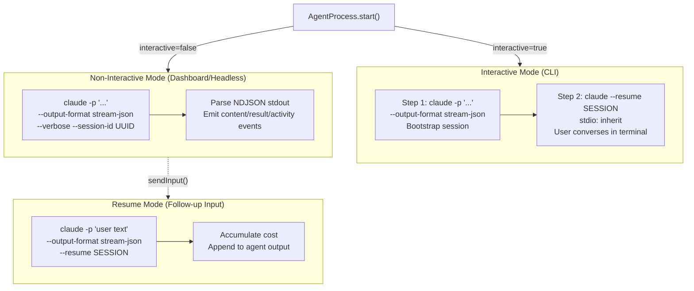

# Architecture Overview

Swarm is a CLI tool and web dashboard that orchestrates Claude Code sub-agents through a multi-stage development pipeline. It spawns `claude` CLI processes with specialized system prompts, enforces strict role boundaries per persona, and tracks output, cost, and status in real time.

---

## 1. System Architecture

Swarm is structured as an **npm workspaces monorepo** with two packages:

| Package | Path | Stack | Purpose |
|---------|------|-------|---------|
| **CLI** | `packages/cli` | TypeScript, Commander.js | Agent orchestration, pipeline execution, WebSocket server |
| **Dashboard** | `packages/dashboard` | React 19, Vite, Tailwind CSS 4 | Real-time web UI connected via WebSocket |

### Entry Point

`packages/cli/bin/swarm.ts` registers **11 commands**:

| Command | Description |
|---------|-------------|
| `init` | Initialize a `.swarm/` project directory |
| `analyze` | Run the Analyst stage (produces REQUIREMENTS.md) |
| `architect` | Run the Architect stage (produces SPEC.md) |
| `plan` | Run the Lead stage (produces TASKS.md) |
| `build` | Run the Engineer stage (implements code from TASKS.md) |
| `test` | Run the Tester stage (produces TESTPLAN.md, runs E2E tests) |
| `evaluate` | Validate pipeline artifacts against guardrail rules |
| `status` | Display current pipeline state |
| `agent` | Spawn/manage individual agents outside the pipeline |
| `dashboard` | Launch the web dashboard + WebSocket server |
| `mayday` | Run fully autonomous end-to-end pipeline with fix loops |

### Prompts Directory

The `prompts/` directory contains **15 bundled persona system prompts** (5 personas x 3 tech stacks):

| Persona | Filenames | Artifact | Role Boundary |
|---------|-----------|----------|---------------|
| Analyst | `analyst-{react,node,go}.md` | REQUIREMENTS.md | No architecture, no code, no tasks |
| Architect | `Architect-{React,Node,Go}.md` | SPEC.md | No code, no task breakdown |
| Lead | `Software-lead-{react,node,go}.md` | TASKS.md | No code, no architecture redesign |
| Engineer | `Software-engineer-{react,node,go}.md` | Code | Full access to all tools |
| Tester | `test-engineer-{react,node,go}.md` | TESTPLAN.md | No implementation code, only test plans |

---

## 2. Architecture Diagram



---

## 3. Core Abstractions

### AgentProcess (`core/agent-process.ts`, 439 lines)

Wraps a single `claude` CLI subprocess. Supports three execution modes:

- **Non-interactive (headless)**: `claude -p "<prompt>" --output-format stream-json --verbose` -- parses NDJSON output for content, cost, and activity events. Used for engineers and dashboard-spawned agents.
- **Interactive (two-step)**: Bootstraps a session with `-p` to capture the first response, then resumes with `claude --resume <session-id>` with `stdio: 'inherit'` for terminal conversation. Used for analyst, architect, and lead via CLI.
- **Resume (dashboard input)**: `claude -p "<text>" --resume <session-id>` -- sends follow-up messages to existing sessions.

Key responsibilities:
- Stream-JSON parsing with line buffering (content at `msg.message.content[].text`)
- Activity tracking: tool_use, tool_result, thinking, and text events
- Sub-agent detection: tracks `Agent` tool_use IDs, emits `sub-agent-start` / `sub-agent-end` events
- Temp file management for large system prompts (written to `/tmp/swarm-prompts/`)
- Graceful kill with SIGTERM followed by SIGKILL after 5s timeout

### AgentManager (`core/agent-manager.ts`, 419 lines)

Manages the lifecycle of multiple agents:

- **`spawn(opts)`** -- Creates an `Agent` record, loads the persona system prompt via `PromptLoader`, instantiates `AgentProcess`, wires all event handlers (content, result, activity, sub-agent, exit), starts the process, and registers it with `StateManager`.
- **`kill(agentId)`** -- Sends SIGTERM/SIGKILL, marks agent as `killed`.
- **`sendInput(agentId, text)`** -- Resumes a completed agent's session with new user text. Spawns a fresh `AgentProcess` in resume mode, accumulates cost across turns.
- **`waitForAgent(agentId)`** -- Returns a Promise that resolves when the agent finishes or rejects on error.
- **Sub-agent wiring** -- When a parent agent uses Claude's internal `Agent` tool, virtual child agent entries are created in the state so they appear in the dashboard sidebar.

### Pipeline (`core/pipeline.ts`, 1098 lines)

Sequences the 5 pipeline stages with strict persona enforcement:

- **`runAnalyze(featureRequest, opts)`** -- Spawns an analyst agent with role-boundary constraints.
- **`runArchitect(opts)`** -- Reads REQUIREMENTS.md, spawns architect agent.
- **`runPlan(opts)`** -- Reads SPEC.md, spawns lead agent to produce TASKS.md.
- **`runBuild(opts)`** -- Parses TASKS.md for task groups, spawns parallel engineer agents. `parseTaskGroups()` extracts task IDs (T001, FND-001 patterns) and parallel markers `[P]`.
- **`runTest(opts)`** -- Reads TESTPLAN.md, spawns tester agents for E2E test execution.
- **`runMayday(prompt, opts)`** -- Fully autonomous mode: runs all stages sequentially, then enters a fix loop (test -> fix -> re-test) up to a configurable max iteration count.

Each non-engineer stage enforces:
- **Tool restrictions**: `Bash`, `Edit`, `NotebookEdit` are disallowed
- **System enforcement prompts**: Appended via `--append-system-prompt` (cannot be overridden by the agent)
- **Guardrail validation**: Artifacts are checked post-completion for required sections and patterns

### StateManager (`core/state.ts`, 199 lines)

Persists the full `PipelineState` to `.swarm/state.json`:

- **Debounced writes**: Changes are batched with a 100ms timer to avoid excessive disk I/O.
- **`cleanupStaleAgents()`**: Called on dashboard startup -- marks orphaned `running` agents as `error`, clears all finished agents, resets stages to `pending`.
- **Event emission**: Emits `agent-update` and `state-change` events consumed by `SwarmWsServer`.
- **`flush()`**: Force-writes pending changes (called during SIGINT/SIGTERM cleanup).
- **MayDay state management**: Tracks autonomous pipeline progress, user message queues, and fix iterations.

### SwarmWsServer (`core/ws-server.ts`, 458 lines)

WebSocket server on port 3847 bridging CLI state to the dashboard:

- **Connection handling**: Sends full state snapshot on connect; processes incoming `WsCommand` messages.
- **File watching**: Hybrid approach using `fs.watch()` (debounced at 150ms) plus 1-second polling as fallback for missed kqueue events on macOS.
- **Command handling**: `spawn`, `kill`, `send-input`, `get-state`, `run-stage`, `run-mayday`, `mayday-input`, `mayday-stop`.
- **Persona enforcement**: Non-engineer agents spawned from the dashboard get tool restrictions and system enforcement prompts identical to CLI-spawned agents.
- **Broadcast**: All state changes, agent updates, output chunks, and activity events are broadcast to connected dashboard clients.

### GuardrailsEngine (`core/guardrails.ts`, 196 lines)

Validates pipeline artifacts against structural rules:

- **Check types**:
  - `section-exists` -- Verifies a markdown heading exists (regex: `^#{1,4}\s+.*<value>`)
  - `pattern-match` -- Tests content against a regex pattern
  - `command` -- Executes a shell command (30s timeout), failure = violation
- **Default rules**: Built-in validation for REQUIREMENTS.md (12 required sections, user story format, Given/When/Then AC), SPEC.md (ADRs, Mermaid diagrams), TASKS.md (task IDs, parallel markers, phases), and TESTPLAN.md (test case IDs, E2E paths).
- **Custom rules**: Loaded from `.swarm/guardrails.yaml` and merged with defaults.
- **Severity levels**: `error` (blocks pipeline) and `warning` (advisory).

### PromptLoader (`prompts/loader.ts`, 98 lines)

Resolves a persona + tech stack combination to a system prompt file:

- **Search order** (first match wins):
  1. Bundled `prompts/` directory (ships with repo, contains enforced structure templates)
  2. Custom directory from `config.promptsDir` (if set and not `"bundled"`)
  3. `~/.claude/prompts/` (user-level)
  4. `~/.claude/prompt/` (legacy location)
- **Filename mapping**: Handles inconsistent casing across personas (e.g., `Architect-React.md` vs `analyst-react.md`).
- **`listAvailable()`**: Enumerates all resolvable persona/stack combinations.

### CostTracker (`core/cost-tracker.ts`, 39 lines)

Aggregates costs across all agents:

- Records per-agent `CostInfo` (USD, input/output tokens, cache tokens, duration).
- Emits `cost-update` events with running totals.
- Formatting: `$0.0342 | 12,500 in | 3,200 out | 4.2s`.

---

## 4. Data Flow Diagram



### Message Types (WebSocket)

| Type | Direction | Payload | Purpose |
|------|-----------|---------|---------|
| `state` | Server -> Client | `PipelineState` | Full state snapshot |
| `agent-update` | Server -> Client | `Agent` | Single agent status change |
| `agent-output` | Server -> Client | `{ agentId, chunk }` | Streaming text output |
| `agent-activity` | Server -> Client | `AgentActivity` | Tool use, thinking, text events |
| `guardrail-alert` | Server -> Client | `GuardrailViolation` | Artifact validation failure |
| `cost-update` | Server -> Client | `CostInfo` | Aggregated cost update |

### Commands (Dashboard -> Server)

| Action | Parameters | Effect |
|--------|-----------|--------|
| `spawn` | name, persona, stack, model, prompt, permissionMode | Create new agent |
| `kill` | agentId | Terminate agent process |
| `send-input` | agentId, text | Resume session with user message |
| `get-state` | -- | Request full state broadcast |
| `run-stage` | stage, prompt, parallel, taskId, figmaUrl | Execute pipeline stage |
| `run-mayday` | prompt, maxIterations, figmaUrl, parallel, model, resume | Start/resume autonomous pipeline |
| `mayday-input` | text | Send user message to MayDay loop |
| `mayday-stop` | -- | Halt MayDay, kill running agents |

---

## 5. Technology Stack

### CLI (`packages/cli`)

| Category | Technology |
|----------|-----------|
| Runtime | Node.js (ESM, `"type": "module"`) |
| Language | TypeScript (strict, `.js` import extensions) |
| CLI Framework | Commander.js |
| Terminal UI | chalk, ora (spinners) |
| Process Management | `node:child_process` (spawn) |
| WebSocket | ws |
| Unique IDs | uuid (v4) |
| YAML | yaml (parse + stringify) |
| Build | tsc (TypeScript compiler) |

### Dashboard (`packages/dashboard`)

| Category | Technology |
|----------|-----------|
| Framework | React 19 |
| Styling | Tailwind CSS 4 |
| Bundler | Vite |
| Icons | lucide-react |
| WebSocket | Native browser WebSocket API |
| Build | tsc + vite build |

---

## 6. Configuration

### `.swarm/config.yaml` (SwarmConfig)

Created by `swarm init`. Controls project-wide settings.

```yaml
projectName: my-project         # Project display name
stack: react                     # Tech stack: react | node | go
model: opus                      # Default Claude model
maxBudgetUsd: null               # Per-agent budget cap (null = unlimited)
promptsDir: bundled              # Prompt source: "bundled" or custom path
wsPort: 3847                     # WebSocket server port
dashboardPort: 3848              # Dashboard HTTP server port
permissions:
  permissionMode: default        # default | acceptEdits | auto | plan | bypassPermissions
  allowedTools: []               # Whitelist specific tools
  disallowedTools: []            # Blacklist specific tools
playwright:                      # Optional E2E test configuration
  baseUrl: http://localhost:3000
  authStorageState: auth.json
  testDir: e2e
```

### `.swarm/state.json` (PipelineState)

Auto-managed by `StateManager`. Tracks the full pipeline state including all agents, stages, costs, and violations.

```
PipelineState
├── projectName: string
├── stack: TechStack
├── stages: Record<StageName, StageState>
│   ├── analyze:   { status, agentIds[], artifact }
│   ├── architect: { status, agentIds[], artifact }
│   ├── plan:      { status, agentIds[], artifact }
│   ├── build:     { status, agentIds[], artifact }
│   ├── test:      { status, agentIds[], artifact }
│   └── evaluate:  { status, agentIds[], artifact }
├── agents: Agent[]
│   └── { id, name, persona, stack, status, pid, sessionId,
│          model, permissionMode, cost, output, error,
│          parentId, childIds, allowedTools, disallowedTools }
├── totalCost: CostInfo
├── violations: GuardrailViolation[]
├── updatedAt: number
└── mayday?: MaydayState
    ├── active, featureRequest, currentStage
    ├── fixIteration, maxFixIterations
    ├── lastTestOutput, lastTestPassed
    └── userMessages[], startedAt, error
```

### `.swarm/guardrails.yaml` (Custom Rules)

Optional file for project-specific validation rules, merged with built-in defaults.

```yaml
rules:
  - name: "Custom API docs"
    target: "API.md"
    checks:
      - type: section-exists
        value: "Endpoints"
        message: "Missing Endpoints section"
        severity: error
      - type: pattern-match
        value: "GET|POST|PUT|DELETE"
        message: "No HTTP methods documented"
        severity: warning
      - type: command
        value: "npx tsc --noEmit"
        message: "TypeScript compilation failed"
        severity: error
```

---

## 7. Agent Process Model

### Execution Modes



### Permission Modes

| Mode | Use Case | Behavior |
|------|----------|----------|
| `default` | CLI interactive agents | Prompts user for each permission |
| `acceptEdits` | Dashboard agents | Auto-accepts file edits, prompts for Bash |
| `auto` | Headless/non-interactive | Accepts all permissions automatically |
| `plan` | Read-only exploration | Agent can only read, not modify |
| `bypassPermissions` | Trusted environments | Skips all permission checks |

> **Note**: Dashboard-spawned agents cannot use `default` mode since there is no terminal to prompt the user. The dashboard defaults to `auto` for non-interactive execution.
