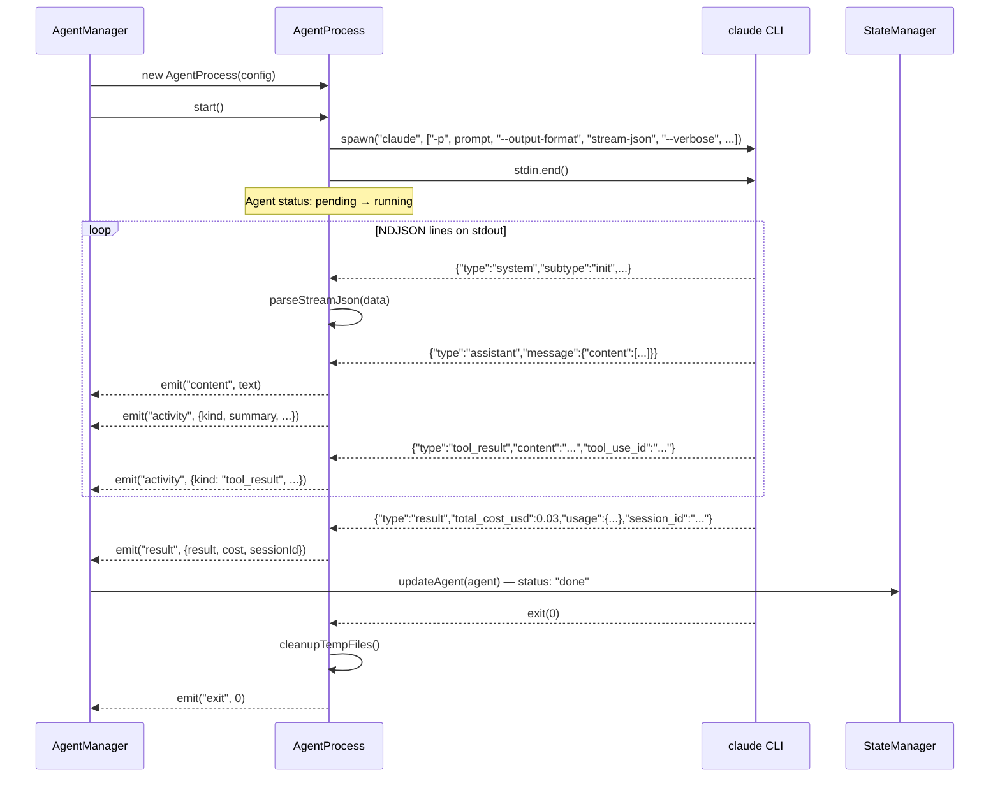
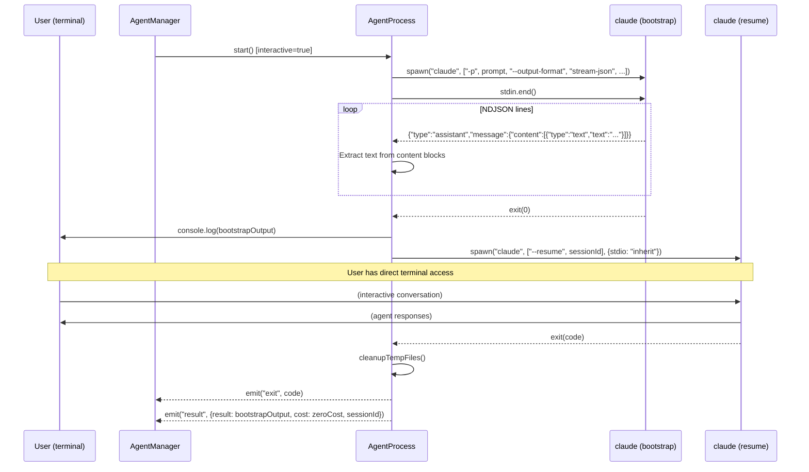
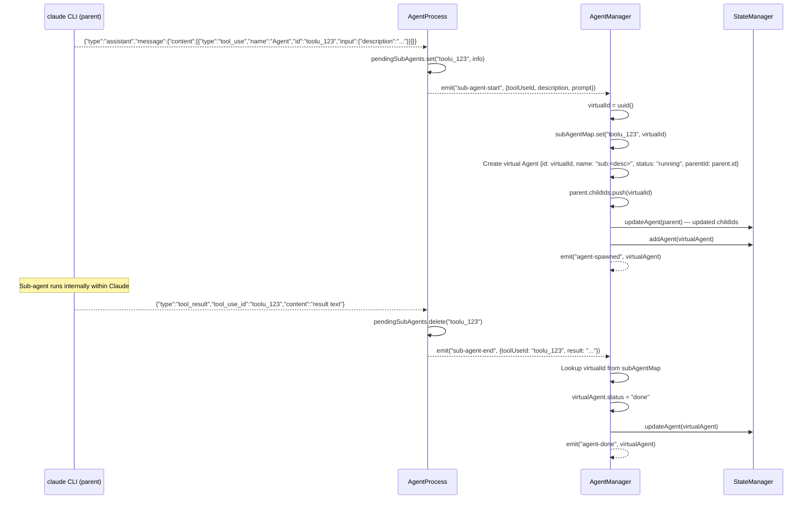
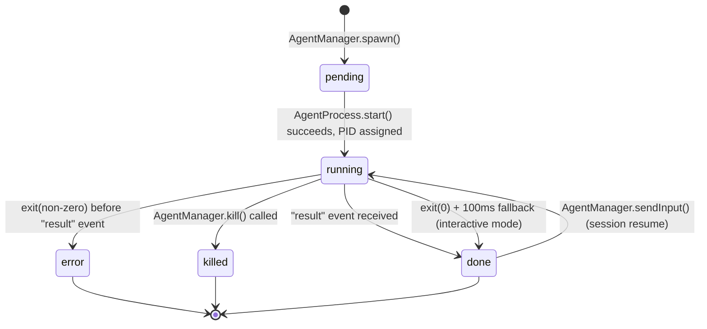

# Agent Process Model

How Swarm spawns and manages Claude Code sub-agents. This document covers the two execution modes, stream-JSON parsing, activity tracking, sub-agent detection, lifecycle state transitions, and the `AgentManager` API.

**Source files:**
- `packages/cli/src/core/agent-process.ts` -- single-process wrapper
- `packages/cli/src/core/agent-manager.ts` -- multi-agent orchestrator
- `packages/cli/src/types.ts` -- shared type definitions

---

## 1. Agent Process Model Overview

Every agent in Swarm is a child process running the `claude` CLI. Two execution modes exist, chosen at spawn time via the `interactive` flag on `AgentProcessConfig`:

| Mode | CLI Flag Pattern | stdio | Use Case |
|------|-----------------|-------|----------|
| **Non-interactive (headless)** | `-p "<prompt>" --output-format stream-json --verbose` | `pipe` (stdout parsed as NDJSON) | Engineers, dashboard-spawned agents, session resumes |
| **Interactive (two-step)** | Step 1: same as headless; Step 2: `--resume <session-id>` | Step 1: `pipe`; Step 2: `inherit` | Analyst, architect, lead via CLI |

Both modes use the same `AgentProcess` class. The mode is determined by `config.interactive` and dispatched in `start()`:

```
start() → config.interactive ? startInteractive() : startNonInteractive()
```

---

## 2. Non-Interactive Mode

Used for programmatic agent execution where output is captured and parsed.

**Command constructed by `buildNonInteractiveArgs()`:**

```
claude -p "<prompt>" \
  --output-format stream-json \
  --verbose \
  --model <model> \
  --session-id <uuid> \
  --system-prompt "<persona prompt>" \
  [--max-budget-usd <N>] \
  [--permission-mode <mode>] \
  [--append-system-prompt "<enforcement>"] \
  [--allowedTools <tools...>] \
  [--disallowedTools <tools...>]
```

When `config.resume` is true, `--session-id` and `--system-prompt` are replaced with `--resume <session-id>`.

### Sequence Diagram



**Key behaviors:**
- `stdin` is immediately closed (`proc.stdin.end()`) -- no interactive input.
- `stderr` content is captured and forwarded via the `error-output` event.
- The `result` event carries cost, token usage, and the final output.
- The `exit` event fires after `result`. If status is already `done`, the exit handler is a no-op.

---

## 3. Interactive Mode

Used for CLI-driven personas (analyst, architect, lead) where the user converses directly with the agent in the terminal.

### Two-Step Process

**Step 1 -- Bootstrap:** Run the initial prompt in non-interactive (print) mode to establish the session and capture the first response. The system prompt is set during this step.

**Step 2 -- Resume:** Hand the session over to the user with `stdio: 'inherit'`. The user sees the agent's terminal and can converse freely.

**Resume command:**

```
claude --resume <session-id> \
  [--permission-mode <mode>] \
  [--append-system-prompt "<enforcement>"] \
  [--allowedTools <tools...>] \
  [--disallowedTools <tools...>]
```

Note: `--model` and `--system-prompt` are NOT passed on resume -- the session already has them.

### Sequence Diagram



**Key behaviors:**
- Bootstrap stderr is forwarded to `process.stderr` so the user sees permission prompts.
- If bootstrap exits non-zero, the interactive resume is skipped entirely.
- The `result` event emitted on resume exit carries `cost: zeroCost` because token usage is not available in interactive mode.
- The resume process reference (`this.proc`) replaces the bootstrap process, so `kill()` targets the active session.

---

## 4. Session Resume (Dashboard Input)

When a user sends a follow-up message via the dashboard to a completed agent, `AgentManager.sendInput()` spawns a new non-interactive process that resumes the existing session:

```
claude -p "<user-text>" \
  --output-format stream-json \
  --verbose \
  --model <model> \
  --resume <session-id> \
  [--permission-mode <mode>] \
  [--allowedTools <tools...>] \
  [--disallowedTools <tools...>] \
  [--append-system-prompt "<enforcement>"]
```

### Behavior

1. Agent status is set back to `running`, `finishedAt` is cleared.
2. A `> User: <text>` chunk is emitted to the output stream so the dashboard shows the user's message.
3. A new `AgentProcess` is created with `resume: true`.
4. All tool restrictions (`allowedTools`, `disallowedTools`, `appendSystemPrompt`, `permissionMode`) are carried over from the original agent.
5. The new process replaces the old one in the agents map.

### Cost Accumulation

Costs are **accumulated** across turns, not reset:

```typescript
agent.cost = {
  totalUsd: agent.cost.totalUsd + cost.totalUsd,
  inputTokens: agent.cost.inputTokens + cost.inputTokens,
  outputTokens: agent.cost.outputTokens + cost.outputTokens,
  cacheReadTokens: agent.cost.cacheReadTokens + cost.cacheReadTokens,
  cacheWriteTokens: agent.cost.cacheWriteTokens + cost.cacheWriteTokens,
  durationMs: agent.cost.durationMs + cost.durationMs,
};
```

This means the agent's `cost` field always reflects the total spend across all turns of conversation.

---

## 5. Stream-JSON Parsing

The `parseStreamJson()` method on `AgentProcess` handles NDJSON output from the Claude CLI.

### Buffer Strategy

Data arrives in arbitrary chunks. A line buffer accumulates partial data:

```
buffer += data.toString()
lines = buffer.split('\n')
buffer = lines.pop()   // keep incomplete last line
```

Each complete line is parsed as JSON. Parse failures are silently skipped.

### Message Types

The Claude CLI emits three primary message types in `stream-json` mode:

| `type` | Structure | Emitted Events |
|--------|-----------|---------------|
| `system` | `{"type":"system","subtype":"init",...}` | `message` only |
| `assistant` | `{"type":"assistant","message":{"content":[...]}}` | `message`, `content`, `activity`, `sub-agent-start` |
| `result` | `{"type":"result","result":"...","total_cost_usd":N,"usage":{...}}` | `message`, `result`, `sub-agent-end` (flush) |
| `tool_result` | `{"type":"tool_result","content":"...","tool_use_id":"..."}` | `message`, `activity`, `sub-agent-end` |

### ClaudeStreamMessage Type

```typescript
interface ClaudeStreamMessage {
  type: string;           // "system" | "assistant" | "result" | "tool_result"
  subtype?: string;       // "init" for system messages

  // result fields
  result?: string;
  total_cost_usd?: number;
  duration_ms?: number;
  duration_api_ms?: number;
  session_id?: string;
  usage?: {
    input_tokens: number;
    output_tokens: number;
    cache_creation_input_tokens?: number;
    cache_read_input_tokens?: number;
  };
  is_error?: boolean;

  // assistant message wrapper
  message?: {
    content?: Array<{
      type: string;       // "text" | "tool_use" | "thinking" | "tool_result"
      text?: string;
      id?: string;        // tool_use block ID
      name?: string;      // tool name
      input?: Record<string, unknown>;
    }>;
    role?: string;
    stop_reason?: string | null;
  };

  // top-level tool_result fields
  content?: string | Array<{ type: string; text?: string }>;
  tool_use_id?: string;
}
```

### Content Path

Content text lives at `msg.message.content[].text`, **not** `msg.content`. The `msg.content` field is only used for top-level `tool_result` messages.

### Content Block Processing

For `assistant` messages, each block in `message.content` is processed:

| Block `type` | Action |
|-------------|--------|
| `text` | Emit `content` event + `activity` (kind: `text`) |
| `tool_use` | Emit `activity` (kind: `tool_use`). If tool is `Agent`, also emit `sub-agent-start` |
| `thinking` | Emit `activity` (kind: `thinking`) |
| `tool_result` | Emit `activity` (kind: `tool_result`). If `tool_use_id` matches a pending sub-agent, emit `sub-agent-end` |

---

## 6. Activity Tracking

Every meaningful block in the stream produces an `AgentActivity` event.

### AgentActivity Type

```typescript
interface AgentActivity {
  id: string;        // "act-<sessionPrefix>-<counter>"
  agentId: string;   // set by AgentManager (AgentProcess emits without it)
  kind: ActivityKind; // "tool_use" | "tool_result" | "thinking" | "text"
  tool?: string;     // tool name, only for tool_use
  summary: string;   // short description, max ~200 chars
  content?: string;  // full content (tool input JSON, result text, thinking)
  timestamp: number;
}
```

### Events Emitted by AgentProcess

| Event | Payload | When |
|-------|---------|------|
| `content` | `string` (text chunk) | Text block in assistant message |
| `result` | `{result, cost, sessionId}` | `result` message parsed |
| `error-output` | `string` | stderr data or spawn error |
| `exit` | `number \| null` (exit code) | Process exits |
| `message` | `ClaudeStreamMessage` | Every parsed NDJSON line |
| `activity` | `Omit<AgentActivity, 'agentId'>` | Text, tool_use, tool_result, or thinking block |
| `sub-agent-start` | `SubAgentInfo` | Agent tool_use detected |
| `sub-agent-end` | `{toolUseId, result}` | Agent tool_result received or parent finishes |

### Tool Summarization

The `summarizeToolUse()` method generates human-readable summaries for activity feed entries:

| Tool | Summary Format |
|------|---------------|
| `Read` | `Reading <file_path>` |
| `Edit` | `Editing <file_path>` |
| `Write` | `Writing <file_path>` |
| `Bash` | `Running: <command or description>` (truncated to 120 chars) |
| `Grep` | `Searching for "<pattern>" in <path>` |
| `Glob` | `Finding files: <pattern>` |
| `Agent` | `Spawning sub-agent: <description>` |
| `WebSearch` | `Searching web: <query>` |
| `WebFetch` | `Fetching: <url>` |
| Other | `Using <name>` |

---

## 7. Sub-Agent Tracking

When a Claude agent uses the `Agent` tool internally (Claude's built-in delegation), Swarm detects this and creates virtual child agents visible in the dashboard.

### Detection Mechanism

`AgentProcess` maintains a `pendingSubAgents` map (`Map<string, SubAgentInfo>`) keyed by `tool_use_id`.

```typescript
interface SubAgentInfo {
  toolUseId: string;
  description: string;
  prompt: string;  // truncated to 500 chars
}
```

### Lifecycle



### Flush on Parent Completion

When a `result` message is received (parent agent finished), all remaining pending sub-agents are forcefully completed:

```
for (const [toolUseId] of this.pendingSubAgents) {
  this.emit('sub-agent-end', { toolUseId, result: 'Completed (parent process finished)' });
}
this.pendingSubAgents.clear();
```

This ensures no virtual agents remain stuck in `running` state.

### Virtual Agent Properties

| Field | Value |
|-------|-------|
| `id` | New UUID |
| `name` | `sub:<description>` (truncated to 30 chars) |
| `persona` | `engineer` |
| `stack` | Inherited from parent |
| `status` | `running` initially, `done` on tool_result |
| `pid` | `null` (no real process) |
| `sessionId` | `virtual-<toolUseId>` |
| `model` | Inherited from parent |
| `permissionMode` | Inherited from parent |
| `parentId` | Parent agent's ID |
| `childIds` | `[]` |

---

## 8. Agent Lifecycle State Machine



### State Transitions

| From | To | Trigger | Handler |
|------|----|---------|---------|
| `pending` | `running` | `agentProcess.start()` returns, PID read | `AgentManager.spawn()` |
| `running` | `done` | `result` event fires | `agentProcess.on('result')` in `spawn()` |
| `running` | `done` | `exit(0)` + 100ms timeout, status still `running` | `agentProcess.on('exit')` fallback |
| `running` | `error` | `exit(non-zero)` and status is not `done` | `agentProcess.on('exit')` |
| `running` | `killed` | `AgentManager.kill(agentId)` | Sends SIGTERM, sets status |
| `done` | `running` | `AgentManager.sendInput(agentId, text)` | Resets status and `finishedAt` |

### The 100ms Fallback

In interactive mode, the `result` event may not fire (no stream-json parsing on the resumed session). The exit handler waits 100ms before marking the agent as `done`, giving the `result` event a chance to fire first from the bootstrap phase:

```typescript
setTimeout(() => {
  if (agent.status === 'running') {
    agent.status = 'done';
    agent.finishedAt = Date.now();
    this.state.updateAgent(agent);
    this.emit('agent-done', agent);
  }
}, 100);
```

---

## 9. AgentManager API

`AgentManager` extends `EventEmitter` and manages the full set of agents.

### Constructor

```typescript
constructor(
  state: StateManager,
  costTracker: CostTracker,
  promptLoader: PromptLoader,
  config: SwarmConfig,
)
```

### Methods

| Method | Signature | Description |
|--------|-----------|-------------|
| `spawn` | `(opts: SpawnOptions) => Promise<Agent>` | Create and start a new agent. Loads system prompt via `PromptLoader`, creates `AgentProcess`, wires all events, updates pipeline stage. Returns the `Agent` object. |
| `kill` | `(agentId: string) => boolean` | Send SIGTERM to the agent's process. Sets status to `killed`. Returns `false` if agent not found. |
| `sendInput` | `(agentId: string, text: string) => Promise<void>` | Resume an existing session with new user input. Creates a new `AgentProcess` with `resume: true`. Accumulates cost. |
| `killAll` | `() => void` | Kill every tracked agent. |
| `list` | `() => Agent[]` | Return all tracked agents. |
| `get` | `(agentId: string) => Agent \| undefined` | Look up agent by ID. |
| `getByName` | `(name: string) => Agent \| undefined` | Look up agent by name (linear scan). |
| `waitForAgent` | `(agentId: string) => Promise<Agent>` | Returns a promise that resolves when the agent reaches `done` or rejects on `error`/`killed`. Resolves immediately if already done. |
| `addChild` | `(parentId: string, childId: string) => void` | Register a child agent under a parent (used by pipeline for orchestrator relationships). |

### SpawnOptions

```typescript
interface SpawnOptions {
  name: string;
  persona: Persona;       // "analyst" | "architect" | "lead" | "engineer" | "tester"
  stack: TechStack;       // "react" | "node" | "go"
  prompt: string;
  model?: string;         // defaults to config.model
  maxBudgetUsd?: number | null;
  cwd: string;
  interactive?: boolean;
  permissionMode?: PermissionMode;
  parentId?: string;      // for sub-engineers
  allowedTools?: string[];
  disallowedTools?: string[];
  appendSystemPrompt?: string;
}
```

### Events

| Event | Payload | When |
|-------|---------|------|
| `agent-spawned` | `Agent` | After process starts and agent is registered in state |
| `agent-done` | `Agent` | Agent completes successfully (result event or fallback) |
| `agent-error` | `Agent` | Agent process exits non-zero without a result |
| `agent-killed` | `Agent` | `kill()` called on an agent |
| `agent-output` | `{agentId: string, chunk: string}` | New text content from agent |
| `agent-activity` | `AgentActivity` | Tool use, tool result, thinking, or text activity |

---

## 10. Error Handling

### Process Termination

`AgentProcess.kill()` uses a two-stage approach:

1. Send `SIGTERM` to the child process.
2. After **5 seconds**, if the process is still alive, send `SIGKILL`.

```typescript
kill(): void {
  if (this.proc && !this.proc.killed) {
    this.proc.kill('SIGTERM');
    setTimeout(() => {
      if (this.proc && !this.proc.killed) {
        this.proc.kill('SIGKILL');
      }
    }, 5000);
  }
}
```

### Exit Code Handling

In `AgentManager`, the `exit` event handler distinguishes three cases:

| Condition | Action |
|-----------|--------|
| `agent.status === 'done'` | No-op (already handled by `result` event) |
| `code !== 0` | Set status to `error`, record exit code in `agent.error` |
| `code === 0` but no result yet | Wait 100ms, then set to `done` if still `running` |

### Stderr Capture

All stderr output from the Claude CLI process is captured and:
- Stored in `agent.error` (appended).
- In `sendInput()` resumes, also emitted as `agent-output` with a `[stderr]` prefix so the dashboard user can see errors inline.

### Bootstrap Failure (Interactive Mode)

If the bootstrap step in interactive mode exits with a non-zero code:
- `error-output` event is emitted with the exit code message.
- `exit` event is emitted.
- The resume step is **not** executed.

### Temp File Cleanup

`AgentProcess` writes system prompts to temporary files in `$TMPDIR/swarm-prompts/` (named `<prefix>-<sessionId>.md`). These are cleaned up via `cleanupTempFiles()` when the process exits, regardless of success or failure.
