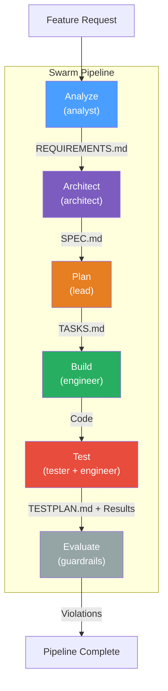
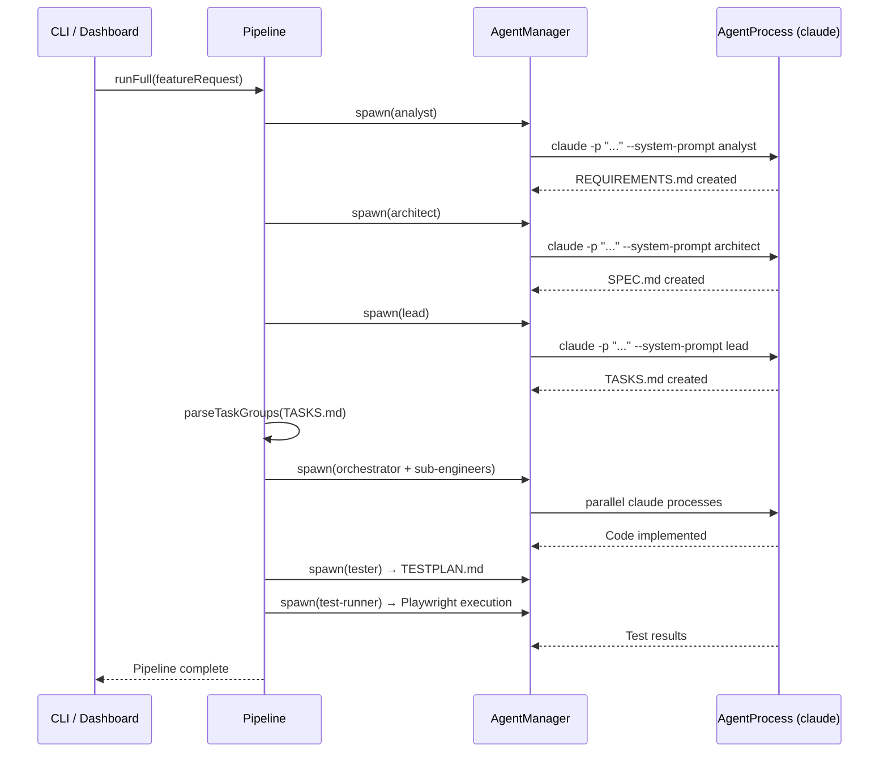
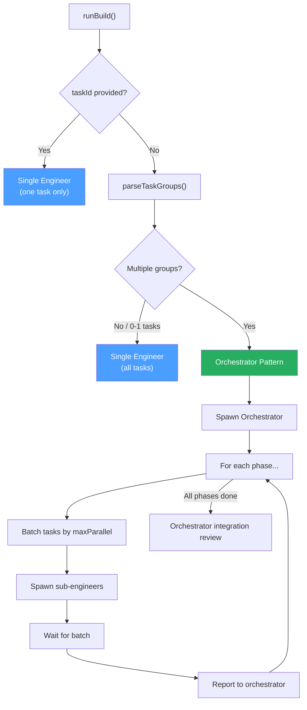
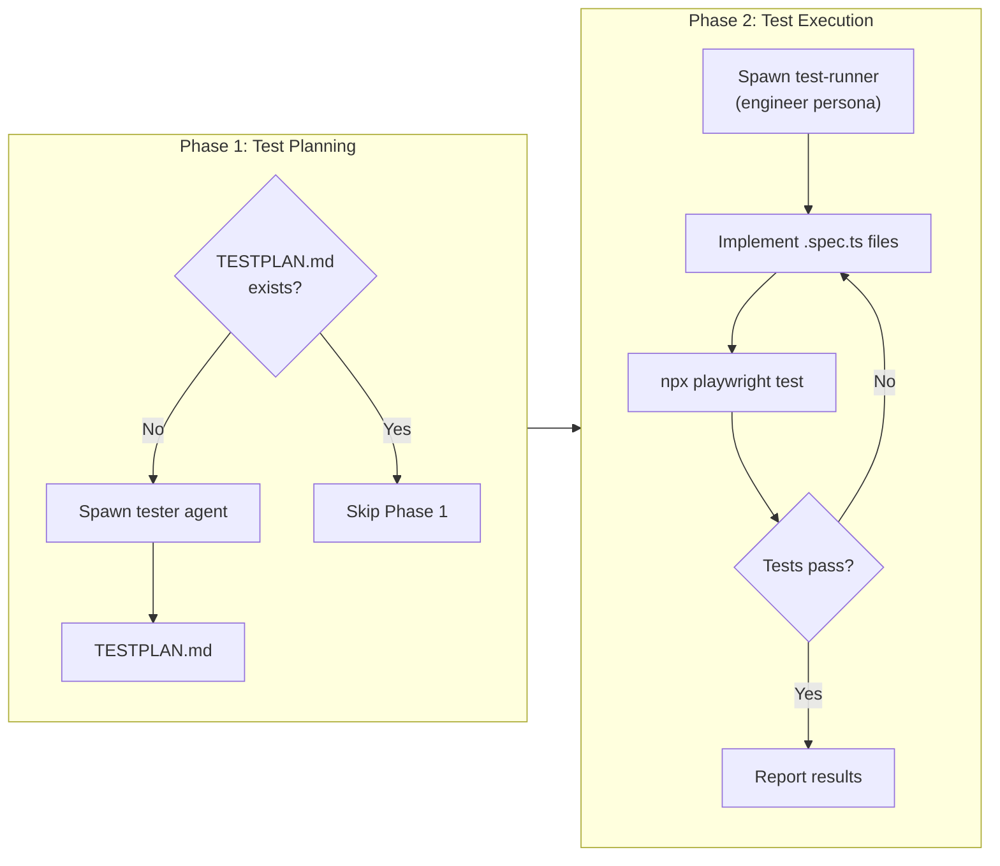
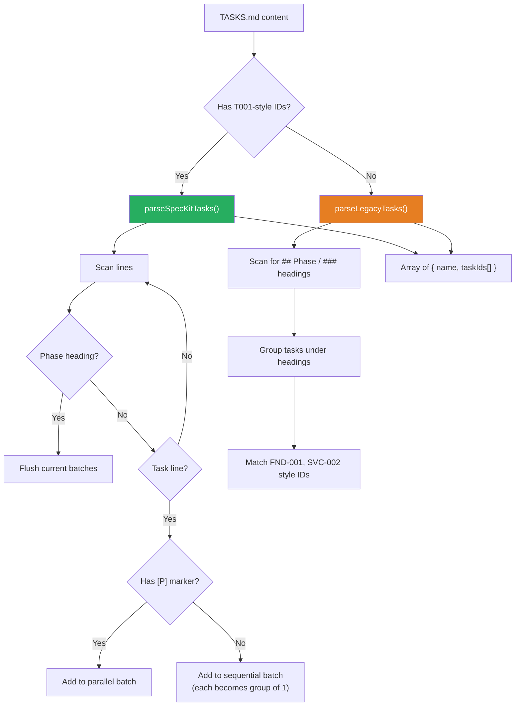
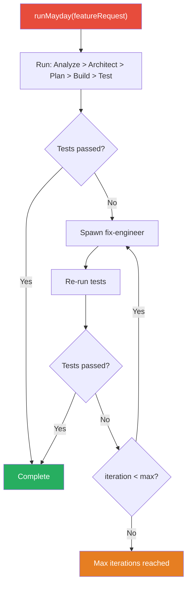

# Pipeline Orchestration

How Swarm sequences AI agents through a multi-stage development pipeline to transform a feature request into tested, production-ready code.

---

## 1. Pipeline Overview

Swarm implements a **6-stage pipeline** where each stage is owned by a specialized persona with strict role boundaries. Stages execute sequentially, each consuming the artifact produced by the previous stage.

| Stage | Persona | Artifact Produced | Purpose |
|-------|---------|-------------------|---------|
| **Analyze** | `analyst` | `REQUIREMENTS.md` | Elicit and structure requirements from a feature request |
| **Architect** | `architect` | `SPEC.md` | Design system architecture with ADRs and Mermaid diagrams |
| **Plan** | `lead` | `TASKS.md` | Break architecture into file-level, parallelizable tasks |
| **Build** | `engineer` | Code | Implement tasks (parallel sub-engineers + orchestrator) |
| **Test** | `tester` + `engineer` | `TESTPLAN.md` + E2E results | Generate test plan, then implement and run Playwright tests |
| **Evaluate** | Guardrails engine | Violations report | Validate artifacts against structural rules |

The pipeline is defined in `packages/cli/src/types.ts`:

```typescript
type StageName = 'analyze' | 'architect' | 'plan' | 'build' | 'test' | 'evaluate';
type Persona = 'analyst' | 'architect' | 'lead' | 'engineer' | 'tester';
```

The mapping between personas and stages is codified in `PERSONA_STAGE_MAP`:

```typescript
const PERSONA_STAGE_MAP: Record<Persona, StageName> = {
  analyst: 'analyze',
  architect: 'architect',
  lead: 'plan',
  engineer: 'build',
  tester: 'test',
};
```

---

## 2. Pipeline Flow Diagram



### Full Pipeline Execution

The `runFull()` method executes all stages in sequence:



---

## 3. Stage Details

### 3.1 Analyze Stage

**Entry:** `Pipeline.runAnalyze(featureRequest, opts?)`

The analyst agent receives a raw feature request and produces a structured requirements document.

**Input:** Feature request string (plain text from user)

**Output:** `REQUIREMENTS.md` with a mandatory 13-section structure:

| Section | Contents |
|---------|----------|
| `## 0. Original Requirement` | Verbatim feature request |
| `## 1. Summary` | High-level description |
| `## 2. Scope` | In-scope and out-of-scope boundaries |
| `## 3. Functional Requirements` | User stories with Given/When/Then acceptance criteria |
| `## 4. Data Requirements` | Data models, storage, migrations |
| `## 5. UI/UX` | Interface requirements, design references |
| `## 6. Non-Functional Requirements` | Performance, scalability, availability |
| `## 7. Integration` | Third-party services, APIs |
| `## 8. Testing` | Testing strategy and E2E scenarios |
| `## 9. Rollout` | Deployment plan, feature flags |
| `## 10. Open Questions` | Unresolved items |
| `## 11. Change Tracking` | Revision log |
| `## 12. Appendix` | Supporting materials |

**Tool restrictions:** `Bash`, `Edit`, `NotebookEdit` are disallowed (unless Figma URL is provided, in which case all tools are allowed to enable Figma MCP access).

**Permission mode:** `auto` for headless; `undefined` (default/ask) for interactive.

**Figma integration:** When a `figmaUrl` is provided, the prompt instructs the agent to use Figma MCP tools (`get_design_context`, `get_screenshot`) and incorporate design insights into sections 5 (UI/UX) and 8 (Testing).

---

### 3.2 Architect Stage

**Entry:** `Pipeline.runArchitect(opts?)`

**Precondition:** `REQUIREMENTS.md` must exist. Throws if missing.

**Input:** Full contents of `REQUIREMENTS.md`, read from disk and injected into the prompt.

**Output:** `SPEC.md` containing:

- Overview and requirements summary
- Architecture with **Mermaid diagrams**
- **Architecture Decision Records** (ADR-1, ADR-2, etc.)
- Component/service architecture
- Data model design
- API specification
- Performance, testing, and security strategies
- Implementation checklist
- File structure

**Tool restrictions:** `Bash`, `Edit`, `NotebookEdit` disallowed.

**Role boundary:** The architect must NOT write implementation code or break work into tasks.

---

### 3.3 Plan Stage

**Entry:** `Pipeline.runPlan(opts?)`

**Precondition:** `SPEC.md` must exist. Throws if missing.

**Input:** Full contents of `SPEC.md`. Optionally accepts user guidance via `opts.prompt`.

**Output:** `TASKS.md` with the spec-kit task format:

```
- [ ] T001 [P] [US1] Create user model — `src/models/user.ts`
  AC: User type exported, includes id, email, name fields
```

**Task format rules:**
- One task = one file
- `T001`-style IDs (three-digit, zero-padded)
- `[P]` marker indicates the task is parallelizable
- `[USn]` links the task to a user story
- `AC:` acceptance criteria line
- Backtick-wrapped file path

**Phase structure:** Setup > Foundational (GATE) > User Stories (parallel) > E2E Tests > Polish

**Tool restrictions:** `Bash`, `Edit`, `NotebookEdit` disallowed.

**Role boundary:** The lead must NOT write code or redesign architecture.

---

### 3.4 Build Stage

**Entry:** `Pipeline.runBuild(opts?)`

**Precondition:** `TASKS.md` must exist. Throws if missing.

The build stage has three execution modes:



#### Single Task Mode

When `taskId` is specified (e.g., `swarm build --task T003`), a single engineer agent implements only that task.

#### Single Engineer Mode

When `parseTaskGroups()` yields 0-1 tasks, a single engineer handles everything.

#### Orchestrator Pattern

For multiple task groups, the build stage uses an **orchestrator + sub-engineer** pattern:

1. **Orchestrator spawned first** -- receives the execution plan and acknowledges it
2. **Sub-engineers spawned in phases** -- each phase is a group from `parseTaskGroups()`
3. **Batching within phases** -- tasks within a phase are batched by `maxParallel` (default: 3)
4. **Phase reports** -- after each phase, a completion report is sent to the orchestrator via `sendInput()`
5. **Final integration review** -- the orchestrator checks for conflicts, verifies interfaces, fixes integration issues, and updates `TASKS.md`

Sub-engineers are linked to the orchestrator via `parentId` / `childIds` for tracking.

**Permission mode:** Always `auto` (build is non-interactive).

**Tool access:** Full (no restrictions for engineer persona).

---

### 3.5 Test Stage

**Entry:** `Pipeline.runTest(opts?)`

The test stage operates in **two phases**:



#### Phase 1: Generate TESTPLAN.md

- **Skipped** if `TESTPLAN.md` already exists
- Spawns a `tester` persona agent
- Gathers all available artifacts (`REQUIREMENTS.md`, `SPEC.md`, `TASKS.md`) as context
- Produces `TESTPLAN.md` with test cases formatted as:
  - **ID:** `TC-001`, `TC-002`, etc.
  - **Title, User Story, Preconditions, Steps, Expected, File path**
- Tool restrictions: `Bash`, `Edit`, `NotebookEdit` disallowed (same as other non-engineer personas)
- Supports Figma URL for visual test case derivation

#### Phase 2: Implement and Run E2E Tests

- Spawns an `engineer` persona agent (named `test-runner-{stack}`)
- Implements each test case from `TESTPLAN.md` as a Playwright spec file
- Places tests in the configured `testDir` (default: `e2e/`)
- Runs `npx playwright test` and iterates on failures
- Full tool access (engineer persona)

#### Playwright Configuration

Playwright settings are resolved from (in priority order):
1. `.swarm/playwright.config.yaml`
2. `SwarmConfig.playwright` in `.swarm/config.yaml`
3. Defaults: `{ testDir: 'e2e' }`

Configurable fields: `baseUrl`, `authStorageState`, `globalSetupScript`, `testDir`.

#### Test Result Parsing

The `parseTestOutput()` method uses regex patterns to evaluate Playwright output:

| Pattern | Purpose |
|---------|---------|
| `/(\d+)\s+passed/` | Count passing tests |
| `/(\d+)\s+failed/` | Count failing tests |
| `/(?:FAIL\|Error:\|✗\|AssertionError\|expect\(.*\)\.to)/i` | Generic failure detection |

Tests are considered **passed** when: `failedCount === 0 && !hasGenericFail && passedCount > 0`.

---

### 3.6 Evaluate Stage

The evaluate stage runs the **GuardrailsEngine** (`core/guardrails.ts`) to validate artifacts against structural rules.

- Check types: `section-exists`, `pattern-match`, `command`
- Custom rules loaded from `.swarm/guardrails.yaml`
- Violations are stored in `PipelineState.violations` and broadcast via WebSocket

---

## 4. Persona Enforcement System

Every non-engineer persona has two layers of enforcement:

1. **Prompt-level constraints** -- detailed instructions in the user prompt (`CRITICAL CONSTRAINTS` blocks)
2. **System-level enforcement** -- appended via `--append-system-prompt` (highest priority, cannot be overridden by the agent)

| Persona | System Enforcement | Tool Restrictions | Artifact | Role Boundary |
|---------|-------------------|-------------------|----------|---------------|
| **analyst** | Exact 13-section structure for `REQUIREMENTS.md`; user stories must use Given/When/Then; no migration plans or free-form documents | `Bash`, `Edit`, `NotebookEdit` disallowed | `REQUIREMENTS.md` | No architecture, no code, no tasks |
| **architect** | Required sections (Overview, ADRs, Mermaid diagrams, etc.); ADR entries must be numbered (ADR-1, ADR-2) | `Bash`, `Edit`, `NotebookEdit` disallowed | `SPEC.md` | No code, no task breakdown |
| **lead** | Task format `- [ ] T001 [P] [US1] Description`; one task = one file; phase structure (Setup > GATE > Stories > Tests > Polish) | `Bash`, `Edit`, `NotebookEdit` disallowed | `TASKS.md` | No code, no architecture redesign |
| **tester** | Required sections (Overview, Strategy, E2E Test Cases, etc.); test case IDs (TC-001); target file paths under `e2e/`; no implementation code | `Bash`, `Edit`, `NotebookEdit` disallowed | `TESTPLAN.md` | No code, no source modifications |
| **engineer** | None (full autonomy) | None (full tool access) | Code | Full access |

### Enforcement Constants

The system enforcement strings are defined at module scope in `pipeline.ts`:

- `ANALYST_SYSTEM_ENFORCEMENT` -- 4 rules covering filename, section structure, user story format, and template adherence
- `ARCHITECT_SYSTEM_ENFORCEMENT` -- 3 rules covering filename, section structure, and ADR/Mermaid requirements
- `LEAD_SYSTEM_ENFORCEMENT` -- 5 rules covering filename, task format, one-task-one-file, phase structure, and template adherence
- `TESTER_SYSTEM_ENFORCEMENT` -- 5 rules covering filename, section structure, test case format, no implementation code, and Figma integration

### Tool Restriction Mechanism

Non-engineer personas use a shared disallowed tools list:

```typescript
const NON_ENGINEER_DISALLOWED_TOOLS = ['Bash', 'Edit', 'NotebookEdit'];
```

This is passed to `AgentManager.spawn()` as `disallowedTools` and forwarded to the Claude CLI via `--disallowed-tools`. The exception is when a Figma URL is provided -- in that case, tool restrictions are lifted to allow Figma MCP tool access.

---

## 5. Permission Modes

### headlessPermission()

```typescript
function headlessPermission(interactive: boolean): 'auto' | undefined {
  return interactive ? undefined : 'auto';
}
```

- **Interactive mode** (`interactive: true`): Returns `undefined`, falling back to the CLI's default permission behavior (prompts the user for approval)
- **Headless mode** (`interactive: false`): Returns `'auto'`, granting the agent automatic permission for all tool use

### Available Permission Modes

| Mode | Behavior | Use Case |
|------|----------|----------|
| `auto` | Agent auto-approves all tool use | Headless agents, build stage, test runner |
| `acceptEdits` | Auto-approves file edits, prompts for others | Dashboard-spawned agents (moderate trust) |
| `plan` | Agent can only plan, no execution | Read-only exploration |
| `bypassPermissions` | Bypasses all permission checks | Fully trusted environments |
| `default` | Prompts user for every tool use | NOT usable for headless agents |

The `default` / `ask` mode is explicitly excluded from dashboard-spawned agents because headless processes cannot prompt for user input.

---

## 6. Task Parsing

### TASKS.md Format

```markdown
## Phase 1: Setup

- [ ] T001 [US0] Initialize project structure — `package.json`
  AC: package.json exists with correct name and dependencies

## Phase 2: Foundational (GATE)

- [ ] T002 [P] [US1] Create user model — `src/models/user.ts`
  AC: User type exported with id, email, name fields
- [ ] T003 [P] [US1] Create auth service — `src/services/auth.ts`
  AC: login(), logout(), getCurrentUser() exported

## Phase 3: User Stories

- [ ] T004 [P] [US2] Build login page — `src/pages/Login.tsx`
  AC: Email/password form, submits to auth service
- [ ] T005 [P] [US2] Build dashboard page — `src/pages/Dashboard.tsx`
  AC: Shows user info, logout button
```

### parseTaskGroups() Logic



### Format Detection

The parser auto-detects the format using a regex test:

```typescript
const hasSpecKitFormat = /^-\s+\[\s*\]\s+T\d{3}/m.test(tasksContent);
```

### Parallel vs Sequential Determination

| Marker | Behavior | Execution |
|--------|----------|-----------|
| `[P]` present | Task is parallelizable | Grouped with adjacent `[P]` tasks; entire group runs concurrently |
| `[P]` absent | Task is sequential | Runs alone as a group of 1; next group waits for completion |

Adjacent `[P]` tasks within a phase are **batched together** into a single parallel group. When a non-`[P]` task is encountered, pending parallel batches are flushed first.

### Supported ID Formats

| Format | Example | Parser |
|--------|---------|--------|
| Spec-kit | `T001`, `T042` | `parseSpecKitTasks()` |
| Legacy | `FND-001`, `SVC-002`, `UI-003` | `parseLegacyTasks()` (2-4 uppercase letters + dash + 3 digits) |

---

## 7. Artifact Chain

```mermaid
flowchart LR
    FR["Feature\nRequest"]
    REQ["REQUIREMENTS.md\n(13 sections)"]
    SPEC["SPEC.md\n(ADRs + diagrams)"]
    TASKS["TASKS.md\n(T001 tasks)"]
    CODE["Code\n(implemented)"]
    TP["TESTPLAN.md\n(TC-001 cases)"]
    TR["Test Results\n(pass/fail)"]
    V["Violations\n(guardrails)"]

    FR -->|"analyst reads"| REQ
    REQ -->|"architect reads"| SPEC
    SPEC -->|"lead reads"| TASKS
    TASKS -->|"engineer reads"| CODE
    CODE -->|"tester reads all artifacts"| TP
    TP -->|"test-runner implements"| TR
    TR -->|"guardrails validate"| V

    style FR fill:#333,color:#fff
    style REQ fill:#4a9eff,color:#fff
    style SPEC fill:#7c5cbf,color:#fff
    style TASKS fill:#e67e22,color:#fff
    style CODE fill:#27ae60,color:#fff
    style TP fill:#e74c3c,color:#fff
    style TR fill:#e74c3c,color:#fff
    style V fill:#95a5a6,color:#fff
```



### How Artifacts Are Passed Between Stages

Each stage reads its predecessor's artifact **from disk** (not in-memory):

| Stage | Reads From | Writes To |
|-------|-----------|-----------|
| Analyze | Feature request (prompt argument) | `REQUIREMENTS.md` |
| Architect | `readFileSync('REQUIREMENTS.md')` | `SPEC.md` |
| Plan | `readFileSync('SPEC.md')` | `TASKS.md` |
| Build | `readFileSync('TASKS.md')` | Source code files |
| Test (Phase 1) | `readFileSync('REQUIREMENTS.md')` + `readFileSync('SPEC.md')` + `readFileSync('TASKS.md')` | `TESTPLAN.md` |
| Test (Phase 2) | `readFileSync('TESTPLAN.md')` | Test files in `e2e/` |

The artifact file is injected directly into the agent's prompt. The full file contents are included -- there is no summarization or truncation.

### Stage Artifact Map

Defined in `types.ts`:

```typescript
const STAGE_ARTIFACT_MAP: Record<StageName, string | null> = {
  analyze: 'REQUIREMENTS.md',
  architect: 'SPEC.md',
  plan: 'TASKS.md',
  build: null,        // produces code, no single artifact
  test: 'TESTPLAN.md',
  evaluate: null,     // produces violations, no file artifact
};
```

---

## 8. StageOpts Interface

The `StageOpts` interface controls per-stage execution behavior:

```typescript
interface StageOpts {
  stack?: TechStack;       // Override tech stack (react, node, go)
  interactive?: boolean;   // Interactive mode (terminal conversation) vs headless
  figmaUrl?: string;       // Figma design URL for MCP integration
  prompt?: string;         // Additional user guidance (used by Plan stage)
}
```

### Build-Specific Options

`runBuild()` accepts a separate options object:

| Option | Type | Default | Description |
|--------|------|---------|-------------|
| `parallel` | `number` | `3` | Maximum concurrent sub-engineers per batch |
| `taskId` | `string` | `undefined` | Run a single specific task (e.g., `T003`) |
| `stack` | `TechStack` | `config.stack` | Tech stack override |

### Test-Specific Options

`runTest()` accepts:

| Option | Type | Default | Description |
|--------|------|---------|-------------|
| `parallel` | `number` | `undefined` | Max parallel (reserved for future use) |
| `stack` | `TechStack` | `config.stack` | Tech stack override |
| `figmaUrl` | `string` | `undefined` | Figma URL for visual test case derivation |
| `interactive` | `boolean` | `false` | Run tester in interactive mode |

### Playwright Configuration Options

Resolved from `.swarm/playwright.config.yaml` or `SwarmConfig.playwright`:

| Option | Type | Default | Description |
|--------|------|---------|-------------|
| `baseUrl` | `string` | `undefined` | Application base URL for tests |
| `authStorageState` | `string` | `undefined` | Path to Playwright auth storage state file |
| `globalSetupScript` | `string` | `undefined` | Path to global setup script |
| `testDir` | `string` | `'e2e'` | Directory for test spec files |

### WsCommand run-stage Options

When triggered from the dashboard via WebSocket:

```typescript
{
  action: 'run-stage';
  stage: 'analyze' | 'architect' | 'plan' | 'build' | 'test';
  prompt?: string;            // User prompt / feature request
  parallel?: number;          // Max parallel engineers
  taskId?: string;            // Single task ID for build
  figmaUrl?: string;          // Figma design URL
  baseUrl?: string;           // Playwright base URL
  authStorageState?: string;  // Playwright auth state path
}
```

---

## 9. MayDay: Autonomous Pipeline Mode

MayDay (`Pipeline.runMayday()`) runs the entire pipeline end-to-end **without human intervention**, followed by an automatic **fix-retest loop**.



### Fix-Retest Loop

- Default max iterations: **5**
- Each iteration spawns a `fix-engineer` that reads the last test output and fixes application code
- User can provide guidance via `mayday-input` WebSocket command
- The loop can be paused/resumed and supports the `mayday-stop` command

### MaydayState

Tracked in `PipelineState.mayday`:

```typescript
interface MaydayState {
  active: boolean;
  featureRequest: string;
  currentStage: StageName | 'fix-loop' | 'complete';
  fixIteration: number;
  maxFixIterations: number;
  lastTestOutput: string | null;
  lastTestPassed: boolean | null;
  failureCount: number | null;
  fixAgentIds: string[];
  userMessages: string[];
  startedAt: number;
  pausedAt: number | null;
  error: string | null;
  figmaUrl?: string;
}
```
