# CLI Commands Reference

This document covers every Swarm CLI command in detail: registration, options, internal execution flow, and how each command interacts with the core subsystems.

---

## 1. Command Registration

### Entry Point

The CLI entry point is `packages/cli/bin/swarm.ts`. It creates a Commander.js `Command` instance and registers all 11 commands in sequence:

```
bin/swarm.ts
  ├── registerInit(program)
  ├── registerAnalyze(program)
  ├── registerArchitect(program)
  ├── registerPlan(program)
  ├── registerBuild(program)
  ├── registerTest(program)
  ├── registerEvaluate(program)
  ├── registerStatus(program)
  ├── registerAgent(program)
  ├── registerDashboard(program)
  └── registerMayday(program)
```

Each `register*` function accepts the Commander `Command` instance and attaches a subcommand with its own description, options, arguments, and async action handler. The program is parsed with `program.parse()` at the end.

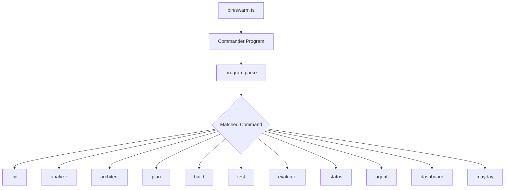

### Command Summary Table

| Command | Source File | Arguments | Pipeline Stage | Interactive Mode |
|---------|-----------|-----------|----------------|-----------------|
| `init` | `commands/init.ts` | None | N/A | No |
| `analyze` | `commands/analyze.ts` | `<feature-request>` | analyze | Yes (default) |
| `architect` | `commands/architect.ts` | None | architect | Yes (default) |
| `plan` | `commands/plan.ts` | None | plan | Yes (default) |
| `build` | `commands/build.ts` | None | build | No |
| `test` | `commands/test.ts` | None | test | Optional (`-i`) |
| `evaluate` | `commands/evaluate.ts` | None | evaluate | No |
| `status` | `commands/status.ts` | None | N/A | No |
| `agent` | `commands/agent.ts` | Subcommands | N/A | No |
| `dashboard` | `commands/dashboard.ts` | None | N/A | No |
| `mayday` | `commands/mayday.ts` | `[feature-request]` | All | No |

---

## 2. Shared Context

### The `createContext()` Factory

File: `packages/cli/src/commands/shared.ts`

Most commands (all except `init` and `status`) use `createContext()` to wire up the full runtime. It constructs and connects all core subsystems, then returns them as a `SwarmContext` object.

#### SwarmContext Interface

```typescript
interface SwarmContext {
  state: StateManager;          // Persists PipelineState to .swarm/state.json
  costTracker: CostTracker;     // Accumulates cost across agents
  promptLoader: PromptLoader;   // Resolves persona+stack to prompt files
  agentManager: AgentManager;   // Spawns, tracks, kills agents
  pipeline: Pipeline;           // Orchestrates the 4-stage workflow
  wsServer: SwarmWsServer;      // WebSocket server for dashboard communication
  cleanup: () => void;          // Kills agents, stops WS, flushes state
}
```

#### Construction Flow

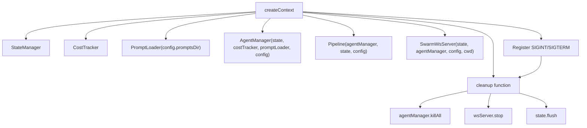

#### Signal Handling

`createContext()` replaces any existing `SIGINT`/`SIGTERM` listeners with a single handler that calls `cleanup()` and exits. This ensures all agents are killed, the WebSocket server is stopped, and state is flushed to disk on any termination.

```typescript
// Cleanup handler registered once per process
const onExit = () => {
  cleanup();      // killAll + stop WS + flush state
  process.exit(0);
};
process.removeAllListeners('SIGINT');
process.removeAllListeners('SIGTERM');
process.on('SIGINT', onExit);
process.on('SIGTERM', onExit);
```

#### Standard Command Pattern

Almost every pipeline command follows this pattern:

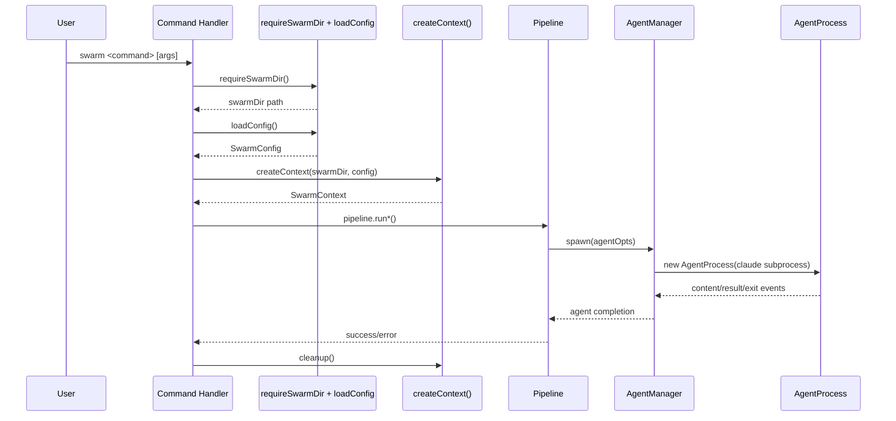

---

## 3. Commands

---

### 3.1 `swarm init`

Initializes a new Swarm project in the current working directory by creating the `.swarm/` configuration directory and all required files.

#### Options

| Flag | Long Form | Description | Default |
|------|-----------|-------------|---------|
| `-s` | `--stack <stack>` | Tech stack: `react`, `node`, `go` | `react` |
| `-m` | `--model <model>` | Default model: `sonnet`, `opus`, `haiku` | `opus` |
| `-b` | `--budget <amount>` | Max budget per agent in USD (0 = no limit) | `0` |
| `-n` | `--name <name>` | Project name | Directory name |

#### Behavior

- If `.swarm/` already exists, prints a warning and exits without changes.
- Derives the project name from the `-n` flag or falls back to the current directory name.
- Parses budget as a float; `0` or non-numeric values resolve to `null` (no limit).

#### Files Created

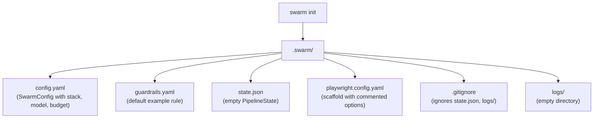

#### Internal Flow

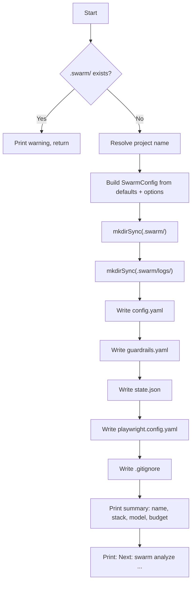

#### Default Guardrails

The generated `guardrails.yaml` includes a single example rule:

```yaml
rules:
  - name: "Custom: example rule"
    target: REQUIREMENTS.md
    checks:
      - type: section-exists
        value: Summary
        message: REQUIREMENTS.md should have a Summary section
        severity: warning
```

#### Notable Details

- Does **not** call `createContext()` -- it operates directly on the filesystem.
- Does **not** require an existing `.swarm/` directory (it creates one).
- Uses the `yaml` package's `stringify` function to serialize config and guardrails.
- `createEmptyPipeline()` from `types.ts` generates the initial state structure.

---

### 3.2 `swarm analyze <feature-request>`

Runs the **Analyst** persona to produce `REQUIREMENTS.md` from a feature request.

#### Arguments

| Argument | Required | Description |
|----------|----------|-------------|
| `<feature-request>` | Yes | Feature request text, or a file path if `--file` is set |

#### Options

| Flag | Long Form | Description | Default |
|------|-----------|-------------|---------|
| `-s` | `--stack <stack>` | Tech stack override | Config value |
| `-m` | `--model <model>` | Model override | Config value |
| `-f` | `--file` | Treat argument as file path to read | `false` |
| | `--figma <url>` | Figma design URL to pass to the analyst | None |
| | `--no-interactive` | Run in single-shot mode (no conversation) | Interactive on |

#### Execution Modes

**Interactive mode (default):** The analyst agent bootstraps with the prompt in headless mode, captures the initial response, then resumes with `claude --resume <session-id>` using `stdio: 'inherit'` so the user can converse directly in the terminal. No spinner is shown.

**Non-interactive mode (`--no-interactive`):** The analyst runs as a single-shot headless agent. An `ora` spinner displays during execution. Output is captured programmatically.

#### Internal Flow

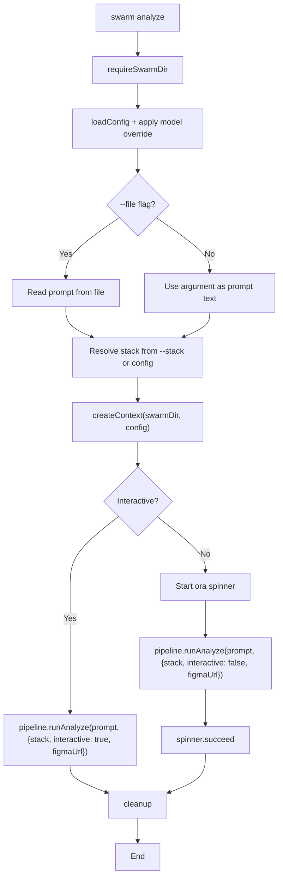

#### Output Artifact

- **REQUIREMENTS.md** -- Written to the project root by the analyst persona.
- The analyst persona is strictly bounded: no architecture decisions, no code, no task breakdowns.

---

### 3.3 `swarm architect`

Runs the **Architect** persona to produce `SPEC.md` from `REQUIREMENTS.md`.

#### Options

| Flag | Long Form | Description | Default |
|------|-----------|-------------|---------|
| `-s` | `--stack <stack>` | Tech stack override | Config value |
| `-m` | `--model <model>` | Model override | Config value |
| | `--no-interactive` | Run in single-shot mode | Interactive on |

#### Prerequisites

- `.swarm/` directory must exist (`requireSwarmDir()`).
- `REQUIREMENTS.md` must exist in the project root (read by the pipeline internally).

#### Internal Flow

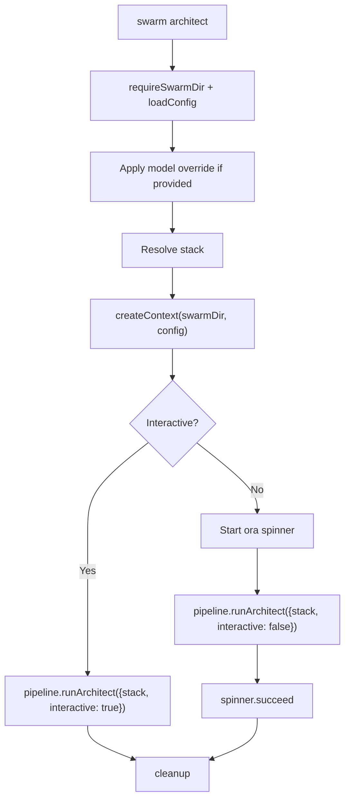

#### Output Artifact

- **SPEC.md** -- Architecture specification document.
- The architect persona is bounded: no code, no task breakdown.

---

### 3.4 `swarm plan`

Runs the **Lead** persona to produce `TASKS.md` from `SPEC.md`.

#### Options

| Flag | Long Form | Description | Default |
|------|-----------|-------------|---------|
| `-s` | `--stack <stack>` | Tech stack override | Config value |
| `-m` | `--model <model>` | Model override | Config value |
| | `--no-interactive` | Run in single-shot mode | Interactive on |

#### Prerequisites

- `SPEC.md` must exist in the project root.

#### Internal Flow

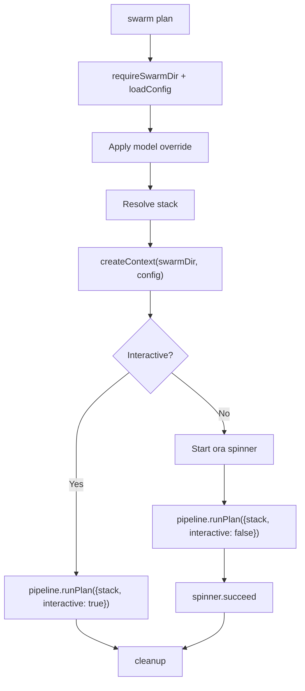

#### Output Artifact

- **TASKS.md** -- Structured task list with IDs (e.g., `FND-001`, `SVC-002`) and parallel group markers.
- The lead persona is bounded: no code, no architecture redesign.

---

### 3.5 `swarm build`

Runs **Engineer** persona(s) to implement the tasks defined in `TASKS.md`. Always runs in non-interactive (headless) mode.

#### Options

| Flag | Long Form | Description | Default |
|------|-----------|-------------|---------|
| `-s` | `--stack <stack>` | Tech stack override | Config value |
| `-m` | `--model <model>` | Model override | Config value |
| `-p` | `--parallel <n>` | Maximum parallel agents | `3` |
| `-t` | `--task <id>` | Run a specific task ID only | None (all tasks) |

#### Prerequisites

- `TASKS.md` must exist in the project root.

#### Execution Model

The pipeline parses `TASKS.md` using `Pipeline.parseTaskGroups()` to extract task IDs organized into parallel execution groups. Engineers are spawned as headless agents, up to the `--parallel` limit at a time.

**Single task mode:** When `--task <id>` is provided, only that specific task is executed.

#### Internal Flow

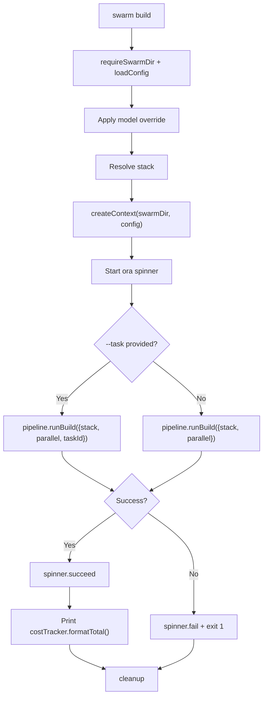

#### Parallel Execution Model

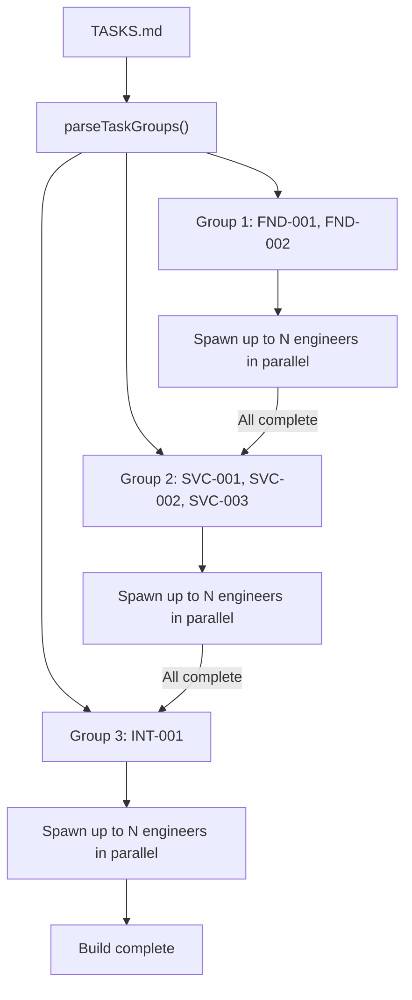

---

### 3.6 `swarm test`

Generates a test plan (`TESTPLAN.md`) and runs test-runner agents. Supports both interactive and non-interactive modes.

#### Options

| Flag | Long Form | Description | Default |
|------|-----------|-------------|---------|
| `-s` | `--stack <stack>` | Tech stack override | Config value |
| `-m` | `--model <model>` | Model override | Config value |
| `-p` | `--parallel <n>` | Max parallel agents | `2` |
| | `--figma <url>` | Figma design URL for visual test cases | None |
| `-i` | `--interactive` | Run tester in interactive mode | `false` |

#### Two-Phase Execution

**Phase 1 -- Test Plan Generation:** If `TESTPLAN.md` does not already exist, a test-engineer agent generates it based on the existing artifacts (REQUIREMENTS.md, SPEC.md, TASKS.md, and the codebase).

**Phase 2 -- Test Execution:** Test runner agents are spawned to execute the test plan. When `--figma` is provided, visual test cases are included.

#### Internal Flow

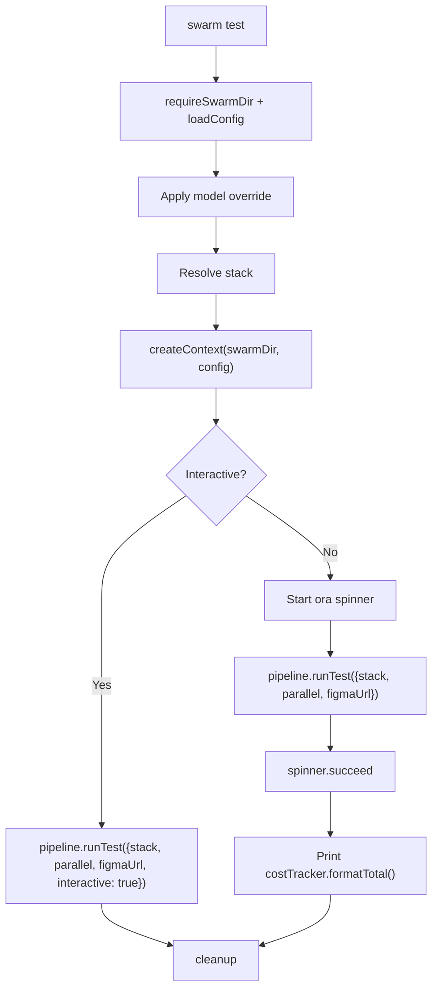

---

### 3.7 `swarm evaluate` (alias: `eval`)

Validates project artifacts against guardrail rules defined in `.swarm/guardrails.yaml`. This command does **not** use `createContext()` -- it directly instantiates `StateManager` and `GuardrailsEngine`.

#### Options

None.

#### Guardrail Check Types

| Check Type | Description |
|-----------|-------------|
| `section-exists` | Verifies a markdown section heading exists in the target file |
| `pattern-match` | Tests a regex pattern against the target file content |
| `command` | Runs a shell command and checks the exit code |

#### Internal Flow

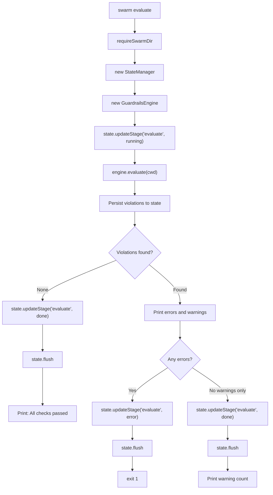

#### Output Format

Violations are displayed with color-coded severity:

- **Errors** (`FAIL`): Red. Block the pipeline. Exit code 1.
- **Warnings** (`WARN`): Yellow. Do not block. Exit code 0.

Each violation shows the message, the relative file path, and the rule name:

```
  FAIL  REQUIREMENTS.md should have a Summary section
       REQUIREMENTS.md [Custom: example rule]
```

Violations are also persisted to `state.json` so the dashboard can display them.

---

### 3.8 `swarm status`

Displays the current pipeline state and agent status. Read-only command that does **not** use `createContext()` -- it directly reads from `StateManager`.

#### Options

None.

#### Display Sections

1. **Project header** -- Name and tech stack.
2. **Pipeline stages table** -- All 6 stages with status, artifact path, and agent count.
3. **Agents table** -- Name, status, cost, token counts (input/output), and duration.
4. **Total cost summary** -- Aggregate USD cost and token counts.

#### Status Color Coding

| Status | Color |
|--------|-------|
| `pending` | Gray |
| `running` | Cyan |
| `done` | Green |
| `error` | Red |
| `killed` | Yellow |
| `skipped` | Dim |

#### Internal Flow

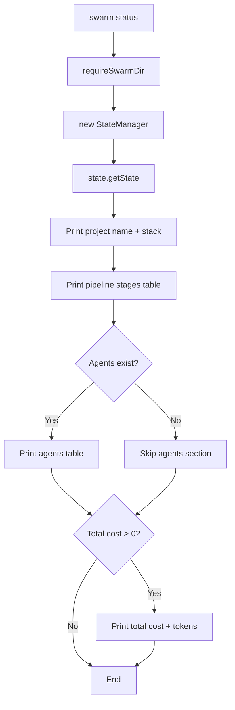

#### Pipeline Stages Displayed

| Stage | Label |
|-------|-------|
| `analyze` | Analyze |
| `architect` | Architect |
| `plan` | Plan |
| `build` | Build |
| `test` | Test |
| `evaluate` | Evaluate |

---

### 3.9 `swarm agent`

Parent command with three subcommands for managing individual agents outside the pipeline.

---

#### 3.9.1 `swarm agent spawn <name>`

Spawns a named agent with a specific persona and waits for it to complete.

##### Arguments

| Argument | Required | Description |
|----------|----------|-------------|
| `<name>` | Yes | Agent name (used for identification and display) |

##### Options

| Flag | Long Form | Description | Default |
|------|-----------|-------------|---------|
| | `--persona <persona>` | **Required.** Persona type: `analyst`, `architect`, `lead`, `engineer` | None |
| `-s` | `--stack <stack>` | Tech stack | Config value |
| `-m` | `--model <model>` | Model override | Config value |
| | `--prompt <prompt>` | Task prompt (text or file path) | Auto-generated |
| | `--file` | Treat prompt as file path | `false` |
| | `--budget <amount>` | Max budget for this agent in USD | None |

##### Internal Flow

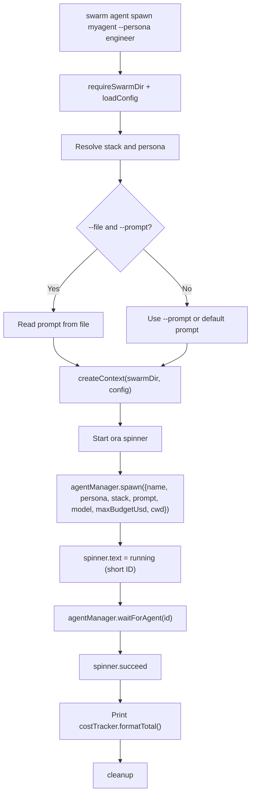

If no `--prompt` is provided, a default prompt is generated: `"Execute the {persona} workflow for a {stack} project"`.

---

#### 3.9.2 `swarm agent list`

Lists all agents from the persisted state.

##### Internal Flow

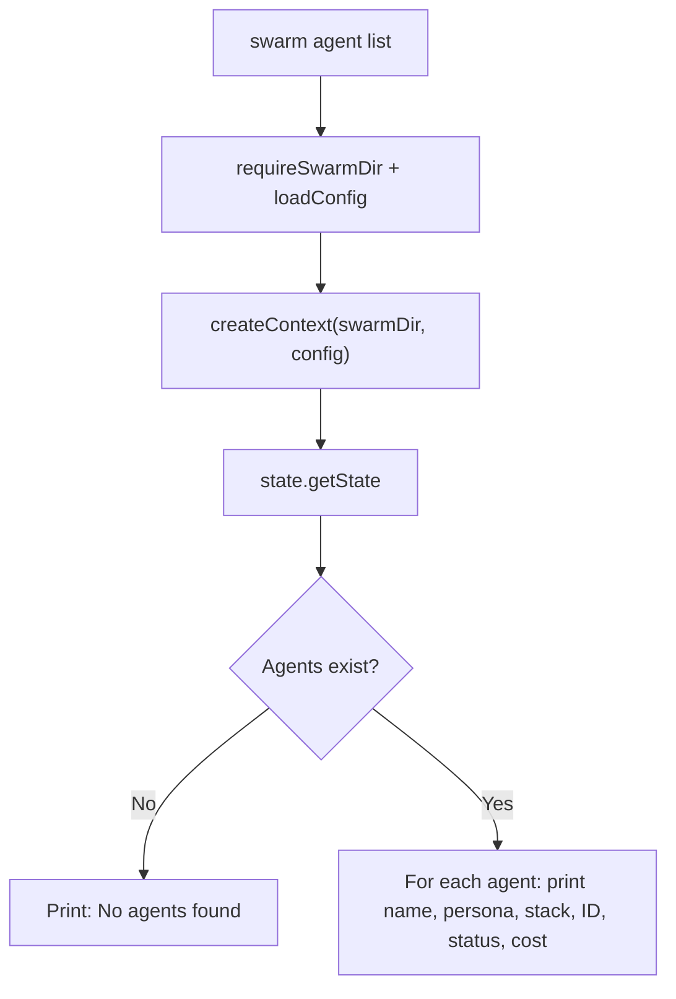

Displays each agent with:
- Name (bold), persona/stack in parentheses
- ID (dimmed), status (color-coded), cost in USD

---

#### 3.9.3 `swarm agent kill <name-or-id>`

Kills a running agent by name or UUID.

##### Arguments

| Argument | Required | Description |
|----------|----------|-------------|
| `<name-or-id>` | Yes | Agent name or UUID |

##### Internal Flow

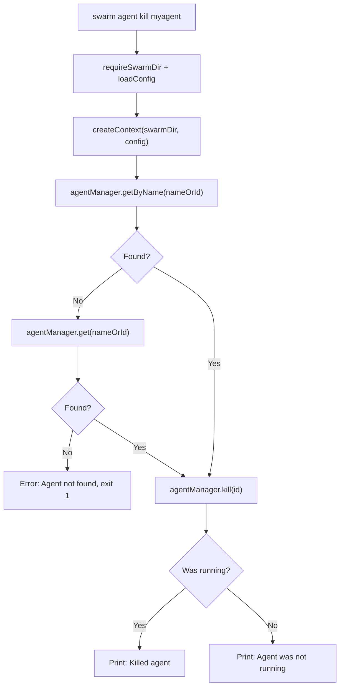

The command first tries to find the agent by name, then by ID. The `kill()` method returns `true` if the agent was actually running and was terminated.

---

### 3.10 `swarm dashboard`

Starts the web dashboard: an HTTP server for the React UI and a WebSocket server for real-time state synchronization.

#### Options

| Flag | Long Form | Description | Default |
|------|-----------|-------------|---------|
| | `--no-open` | Do not auto-open the browser | Auto-open on |

#### Ports

| Service | Default Port | Config Key |
|---------|-------------|------------|
| HTTP (dashboard UI) | 3848 | `config.dashboardPort` |
| WebSocket | 3847 | `config.wsPort` |

#### Internal Flow

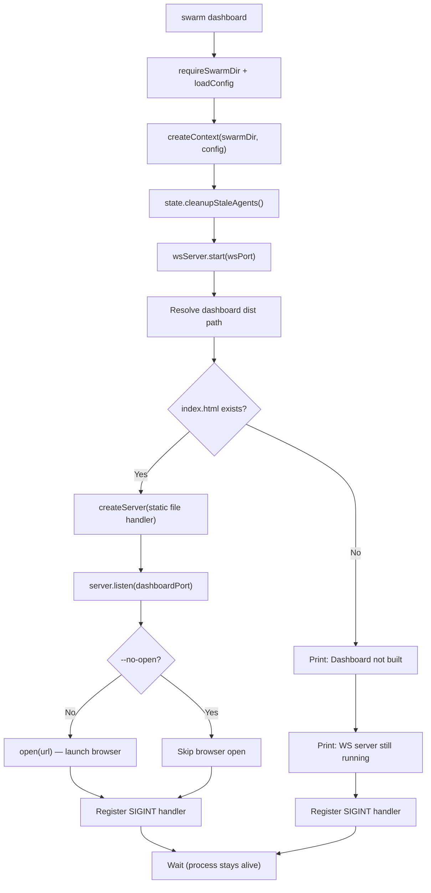

#### Dashboard Path Resolution

The dashboard static files are resolved relative to the compiled CLI module location:

```
dist/src/commands/dashboard.js
  → ../../../../dashboard/dist/
```

This traverses 4 directory levels from the compiled command file to reach `packages/dashboard/dist/`.

#### Static File Server

The built-in HTTP server handles:
- `/` maps to `/index.html`
- Known file extensions are served with correct MIME types (`html`, `js`, `css`, `json`, `svg`, `png`)
- Unknown routes fall back to `index.html` (SPA routing support)

#### Stale Agent Cleanup

On startup, `state.cleanupStaleAgents()` runs to:
- Remove all agents with `done` status from previous sessions.
- Mark any agents still in `running` status as `error` (orphaned processes).

#### Shutdown

The dashboard registers its own `SIGINT` handler that:
1. Closes the HTTP server.
2. Calls `cleanup()` (kills agents, stops WS, flushes state).
3. Exits with code 0.

---

### 3.11 `swarm mayday [feature-request]`

Autonomous end-to-end pipeline that runs analyze, architect, plan, build, test, and evaluate in sequence, with an automatic fix loop that iterates until all tests pass or the iteration limit is reached.

#### Arguments

| Argument | Required | Description |
|----------|----------|-------------|
| `[feature-request]` | Conditional | Required for new runs; not needed with `--resume` |

#### Options

| Flag | Long Form | Description | Default |
|------|-----------|-------------|---------|
| `-s` | `--stack <stack>` | Tech stack override | Config value |
| `-m` | `--model <model>` | Model override | Config value |
| `-p` | `--parallel <n>` | Max parallel agents | `3` |
| `-n` | `--max-iterations <n>` | Max fix-retest iterations | `5` |
| | `--figma <url>` | Figma design URL | None |
| `-f` | `--file` | Treat argument as file path to read | `false` |
| | `--resume` | Resume a previously interrupted session | `false` |

#### Two Execution Modes

**New run:** Requires a `feature-request` argument. Runs the full pipeline from analyze through evaluate with the fix loop.

**Resume mode (`--resume`):** Reads the persisted `MaydayState` from state and continues from where it left off. No feature request argument needed.

#### Internal Flow

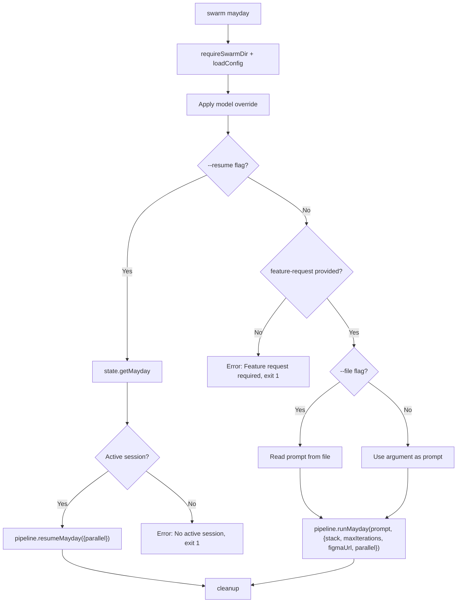

#### Autonomous Fix Loop

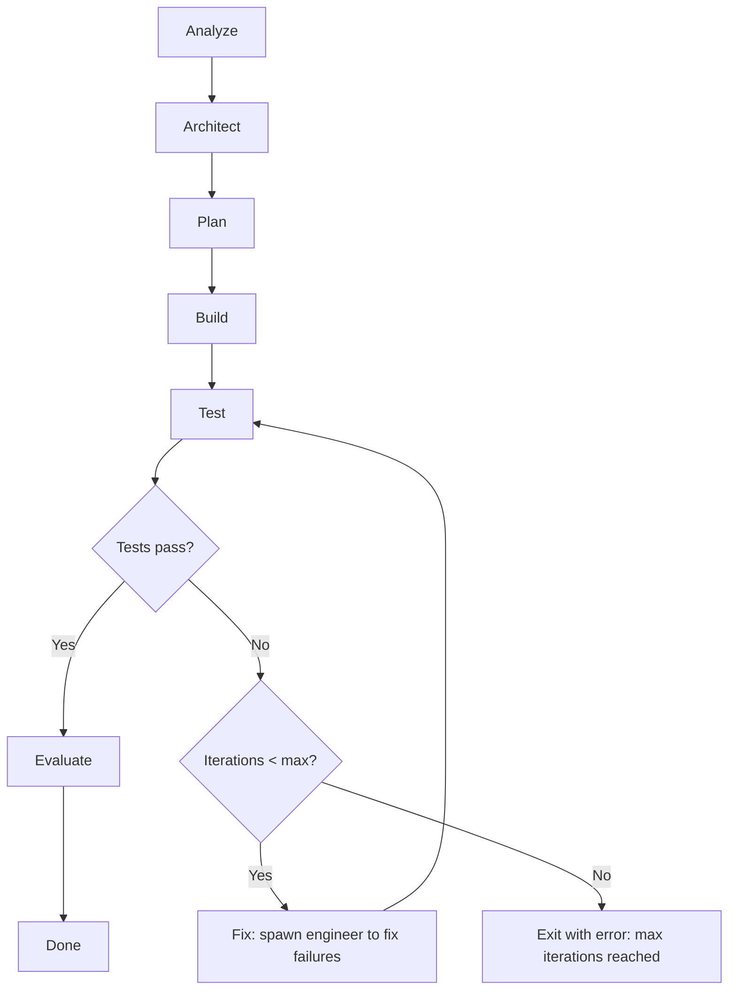

The `MaydayState` is persisted to `state.json` after each phase, enabling the `--resume` capability. This allows interrupted sessions to continue from the last completed phase rather than restarting from scratch.

---

## 4. Generic Command Execution Flow

The following sequence diagram shows the complete lifecycle of a typical pipeline command (analyze, architect, plan, build, test):

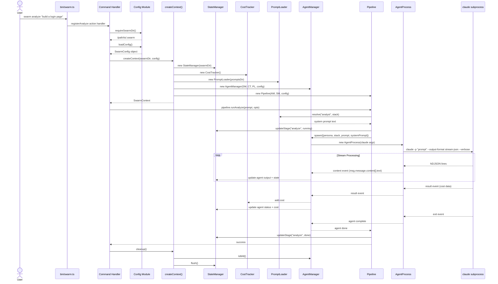

### Key Points

- **State persistence** happens at every significant event (agent spawn, content update, completion, error) via `StateManager`, which debounces writes to `.swarm/state.json` at 100ms intervals.
- **Cost tracking** accumulates across all agents for the session. The `CostTracker` aggregates input tokens, output tokens, and USD cost from `result` events.
- **WebSocket broadcasting** occurs when the dashboard is running -- `StateManager` emits events that `SwarmWsServer` relays to connected dashboard clients. Cross-process updates are detected via `fs.watch()` on `state.json`.
- **Prompt resolution** follows a search chain: custom directory (from config), bundled `prompts/` directory, `~/.claude/prompts/`, then `~/.claude/prompt/`. Filename casing varies by persona (e.g., `analyst-react.md` vs `Architect-React.md`).
- **Cleanup** is guaranteed via both explicit `cleanup()` calls in `finally` blocks and the registered `SIGINT`/`SIGTERM` handlers.
