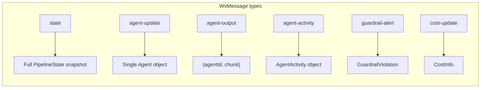
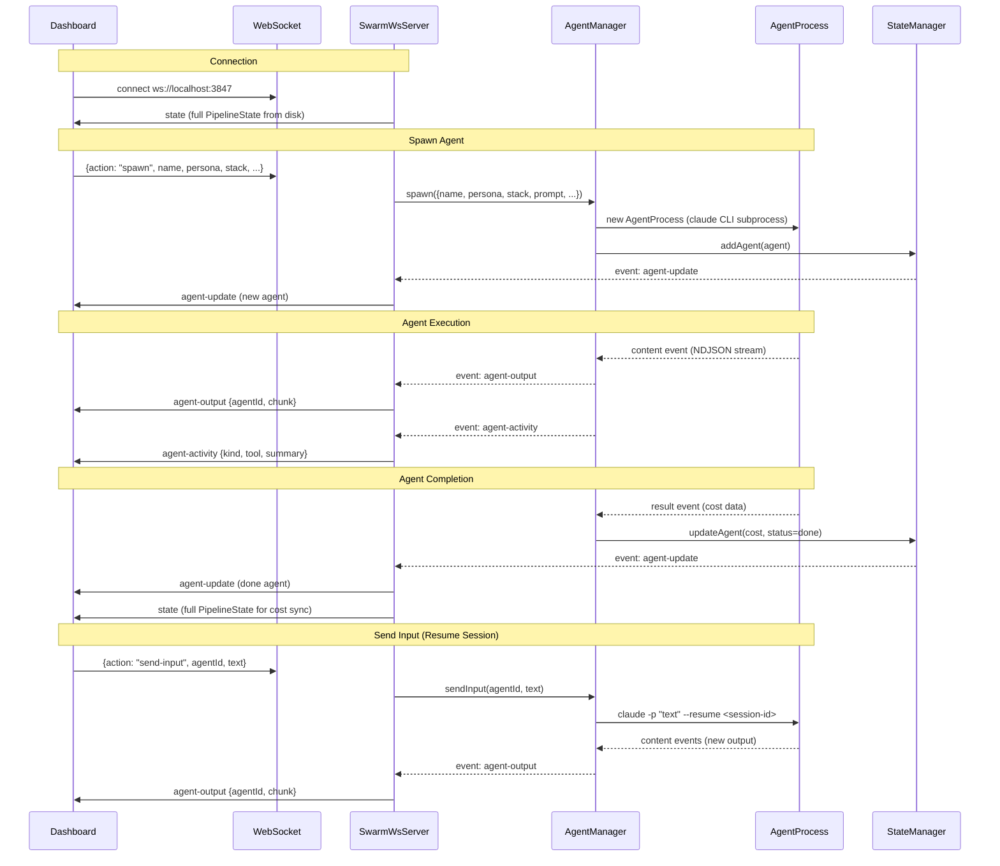
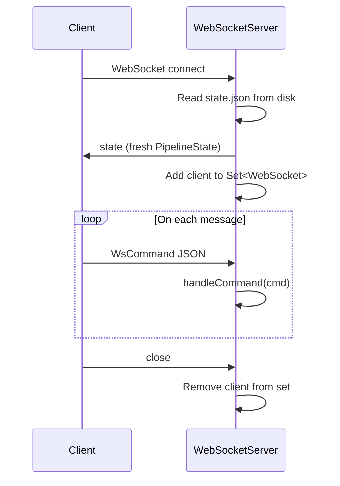
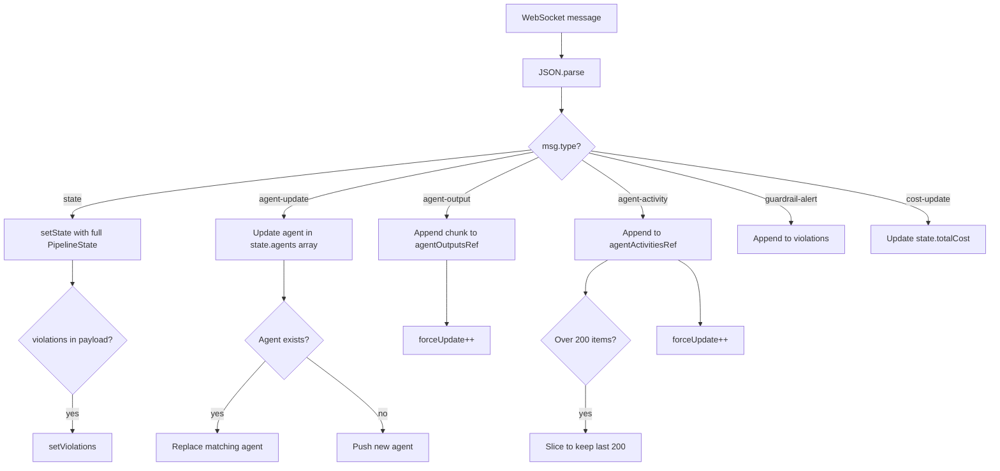
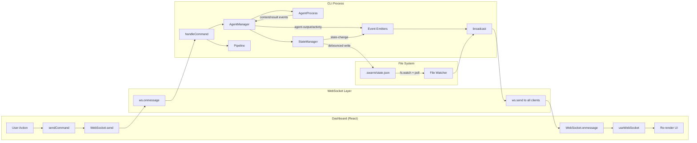
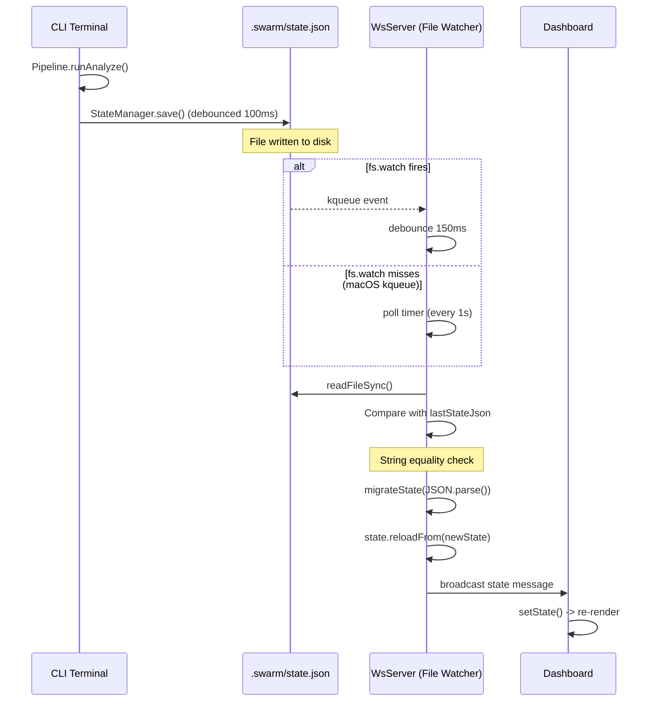

# Dashboard & WebSocket Communication

## 1. Dashboard Overview

The Swarm dashboard is a real-time web UI that connects to the CLI's WebSocket server to monitor and control Claude Code sub-agents.

**Tech stack:**

- **React 19** with functional components and hooks
- **Vite** for bundling and dev server
- **Tailwind CSS 4** for utility-first styling
- **lucide-react** for iconography (Terminal, Wifi, Play, Siren, Send, etc.)

**Design language:**

- Terminal-gothic dark theme built on `bg-[#0c0a09]` and `bg-[#0e0c0b]`
- Stone palette (`stone-300` through `stone-800`) for text and borders
- Red accents for active/running state (`red-400`, `red-600`, `red-950`)
- Monospace font (`font-mono`) throughout for terminal aesthetic
- Simulated terminal window dots (red/amber/green circles in header)
- Glow effects (`glow-red`) on selected/active elements
- Blinking pulse animations on running indicators

**Source location:** `packages/dashboard/src/`

---

## 2. Dashboard Layout

```
+------------------------------------------------------------------+
|  [o o o]  |  SWARM // projectName:stack       [wifi] CONNECTED   |
+----------+-------------------------------------------------------+
|          |  $ analyze > architect > plan > build > test > eval    |
|   COST   |    [violations badge]                    [MAYDAY btn]  |
|  $0.1234 |  2 running | 1 done | $0.1234 | 12.5k/8.2k tok | 45s |
|          +-------------------------------------------------------+
|  in  12k |                                                       |
|  out  8k |              ACTIVITY FEED / RAW OUTPUT               |
|  time 45s|                                                       |
|          |   1 | READ  src/App.tsx                      10:23:45  |
|  analyst |   2 | EDIT  src/utils.ts                     10:23:46  |
|  [$0.02] |   3 | BASH  npm test                         10:23:50  |
|  engineer|   4 | THINK planning next step...             10:23:51  |
|  [$0.08] |   5 | text  Here is the implementation...     10:23:52  |
|          |                                                       |
+----------+                                                       |
| PROCESSES|                                                       |
|  (3) [+] |                                                       |
|          |-------------------------------------------------------+
| [*] eng-1|  > send input...                              [send]  |
| [+] anlst|                                                       |
| [x] arch |                                                       |
+----------+-------------------------------------------------------+
```

**Layout structure (flexbox):**

| Region | Component | Width | Description |
|--------|-----------|-------|-------------|
| Header | `App.tsx` header | Full width | Terminal title bar with project name, connection status |
| Left sidebar | `<aside>` | `w-72` (288px) | CostPanel + agent list with spawn button |
| Top bar | `TopBar` | Fills remaining | Pipeline stages, MayDay controls, stats |
| Main content | `OutputStream` | Fills remaining | Activity feed or raw output with input box |
| Overlays | `SpawnDialog`, `KillConfirmDialog` | Modal | Full-screen backdrop modals |

---

## 3. Component Breakdown

### App.tsx

**File:** `packages/dashboard/src/App.tsx`

The root component that orchestrates layout and state.

**State management:**

| State | Type | Purpose |
|-------|------|---------|
| `selectedAgentId` | `string \| null` | Currently selected agent in sidebar |
| `showSpawn` | `boolean` | Controls SpawnDialog visibility |
| `killTarget` | `Agent \| null` | Agent pending kill confirmation |

**Hook integration:**

```
useWebSocket() -> { state, connected, agentOutputs, agentActivities, violations, sendCommand }
```

All child components receive data and callbacks from this single hook. The `sendCommand` function is passed to `TopBar`, `SpawnDialog`, and `KillConfirmDialog` for sending WebSocket commands.

**Conditional rendering:**

- No state yet: shows "awaiting connection..." placeholder with terminal prompt
- State loaded: renders the full sidebar + main layout
- `showSpawn`: renders `SpawnDialog` modal overlay
- `killTarget`: renders `KillConfirmDialog` modal overlay
- `violations.length > 0`: renders `GuardrailAlerts` banner above the output stream

---

### TopBar.tsx

**File:** `packages/dashboard/src/components/TopBar.tsx`

The command center for pipeline control. Contains three logical sections.

**Pipeline stage buttons:**

Renders 6 stages as a terminal-style breadcrumb with `$` prefix and `>` separators:

| Stage | Label | Artifact | Runnable | Input required |
|-------|-------|----------|----------|----------------|
| `analyze` | analyze | REQUIREMENTS.md | Yes | Feature prompt + optional Figma URL |
| `architect` | architect | SPEC.md | Yes | None (reads REQUIREMENTS.md) |
| `plan` | plan | TASKS.md | Yes | Guidance prompt |
| `build` | build | code | Yes | None (reads TASKS.md) |
| `test` | test | TESTPLAN.md | Yes | Optional base URL, auth state, Figma URL |
| `evaluate` | eval | report | No | N/A |

**Stage status indicators:**

| Status | Visual |
|--------|--------|
| Running | Red pulsing dot + `bg-red-950/50` background |
| Done | Green `+` prefix |
| Error | Red `x` prefix |
| Pending (runnable) | Gray text, Play icon on hover |
| Pending (not runnable) | Dimmed gray text |

**Inline prompt inputs:**

Clicking `analyze`, `plan`, or `test` opens an inline input form rather than immediately running. Each has distinct fields:

- **Analyze:** feature description (required) + Figma URL (optional)
- **Plan:** guidance prompt for task breakdown (required)
- **Test:** base URL (optional) + auth storage state path (optional) + Figma URL (optional)

**MayDay controls:**

| State | UI |
|-------|----|
| Inactive | Red "mayday" button with Siren icon |
| Paused | Red "resume" button |
| Active | Status badge showing current stage + fix iteration count + failure count, message button, stop button |

MayDay launch opens an inline form with: feature description input, model selector (opus/sonnet/haiku toggle buttons), and optional Figma URL.

**Stats bar:**

Displays in `text-[10px] font-mono` at the bottom:

```
2 running | 1 done | $0.1234 | 12.5k/8.2k tok | 45s
```

Shows running (red), done (green), errored (red) counts separated by `|`, total USD cost, token counts (input/output), and elapsed duration.

---

### AgentCard.tsx

**File:** `packages/dashboard/src/components/AgentCard.tsx`

Compact card for each agent in the sidebar list.

**Status indicator symbols:**

| Status | Symbol | Color |
|--------|--------|-------|
| `pending` | `[-]` | `text-stone-600` |
| `running` | `[*]` | `text-red-400` |
| `done` | `[+]` | `text-green-500` |
| `error` | `[x]` | `text-red-500` |
| `killed` | `[!]` | `text-stone-500` |

**Persona color coding:**

| Persona | Color class |
|---------|------------|
| analyst | `text-purple-400` |
| architect | `text-blue-400` |
| lead | `text-amber-400` |
| engineer | `text-red-400` |
| tester | `text-green-400` |

**Card content (3 lines):**

1. Status indicator + agent name + kill button (running only)
2. Persona label + `:` + stack + orchestrator badge (`Crown` icon + child count) or sub-agent badge (`GitBranch` icon)
3. Cost (`$0.0000`) + token counts (`Xk/Yk`) + elapsed time

**Error display:** If `agent.error` exists, a truncated (80 char) red error line appears below.

**Selection states:**

- Selected: `bg-stone-900/60`, red border with `glow-red`
- Running (unselected): `bg-stone-900/30`, subtle border
- Default: transparent, hover reveals background

---

### OutputStream.tsx

**File:** `packages/dashboard/src/components/OutputStream.tsx`

The main content area showing agent output with two view modes.

**View modes:**

| Mode | Tab label | Content |
|------|-----------|---------|
| `activity` | log | Structured activity feed (tool_use, thinking, text) |
| `raw` | raw | Plain text output from agent |

**Activity feed items:**

Each `ActivityItem` renders with a line number, pipe separator, and type-specific formatting:

| Activity kind | Display | Icon | Color |
|---------------|---------|------|-------|
| `tool_use` (Read) | `READ` | FileText | `text-blue-400` |
| `tool_use` (Edit) | `EDIT` | Pencil | `text-amber-400` |
| `tool_use` (Write) | `WRITE` | Pencil | `text-amber-400` |
| `tool_use` (Bash) | `BASH` | TerminalSquare | `text-green-400` |
| `tool_use` (Grep) | `GREP` | Search | `text-purple-400` |
| `tool_use` (Glob) | `GLOB` | FolderSearch | `text-purple-400` |
| `tool_use` (Agent) | `AGENT` | Zap | `text-red-400` |
| `tool_use` (WebSearch) | `SEARCH` | Globe | `text-cyan-400` |
| `tool_use` (WebFetch) | `FETCH` | Globe | `text-cyan-400` |
| `thinking` | `THINK` | Brain | `text-violet-400` |
| `text` | (plain text) | none | `text-stone-300` |
| `tool_result` | (hidden) | N/A | N/A |

**Expandable content:** Items with `content.length > 200` get a chevron toggle to expand/collapse the full content in a dark code block.

**Auto-scroll:** Tracks scroll position; auto-scrolls when user is within 40px of the bottom. Stops auto-scrolling when user scrolls up.

**Input box:** Shown for `running` or `done` agents. Sends `send-input` command to resume the agent's session. Local messages are displayed inline with a green `>` prefix while awaiting agent response.

---

### CostPanel.tsx

**File:** `packages/dashboard/src/components/CostPanel.tsx`

Sidebar panel displaying cost and token metrics.

**Sections:**

1. **Total cost** -- prominent USD display (`text-sm font-semibold text-amber-500`)
2. **Token breakdown** -- rows for: `in` (input tokens), `out` (output tokens), `cache` (read/write, shown only when >0), `time` (duration in seconds)
3. **Per-persona cost bars** -- horizontal bar chart grouped by persona, with persona-specific colors:

| Persona | Bar color |
|---------|-----------|
| analyst | `bg-purple-600/60` |
| architect | `bg-blue-600/60` |
| lead | `bg-amber-600/60` |
| engineer | `bg-red-600/60` |

Bars are scaled relative to the maximum persona cost.

---

### SpawnDialog.tsx

**File:** `packages/dashboard/src/components/SpawnDialog.tsx`

Modal form for manually spawning agents from the dashboard.

**Form fields:**

| Field | Flag | Type | Options/Default |
|-------|------|------|-----------------|
| Name | `--name` | text input | Required |
| Persona | `--persona` | select | analyst, architect, lead, engineer |
| Stack | `--stack` | select | react, node, go |
| Model | `--model` | select | opus (default), sonnet, haiku |
| Permission mode | `--permission-mode` | button grid (2x2) | See below |
| Prompt | `-p` | textarea | Optional task description |

**Permission modes:**

| Value | Label | Description |
|-------|-------|-------------|
| `acceptEdits` | accept-edits | Auto-approve file edits |
| `auto` | auto | Auto-approve safe actions |
| `plan` | plan | Read-only exploration |
| `bypassPermissions` | bypass | Skip all checks |

On submit, sends `WsCommand { action: 'spawn', ... }` with all fields.

---

### GuardrailAlerts.tsx

**File:** `packages/dashboard/src/components/GuardrailAlerts.tsx`

Banner component displayed between TopBar and OutputStream when violations exist.

**Violation display:**

| Severity | Icon | Background | Text color |
|----------|------|------------|------------|
| error | `XOctagon` | `bg-red-950/20` | `text-red-400` |
| warning | `AlertTriangle` | `bg-amber-950/15` | `text-amber-400` |

Each violation shows: severity icon + message + filename (basename only). The list is scrollable with a `max-h-40` constraint.

Header shows counts: `guardrails (X err, Y warn)`.

---

### KillConfirmDialog.tsx

**File:** `packages/dashboard/src/components/KillConfirmDialog.tsx`

Confirmation modal before terminating an agent.

**Content:**

- Title bar: `$ kill --signal SIGTERM`
- Body: "terminate process {agent.name}?" with "in-progress work will be lost." warning
- Actions: `cancel` (gray) and `kill -9` (red)

On confirm, sends `WsCommand { action: 'kill', agentId: agent.id }`.

---

## 4. WebSocket Protocol

### Server-to-Client Messages (`WsMessage`)



| Type | Payload Type | Triggered When |
|------|-------------|----------------|
| `state` | `PipelineState` | On initial connection; on any state change; on file watcher detection |
| `agent-update` | `Agent` | Agent status change (spawned, running, done, error, killed) |
| `agent-output` | `{ agentId: string, chunk: string }` | Agent produces text output (streamed incrementally) |
| `agent-activity` | `AgentActivity` | Agent uses a tool, produces text, or has a thinking block |
| `guardrail-alert` | `GuardrailViolation` | Guardrail engine detects a rule violation |
| `cost-update` | `CostInfo` | Aggregate cost changes |

### Client-to-Server Commands (`WsCommand`)

| Action | Parameters | Effect |
|--------|-----------|--------|
| `spawn` | `name`, `persona`, `stack`, `model?`, `prompt?`, `permissionMode?` | Spawns a new Claude agent process with persona-specific system prompt and tool restrictions |
| `kill` | `agentId` | Sends SIGTERM to the agent process |
| `send-input` | `agentId`, `text` | Resumes the agent's session with `claude -p "<text>" --resume <session-id>` |
| `get-state` | (none) | Requests a full `PipelineState` broadcast |
| `run-stage` | `stage`, `prompt?`, `parallel?`, `taskId?`, `figmaUrl?`, `baseUrl?`, `authStorageState?` | Runs a pipeline stage (analyze, architect, plan, build, test) |
| `run-mayday` | `prompt`, `maxIterations?`, `figmaUrl?`, `parallel?`, `resume?`, `model?` | Starts or resumes the MayDay autonomous pipeline |
| `mayday-input` | `text` | Sends user guidance to the running MayDay pipeline |
| `mayday-stop` | (none) | Pauses MayDay, kills all running agents |

### Message Flow Sequence



---

## 5. WebSocket Server (`SwarmWsServer`)

**File:** `packages/cli/src/core/ws-server.ts`

**Port:** 3847 (default, configurable)

### Initialization

The server is constructed with references to `StateManager`, `AgentManager`, and `SwarmConfig`. On construction, it subscribes to in-process events:

| Event source | Event | Action |
|-------------|-------|--------|
| `StateManager` | `agent-update` | Broadcasts `agent-update` message |
| `StateManager` | `state-change` | Broadcasts full `state` message |
| `AgentManager` | `agent-output` | Broadcasts `agent-output` message |
| `AgentManager` | `agent-activity` | Broadcasts `agent-activity` message |
| `AgentManager` | `agent-error` | Broadcasts `agent-update` message |
| `AgentManager` | `agent-done` | Broadcasts `agent-update` + full `state` (for cost sync) |

### Connection Lifecycle



### File Watching (Cross-Process Sync)

The server watches `.swarm/state.json` for changes from other CLI processes (e.g., a `swarm analyze` running in another terminal).

**Dual-mechanism approach:**

1. **`fs.watch()` (kqueue on macOS):** Primary watcher, fires on filesystem events. Triggers a debounced check with a **150ms** delay to coalesce rapid writes.
2. **Polling (setInterval):** Fallback at **1-second intervals** to catch events that kqueue misses on macOS.

**Change detection flow:**

```
fs.watch event OR poll tick
        |
        v
  Read state.json
        |
        v
  Compare with lastStateJson (string equality)
        |
  [different?]
    |         |
   yes        no -> skip
    |
    v
  Parse JSON
    |
    v
  migrateState() -- ensure all 6 stages exist
    |
    v
  state.reloadFrom(newState) -- update in-memory state
    |
    v
  broadcast({ type: 'state', payload: newState })
```

### Command Handling

The `handleCommand()` method dispatches on `cmd.action`:

| Command | Handler behavior |
|---------|-----------------|
| `spawn` | Builds persona-specific prompt with role constraints and enforcement rules. Spawns via `AgentManager`. Non-engineer personas get `disallowedTools: ['Bash', 'Edit', 'NotebookEdit']` and `appendSystemPrompt` with strict formatting rules. |
| `kill` | Calls `AgentManager.kill(agentId)` |
| `send-input` | Calls `AgentManager.sendInput(agentId, text)` which resumes the Claude session |
| `get-state` | Broadcasts full state to all clients |
| `run-stage` | Runs asynchronously (non-blocking). Delegates to `Pipeline.runAnalyze()`, `runArchitect()`, `runPlan()`, `runBuild()`, or `runTest()`. For `test`, writes Playwright config if base URL or auth state provided. |
| `run-mayday` | Runs asynchronously. Starts or resumes autonomous MayDay pipeline via `Pipeline.runMayday()` or `resumeMayday()`. |
| `mayday-input` | Pushes user message to `StateManager.pushMaydayMessage()` for the running MayDay pipeline to consume. |
| `mayday-stop` | Sets MayDay to inactive with `pausedAt` timestamp, kills all running agents. |

### Persona Prompt Construction

When spawning agents via the dashboard, the server wraps user prompts in persona-specific constraints:

| Persona | Constraints applied |
|---------|-------------------|
| analyst | Must produce REQUIREMENTS.md with sections 0-12, no code/architecture/tasks |
| architect | Must produce SPEC.md with ADRs and Mermaid diagrams, no code/tasks |
| lead | Must produce TASKS.md in `T001 [P] [US1]` format, no code/architecture |
| tester | Must produce TESTPLAN.md with TC-001 format test cases, no implementation code |
| engineer | Receives raw user prompt with no additional constraints |

### State Migration

The `migrateState()` function ensures all 6 expected stages (`analyze`, `architect`, `plan`, `build`, `test`, `evaluate`) exist in state loaded from disk, adding missing ones as `{ status: 'pending', agentIds: [], artifact: null }`. This handles schema changes across versions.

---

## 6. `useWebSocket` Hook

**File:** `packages/dashboard/src/hooks/useWebSocket.ts`

The single hook that manages all dashboard-to-CLI communication.

### Connection Configuration

| Setting | Value |
|---------|-------|
| URL | `ws://${window.location.hostname}:3847` |
| Initial reconnect delay | 2,000ms |
| Max reconnect delay | 30,000ms |
| Backoff multiplier | 1.5x |

### State Management

| State variable | Type | Storage | Purpose |
|---------------|------|---------|---------|
| `state` | `PipelineState \| null` | `useState` | Full pipeline state (triggers re-render) |
| `connected` | `boolean` | `useState` | WebSocket connection status |
| `violations` | `GuardrailViolation[]` | `useState` | Accumulated guardrail violations |
| `agentOutputsRef` | `Map<string, string>` | `useRef` | Raw output text per agent (no re-render on update) |
| `agentActivitiesRef` | `Map<string, AgentActivity[]>` | `useRef` | Activity log per agent (no re-render on update) |
| `forceUpdate` | counter | `useState` | Incremented to force re-render after ref mutations |

### Message Handling



**Activity cap:** Each agent's activity list is capped at **200 entries** (most recent), preventing unbounded memory growth during long-running agents.

**Reconnection:** On `ws.onclose`, the hook schedules a reconnection after `reconnectDelay` milliseconds, then multiplies the delay by 1.5 (capped at 30 seconds). On successful reconnect, the delay resets to 2 seconds.

### Return Value

```typescript
interface UseWebSocketReturn {
  state: PipelineState | null;           // Full pipeline state or null before connection
  connected: boolean;                     // WebSocket connection status
  agentOutputs: Map<string, string>;      // Live output text per agent
  agentActivities: Map<string, AgentActivity[]>; // Activity log per agent
  violations: GuardrailViolation[];       // Guardrail violations
  sendCommand: (cmd: WsCommand) => void;  // Send command if WebSocket is open
}
```

The `sendCommand` function checks `wsRef.current?.readyState === WebSocket.OPEN` before sending, silently dropping commands when disconnected.

---

## 7. Dashboard-CLI Communication Flow

### Full Round-Trip Architecture



### Cross-Process Synchronization

When a CLI command runs in a separate terminal (e.g., `swarm analyze "build a login page"`), the state updates flow through the filesystem:



---

## 8. Real-time Updates

### Three Update Pathways

The dashboard receives real-time updates through three complementary mechanisms:

**1. In-process event emitters (primary path for dashboard-spawned agents):**

When agents are spawned from the dashboard, the `AgentManager` and `StateManager` emit events directly. These are subscribed to in the `SwarmWsServer` constructor and immediately broadcast to all connected WebSocket clients.

| Emitter | Event | Broadcast type |
|---------|-------|---------------|
| `StateManager` | `agent-update` | `agent-update` |
| `StateManager` | `state-change` | `state` |
| `AgentManager` | `agent-output` | `agent-output` |
| `AgentManager` | `agent-activity` | `agent-activity` |
| `AgentManager` | `agent-error` | `agent-update` |
| `AgentManager` | `agent-done` | `agent-update` + `state` |

**2. File system watching (cross-process path):**

When agents are spawned from a separate CLI terminal, the `SwarmWsServer` detects changes to `.swarm/state.json` via `fs.watch()` (kqueue) with a 150ms debounce, backed by 1-second polling. This ensures the dashboard stays in sync regardless of which process modifies state.

**3. On-connect snapshot:**

When a new WebSocket client connects, the server reads `state.json` fresh from disk and sends the complete `PipelineState` as the first message. This ensures the dashboard immediately reflects the current state even if it connects mid-pipeline.

### Dashboard Re-render Strategy

Not all incoming messages trigger React re-renders the same way:

| Message type | Storage | Re-render trigger |
|-------------|---------|-------------------|
| `state` | `useState` | Automatic (React state update) |
| `agent-update` | `useState` (merged into `state.agents`) | Automatic |
| `cost-update` | `useState` (merged into `state.totalCost`) | Automatic |
| `guardrail-alert` | `useState` | Automatic |
| `agent-output` | `useRef` (Map) | Manual (`forceUpdate` counter increment) |
| `agent-activity` | `useRef` (Map) | Manual (`forceUpdate` counter increment) |

Output and activity data use `useRef` instead of `useState` to avoid creating new Map objects on every chunk, which would cause excessive re-renders during high-frequency streaming. The `forceUpdate` counter triggers a single re-render that reads the latest ref values.
