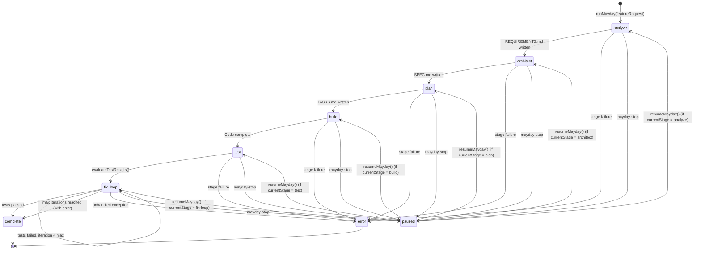
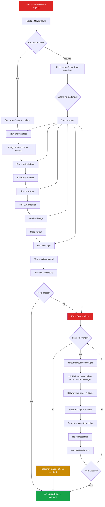
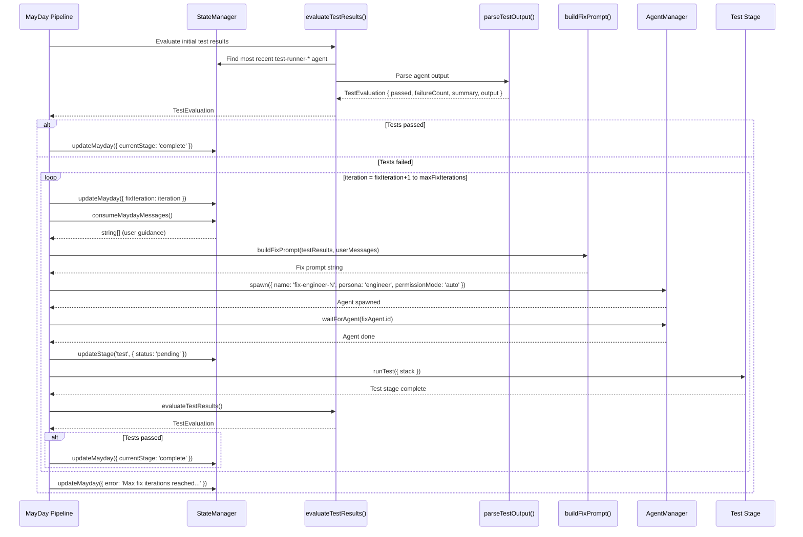

# 06 -- MayDay: Autonomous End-to-End Pipeline

## 1. MayDay Overview

MayDay is Swarm's fully autonomous execution mode. Given a feature request, it runs the entire pipeline -- Analyst, Architect, Lead, Build, Test -- then enters a **fix-retest loop** that spawns fresh engineer agents to repair failing tests until the suite goes green or a configurable iteration cap is reached.

Key properties:

- **Fully autonomous**: no human intervention required between stages. Each stage feeds its artifact to the next.
- **Fix-retest loop**: after the initial build and test, MayDay evaluates test output. If tests fail, it constructs a targeted fix prompt from the failure output, spawns a fix engineer, re-runs tests, and repeats.
- **Resumable**: the entire `MaydayState` is persisted inside `state.json`. A crashed or stopped session can be resumed from the exact stage it left off -- via `swarm mayday --resume` or the dashboard resume button.
- **User input mid-flight**: users can queue guidance messages at any time. These are drained at natural pause points (between stages and before each fix iteration) and injected into prompts.
- **Configurable iteration cap**: `--max-iterations` (default 5) prevents runaway loops.

---

## 2. MayDay State Machine



### Resume entry points

`resumeMayday()` reads `mayday.currentStage` from persisted state and re-enters `executeMaydayPipeline()` at that exact stage index. If `currentStage` is `fix-loop`, the loop resumes from `mayday.fixIteration + 1`.

---

## 3. MaydayState Interface

Defined in `packages/cli/src/types.ts` (lines 75-90):

```typescript
export interface MaydayState {
  active: boolean;               // Whether the session is running
  featureRequest: string;        // Original user prompt
  currentStage: StageName | 'fix-loop' | 'complete';
  fixIteration: number;          // Current fix loop iteration (0 = not started)
  maxFixIterations: number;      // Cap (default 5)
  lastTestOutput: string | null; // Truncated test runner output (last 5000 chars)
  lastTestPassed: boolean | null;
  failureCount: number | null;   // Number of failed tests (-1 for non-Playwright failures)
  fixAgentIds: string[];         // IDs of all fix-engineer agents spawned
  userMessages: string[];        // Queued user guidance messages
  startedAt: number;             // Epoch ms
  pausedAt: number | null;       // Set on mayday-stop, cleared on resume
  error: string | null;          // Terminal error message
  figmaUrl?: string;             // Optional Figma design URL passed through to stages
}
```

`MaydayState` lives as an optional field on `PipelineState`:

```typescript
export interface PipelineState {
  // ...
  mayday?: MaydayState;
}
```

---

## 4. MayDay Flow



### Stage-by-stage detail

| Step | Stage | Agent persona | Artifact produced | Notes |
|------|-------|--------------|-------------------|-------|
| 1 | `analyze` | analyst | `REQUIREMENTS.md` | Feature request injected into prompt. Figma URL passed if provided. |
| 2 | `architect` | architect | `SPEC.md` | Reads `REQUIREMENTS.md`. Non-interactive, `auto` permission mode. |
| 3 | `plan` | lead | `TASKS.md` | Reads `SPEC.md`. User messages injected as guidance prompt. |
| 4 | `build` | engineer(s) | Source code | Parses `TASKS.md` for parallel task groups. Multiple agents may run. |
| 5 | `test` | tester + engineer | `TESTPLAN.md` + test results | Test runner executes Playwright suite. |
| 6 | fix-loop | engineer | Bug fixes | Spawns `fix-engineer-N` per iteration. |

Between every stage, MayDay checks:
1. `this.state.getMayday()?.active` -- if `false`, the pipeline exits gracefully (user stopped it).
2. `this.state.consumeMaydayMessages()` -- drains any queued user guidance.

---

## 5. Fix-Retest Loop



### Key functions

**`evaluateTestResults()`** -- finds the most recent agent whose name starts with `test-runner-` (searched in reverse order from the agents array), extracts its `output` field, and delegates to `parseTestOutput()`.

**`parseTestOutput(output)`** -- applies regex patterns to detect pass/fail counts and generic failure indicators. Returns a `TestEvaluation`.

**`buildFixPrompt(testResults, userMessages)`** -- constructs a prompt for the fix engineer containing: the last 3000 characters of test output, a summary line, any user guidance messages, and explicit rules (fix application code, don't break passing tests, run Playwright to verify).

---

## 6. Test Result Parsing

### Regex patterns

```typescript
// Playwright output patterns
const passedMatch = output.match(/(\d+)\s+passed/);
const failedMatch = output.match(/(\d+)\s+failed/);

// Generic failure indicators (fallback for non-Playwright output)
const hasGenericFail = /(?:FAIL|Error:|✗|AssertionError|expect\(.*\)\.to)/i.test(output);
```

### Pass/fail determination

A test run is considered **passed** when ALL of the following are true:
1. `failedCount === 0` (no Playwright-style failure count)
2. `!hasGenericFail` (no generic failure indicators)
3. `passedCount > 0` (at least one test passed)

If tests fail but the output is not Playwright-formatted, `failureCount` is set to `-1` to indicate "failures detected, count unknown."

### TestEvaluation interface

```typescript
interface TestEvaluation {
  passed: boolean;             // true only if all conditions above are met
  failureCount: number | null; // Parsed failed count, -1 for generic failures, null if no runner found
  summary: string;             // Human-readable: "5 passed, 2 failed" or "Could not parse test results"
  output: string | null;       // Truncated to last 5000 chars for storage
}
```

### Output truncation

Test output stored in `MaydayState.lastTestOutput` is capped at 5000 characters (tail). The fix prompt further truncates to the last 3000 characters of the `TestEvaluation.output` via `testResults.output?.slice(-3000)`.

---

## 7. Cross-Session Resume

MayDay state is fully persisted as part of `PipelineState` in `.swarm/state.json`. This enables resume after:
- CLI process crash or Ctrl+C
- Explicit `mayday-stop` from dashboard
- Machine restart

### Persistence path

```
.swarm/state.json → PipelineState.mayday → MaydayState
```

`StateManager` writes are debounced at 100ms via `scheduleSave()`. Every `updateMayday()` call triggers a debounced write and emits `state-change`, which the WebSocket server broadcasts to connected dashboards.

### Resume flow

**CLI:**
```bash
swarm mayday --resume
```

The command handler checks `state.getMayday()?.active`. If no active session exists, it exits with an error. Otherwise it calls `pipeline.resumeMayday()`.

**Dashboard:**
The resume button appears when `mayday.pausedAt` is set. It sends a `run-mayday` WebSocket command with `resume: true`.

### resumeMayday() implementation

```
1. Read mayday.currentStage from persisted state
2. Clear pausedAt
3. Call executeMaydayPipeline(stack, parallel)
4. executeMaydayPipeline() calculates startIdx from currentStage
5. If currentStage is a pipeline stage (analyze..test) → resume from that stage index
6. If currentStage is 'fix-loop' → skip pipeline stages, enter maydayFixLoop() directly
7. maydayFixLoop() resumes from fixIteration + 1
```

---

## 8. User Input During Pipeline

MayDay supports asynchronous user guidance through a queue-based message system.

### Architecture

```
User (CLI/Dashboard) → pushMaydayMessage(text) → MaydayState.userMessages[]
                                                          ↓
                             consumeMaydayMessages() ← MayDay pipeline (at pause points)
                                                          ↓
                                              Injected into prompts
```

### StateManager methods

| Method | Behavior |
|--------|----------|
| `pushMaydayMessage(text)` | Appends to `mayday.userMessages[]`, triggers save + `state-change` event |
| `consumeMaydayMessages()` | Returns all queued messages, clears the array, triggers save. Returns `[]` if no mayday session. |

### Consumption points

Messages are drained at two locations in the pipeline:

1. **Between pipeline stages** (`executeMaydayPipeline`): consumed before each stage. If messages exist during the `plan` stage, they are passed as the `prompt` option to `runPlan()`, giving the lead agent user guidance.

2. **Before each fix iteration** (`maydayFixLoop`): consumed and passed to `buildFixPrompt()`, which renders them under a `## User Guidance:` section as a bulleted list.

### Entry points

**WebSocket command:**
```typescript
{ action: 'mayday-input', text: string }
```
Handled in `ws-server.ts`: calls `this.state.pushMaydayMessage(cmd.text.trim())`.

**Dashboard:** message input field visible while mayday is active.

---

## 9. MayDay Stop

Stopping MayDay is handled by the `mayday-stop` WebSocket command in `ws-server.ts`:

```typescript
case 'mayday-stop': {
  const mayday = this.state.getMayday();
  if (mayday?.active) {
    this.state.updateMayday({ active: false, pausedAt: Date.now() });
    // Kill all running agents
    for (const agent of this.state.getState().agents) {
      if (agent.status === 'running') {
        this.agentManager.kill(agent.id);
      }
    }
  }
  break;
}
```

### Stop behavior

1. Sets `active: false` -- the pipeline checks this flag before every stage and fix iteration. When detected, it exits gracefully with `"Stopped by user."`.
2. Sets `pausedAt: Date.now()` -- enables the resume button on the dashboard.
3. Kills all currently running agents -- iterates the agent list and kills any with `status === 'running'`.

### Resumability after stop

Because `active` is set to `false` *and* `pausedAt` is set, the session is in a paused state. The resume flow (`swarm mayday --resume` or dashboard resume) sets `pausedAt: null` and re-enters the pipeline from `currentStage`.

---

## 10. Dashboard Integration

### MayDay button

Located in the TopBar component. Red and prominent to reflect the "emergency deployment" metaphor.

### Prompt form

When clicked (and no session is active), the dashboard shows a form with:
- **Feature request** text area
- **Model selector**: `opus` | `sonnet` | `haiku`
- **Figma URL** (optional): passed through to the analyze stage for design-aware requirements

### Active state display

While MayDay is running, the dashboard shows:
- **Pulsing badge** with `currentStage` label (e.g., "architect", "fix-loop")
- **Fix iteration counter** when in fix-loop (e.g., "Fix 2/5")
- **Message button**: opens input to queue user guidance via `mayday-input`
- **Stop button**: sends `mayday-stop` command

### Resume

When `mayday.pausedAt` is set (session was stopped), a resume button appears. Clicking it sends:

```typescript
{ action: 'run-mayday', resume: true, parallel: 3 }
```

### Real-time updates

All `MaydayState` changes flow through the standard WebSocket broadcast path:

```
StateManager.updateMayday() → emit('state-change')
    → SwarmWsServer.broadcast({ type: 'state', payload: PipelineState })
        → Dashboard receives full state including mayday field
```

---

## 11. CLI Command

```
swarm mayday [feature-request]
```

### Options

| Flag | Type | Default | Description |
|------|------|---------|-------------|
| `-s, --stack <stack>` | `react \| node \| go` | from config | Tech stack override |
| `-m, --model <model>` | `opus \| sonnet \| haiku` | from config | Model override (applies to all agents in the run) |
| `-p, --parallel <n>` | number | `3` | Max parallel agents during build stage |
| `-n, --max-iterations <n>` | number | `5` | Max fix-retest iterations before giving up |
| `--figma <url>` | string | -- | Figma design URL for design-aware analysis |
| `-f, --file` | boolean | `false` | Treat the argument as a file path; read its contents as the feature request |
| `--resume` | boolean | `false` | Resume a previously interrupted MayDay session |

### Examples

```bash
# Start a new MayDay run
swarm mayday "Add user authentication with OAuth2 Google login"

# Start with specific model and stack
swarm mayday "Build a real-time chat feature" --model sonnet --stack node

# Read feature request from a file
swarm mayday requirements.txt --file

# Include Figma designs
swarm mayday "Redesign the settings page" --figma "https://figma.com/design/abc123/Settings"

# Increase fix iterations for complex features
swarm mayday "Payment processing integration" --max-iterations 10

# Resume after a crash or stop
swarm mayday --resume
```

### Resume mode

When `--resume` is passed:
1. The command reads `state.getMayday()`
2. If no active session exists (`!mayday?.active`), it exits with `"No active MayDay session to resume."`
3. Otherwise, calls `pipeline.resumeMayday({ parallel })` which continues from the persisted `currentStage`

### Error handling

If any stage throws, the catch block in `runMayday()` / `resumeMayday()` sets `active: false` and `error` on the `MaydayState`, then re-throws. The CLI command's outer catch logs the error and exits with code 1. The `finally` block always calls `cleanup()` (kills agents, stops WS server, flushes state).

---

## Appendix: Source File Reference

| File | Key exports / methods |
|------|----------------------|
| `packages/cli/src/core/pipeline.ts` | `Pipeline.runMayday()`, `resumeMayday()`, `executeMaydayPipeline()`, `maydayFixLoop()`, `buildFixPrompt()`, `evaluateTestResults()`, `parseTestOutput()` |
| `packages/cli/src/commands/mayday.ts` | `registerMayday()` -- Commander.js command registration |
| `packages/cli/src/core/ws-server.ts` | `run-mayday`, `mayday-input`, `mayday-stop` command handlers |
| `packages/cli/src/core/state.ts` | `getMayday()`, `setMayday()`, `updateMayday()`, `pushMaydayMessage()`, `consumeMaydayMessages()` |
| `packages/cli/src/types.ts` | `MaydayState`, `WsCommand` (mayday variants), `PipelineState.mayday` |
