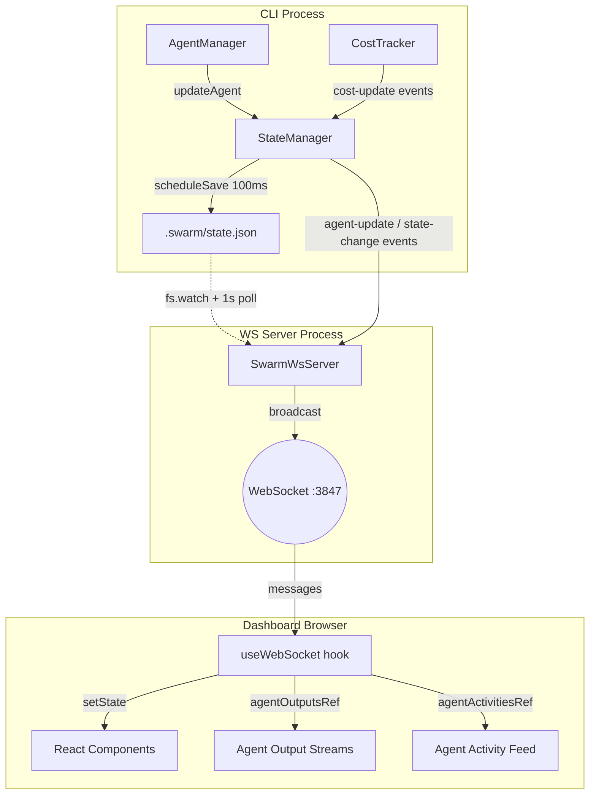
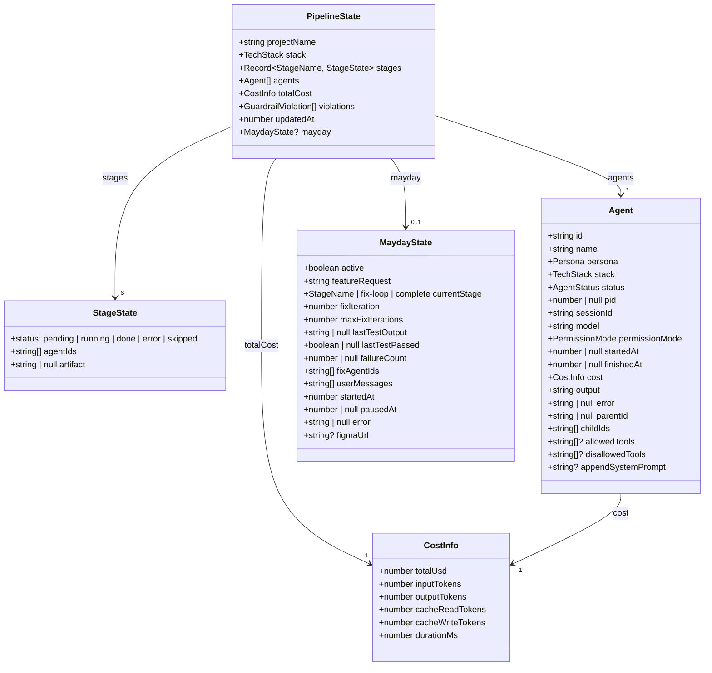
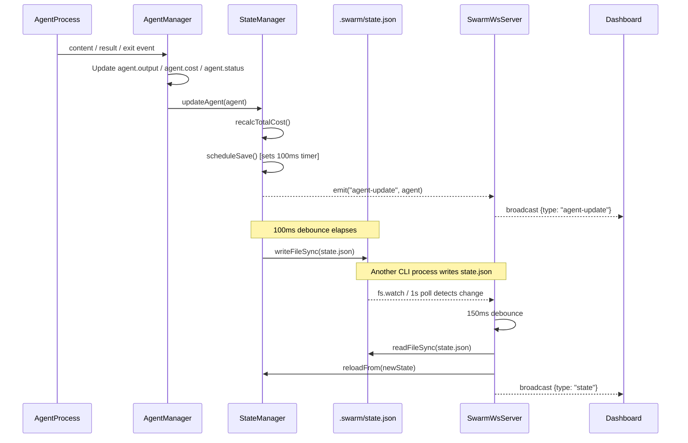
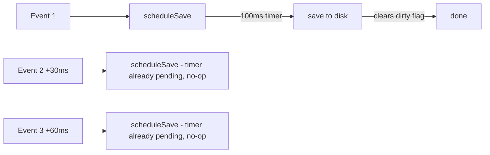
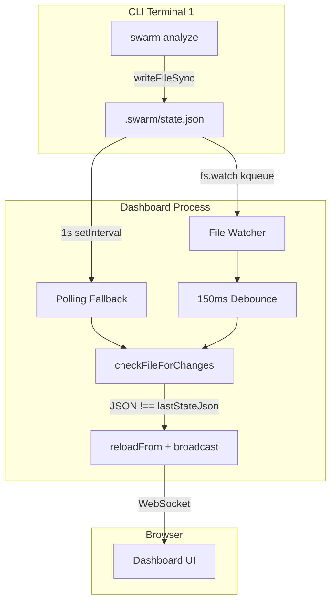
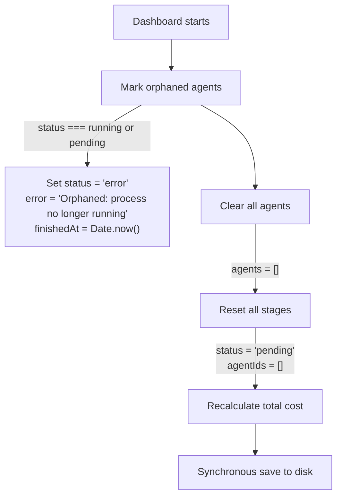

# 07 - State Management

State management in Swarm spans three layers: the CLI persists pipeline state to disk via `StateManager`, the `CostTracker` aggregates cost data in memory, and the dashboard maintains local state through a WebSocket hook. Cross-process synchronization ties everything together using file watching and WebSocket broadcasts.

---

## 1. State Architecture Overview



Key responsibilities:

| Layer | Component | Storage | Purpose |
|-------|-----------|---------|---------|
| CLI | `StateManager` | `.swarm/state.json` | Source of truth for pipeline state |
| CLI | `CostTracker` | In-memory `Map` | Per-agent cost aggregation and formatting |
| Server | `SwarmWsServer` | None (pass-through) | Broadcasts state changes over WebSocket |
| Dashboard | `useWebSocket` | React state + refs | Local UI state with reconnection logic |

---

## 2. PipelineState Structure



### Stage Names and Artifacts

| StageName | Persona | Expected Artifact |
|-----------|---------|-------------------|
| `analyze` | analyst | `REQUIREMENTS.md` |
| `architect` | architect | `SPEC.md` |
| `plan` | lead | `TASKS.md` |
| `build` | engineer | Code (no single file) |
| `test` | tester | `TESTPLAN.md` |
| `evaluate` | -- | None |

### Agent Status Lifecycle

```
pending --> running --> done
                   \-> error
                   \-> killed
```

---

## 3. StateManager Class

**File:** `packages/cli/src/core/state.ts`

`StateManager` extends `EventEmitter` and serves as the single source of truth for pipeline state within a CLI process.

### Constructor

```typescript
constructor(swarmDir: string)
```

- Sets `filePath` to `<swarmDir>/state.json`
- If the file exists, parses it and runs migration (adds missing stages)
- If parsing fails or file is absent, falls back to `createEmptyPipeline('unknown', 'react')`

### Core Methods

| Method | Behavior |
|--------|----------|
| `init(projectName, stack)` | Creates a fresh `PipelineState` via `createEmptyPipeline()` and calls `save()` immediately (not debounced) |
| `getState()` | Returns the in-memory `PipelineState` reference |
| `getFilePath()` | Returns the absolute path to `state.json` |
| `reloadFrom(newState)` | Replaces in-memory state wholesale -- used by `SwarmWsServer` for cross-process sync |

### Agent Methods

| Method | Behavior | Events Emitted |
|--------|----------|----------------|
| `addAgent(agent)` | Pushes agent to array, debounced save | `agent-update` |
| `updateAgent(agent)` | Replaces by ID (or pushes if not found), recalculates total cost, debounced save | `agent-update` |
| `removeAgent(agentId)` | Filters out agent, recalculates total cost, debounced save | `state-change` |
| `getAgent(agentId)` | Returns agent by ID or `undefined` | -- |

### Stage Methods

| Method | Behavior | Events Emitted |
|--------|----------|----------------|
| `updateStage(name, update)` | Merges `Partial<StageState>` via `Object.assign`, debounced save | `state-change` |

### MayDay Helpers

| Method | Behavior |
|--------|----------|
| `getMayday()` | Returns current `MaydayState` or `undefined` |
| `setMayday(mayday)` | Sets or clears the mayday object |
| `updateMayday(update)` | Merges partial update into existing mayday (no-op if no mayday) |
| `pushMaydayMessage(text)` | Appends user text to `mayday.userMessages` queue |
| `consumeMaydayMessages()` | Returns and clears all queued messages |

### Persistence Methods

| Method | Behavior |
|--------|----------|
| `save()` | Writes `state.json` synchronously with `JSON.stringify(state, null, 2)`. Creates directory if missing. |
| `flush()` | Cancels pending timer, writes immediately if dirty. Called during process cleanup. |
| `scheduleSave()` | Sets `dirty = true`, starts a 100ms timer if none is pending. Timer fires `save()` and clears `dirty`. |

### Cost Recalculation

`recalcTotalCost()` is called by `updateAgent` and `removeAgent`. It reduces across all agents:

```typescript
this.state.totalCost = this.state.agents.reduce(
  (acc, a) => addCosts(acc, a.cost),
  emptyCost(),
);
```

---

## 4. State Persistence Flow



There are two broadcast paths:

1. **In-process events** -- When the same process that runs `SwarmWsServer` also spawns agents (dashboard-spawned), `StateManager` events fire directly to `SwarmWsServer` listeners, which broadcast immediately. This path is faster than disk.

2. **Cross-process file watching** -- When a separate CLI process (e.g., `swarm analyze`) modifies `state.json`, the `SwarmWsServer` detects the file change and broadcasts the updated state. This path has approximately 150ms-1150ms latency depending on whether `fs.watch` or polling picks up the change.

---

## 5. Debounce Mechanism

`StateManager` debounces disk writes to prevent excessive I/O during rapid agent updates (content streaming can produce hundreds of events per second).



### How `scheduleSave()` Works

1. Sets `dirty = true`
2. If no `writeTimer` exists, starts a 100ms `setTimeout`
3. If a timer is already pending, does nothing (the pending timer will flush)
4. When the timer fires: if `dirty` is still `true`, calls `save()` and resets `dirty`

### `flush()` for Graceful Shutdown

During process cleanup (SIGINT/SIGTERM), `flush()` is called to ensure no data is lost:

1. Clears any pending `writeTimer`
2. If `dirty`, calls `save()` immediately
3. Resets `dirty` to `false`

### Why 100ms?

- Fast enough that the dashboard sees updates within ~100ms
- Slow enough to batch dozens of content-chunk events into a single write
- Prevents file-watching loops where write triggers watch which triggers re-read

---

## 6. Cross-Process State Sync

### The Problem

Swarm's architecture allows multiple processes to modify `state.json` concurrently:

- The dashboard process runs `SwarmWsServer` and spawns agents
- A separate terminal can run `swarm analyze` or `swarm build`, which also writes to the same `state.json`

The dashboard must reflect changes made by external CLI processes.

### The Solution



### Detection Mechanisms

| Mechanism | How | Latency | Reliability |
|-----------|-----|---------|-------------|
| `fs.watch()` | kqueue on macOS, inotify on Linux | ~150ms (debounced) | Unreliable on macOS -- can miss writes |
| Polling | `setInterval` every 1000ms | Up to 1000ms | Always works |

Both mechanisms call `checkFileForChanges()`, which:

1. Reads the file with `readFileSync`
2. Compares raw JSON string against `lastStateJson`
3. If different: parses, runs `migrateState()`, calls `reloadFrom()`, and broadcasts

### Change Detection via String Comparison

```typescript
const newJson = readFileSync(stateFile, 'utf-8');
if (newJson === this.lastStateJson) return;  // no change
this.lastStateJson = newJson;
```

This avoids costly deep object comparison and naturally ignores writes that produce identical output.

### Debounce on fs.watch

`fs.watch` events fire with a 150ms debounce to avoid processing partial writes:

```typescript
private debouncedFileCheck(stateFile: string): void {
  if (this.fileCheckTimer) return;        // already pending
  this.fileCheckTimer = setTimeout(() => {
    this.fileCheckTimer = null;
    this.checkFileForChanges(stateFile);
  }, 150);
}
```

---

## 7. CostTracker

**File:** `packages/cli/src/core/cost-tracker.ts`

`CostTracker` extends `EventEmitter` and maintains an in-memory `Map<string, CostInfo>` keyed by agent ID. It is used for CLI-side cost reporting and formatting.

### Methods

| Method | Behavior |
|--------|----------|
| `record(agentId, cost)` | Stores/replaces the cost for an agent. Emits `cost-update` with the new total. |
| `getAgentCost(agentId)` | Returns agent's cost or `emptyCost()` if unknown. |
| `getTotal()` | Reduces all stored costs into a single `CostInfo` via `addCosts()`. |
| `formatCost(cost)` | Returns string: `$0.0342 \| 12,500 in \| 3,200 out \| 14.2s` |
| `formatTotal()` | Returns string: `Total: <formatted> across N agent(s)` |

### Cost Accumulation in Multi-Turn Conversations

When `AgentManager.sendInput()` resumes a session, it receives a new `result` event with cumulative cost from the Claude CLI. The new cost is recorded via `record()`, replacing the previous value for that agent. Since `sendInput()` receives the full session cost (not a delta), no manual accumulation is needed at the `CostTracker` level.

However, `StateManager.recalcTotalCost()` sums across all agent objects in state, so individual agent costs must be kept current.

---

## 8. CostInfo Structure

```typescript
interface CostInfo {
  totalUsd: number;        // Total cost in US dollars
  inputTokens: number;     // Tokens sent to the model
  outputTokens: number;    // Tokens generated by the model
  cacheReadTokens: number; // Tokens read from prompt cache
  cacheWriteTokens: number;// Tokens written to prompt cache
  durationMs: number;      // Wall-clock time in milliseconds
}
```

### Helper Functions

Both are exported from `packages/cli/src/types.ts`:

**`emptyCost()`** -- Returns a zero-initialized `CostInfo`:

```typescript
{ totalUsd: 0, inputTokens: 0, outputTokens: 0, cacheReadTokens: 0, cacheWriteTokens: 0, durationMs: 0 }
```

**`addCosts(a, b)`** -- Returns a new `CostInfo` with all fields summed:

```typescript
{
  totalUsd: a.totalUsd + b.totalUsd,
  inputTokens: a.inputTokens + b.inputTokens,
  outputTokens: a.outputTokens + b.outputTokens,
  cacheReadTokens: a.cacheReadTokens + b.cacheReadTokens,
  cacheWriteTokens: a.cacheWriteTokens + b.cacheWriteTokens,
  durationMs: a.durationMs + b.durationMs,
}
```

These are used by `StateManager.recalcTotalCost()` and `CostTracker.getTotal()`.

---

## 9. State Migration

When `StateManager` loads an existing `state.json` from disk, it ensures all expected stages are present. This handles backward compatibility when new stages (like `test` and `evaluate`) are added to the pipeline.

```typescript
const expectedStages: StageName[] = ['analyze', 'architect', 'plan', 'build', 'test', 'evaluate'];
for (const stage of expectedStages) {
  if (!this.state.stages[stage]) {
    this.state.stages[stage] = emptyStage();  // { status: 'pending', agentIds: [], artifact: null }
  }
}
```

The same migration logic exists in `SwarmWsServer.migrateState()` (a standalone function in `ws-server.ts`), which runs on every `state.json` read from disk -- both on initial WebSocket connection and on file-change detection. This ensures that even if a stale state file is read, it always conforms to the current schema.

---

## 10. Dashboard State Management

**File:** `packages/dashboard/src/hooks/useWebSocket.ts`

The `useWebSocket` hook manages all client-side state for the dashboard.

### State Storage

| Storage | Type | Purpose |
|---------|------|---------|
| `state` | `useState<PipelineState \| null>` | Full pipeline state from server |
| `connected` | `useState<boolean>` | WebSocket connection status |
| `violations` | `useState<GuardrailViolation[]>` | Guardrail violations (accumulated) |
| `agentOutputsRef` | `useRef<Map<string, string>>` | Streaming output text per agent |
| `agentActivitiesRef` | `useRef<Map<string, AgentActivity[]>>` | Tool use / thinking activities per agent (capped at 200) |

### Message Handling

| Message Type | Handler |
|--------------|---------|
| `state` | Replaces entire `PipelineState`. Also loads violations from state if present. |
| `agent-update` | Updates or inserts a single agent in the agents array (immutable update). |
| `agent-output` | Appends chunk to `agentOutputsRef` map, triggers re-render via `forceUpdate`. |
| `agent-activity` | Appends activity to `agentActivitiesRef` map (capped at 200 per agent), triggers re-render. |
| `guardrail-alert` | Appends violation to `violations` state array. |
| `cost-update` | Merges new `totalCost` into the existing `PipelineState`. |

### Why Refs for Outputs and Activities

`agentOutputsRef` and `agentActivitiesRef` use `useRef` instead of `useState` to avoid triggering full React re-renders on every content chunk. A separate `forceUpdate` counter (`useState(0)`) triggers re-renders at a controlled cadence.

### Reconnection Strategy

The hook implements exponential backoff reconnection:

```
Initial delay:  2000ms
Multiplier:     1.5x per attempt
Maximum delay:  30000ms
Reset:          On successful connection
```

On reconnect, the server sends the current `state` message, which fully re-syncs the dashboard.

### Sending Commands

```typescript
const sendCommand = useCallback((cmd: WsCommand) => {
  if (wsRef.current?.readyState === WebSocket.OPEN) {
    wsRef.current.send(JSON.stringify(cmd));
  }
}, []);
```

Commands are fire-and-forget. The server handles them asynchronously and broadcasts state updates in response.

---

## 11. Cleanup on Dashboard Startup

When the `swarm dashboard` command starts, `StateManager.cleanupStaleAgents()` runs to ensure a clean slate. This handles the case where a previous dashboard or CLI process exited without proper cleanup.

### What `cleanupStaleAgents()` Does



### Step-by-Step

1. **Mark orphans:** Any agent with `status === 'running'` or `status === 'pending'` is set to `error` with an explanatory message. These agents cannot still be running because the process that spawned them is gone.

2. **Clear all agents:** The agents array is emptied entirely (`this.state.agents = []`). All agents (including done/error/killed ones) are removed.

3. **Reset stages:** Every stage (`analyze`, `architect`, `plan`, `build`, `test`, `evaluate`) is reset to `{ status: 'pending', agentIds: [] }`.

4. **Recalculate cost:** `recalcTotalCost()` runs, which now produces `emptyCost()` since there are no agents.

5. **Immediate save:** Calls `save()` directly (not debounced) to ensure the clean state is written before the WebSocket server starts accepting connections.

This ensures that when the dashboard UI connects, it always sees a fresh state without ghost agents from previous sessions.
