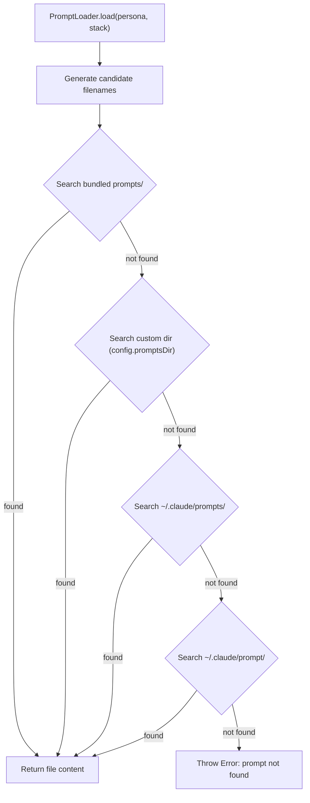
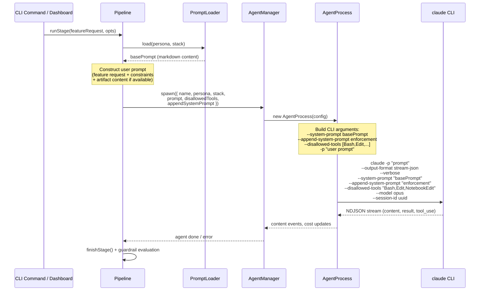

# 08 - Persona and Prompt System

This document covers the persona system, prompt management, system enforcement, tool restrictions, and guardrail validation in Swarm.

---

## 1. Persona System Overview

Swarm's pipeline assigns specialized **personas** to Claude Code sub-agents. Each persona has a bounded role, a mandatory output artifact, and strict behavioral constraints enforced at multiple layers.

There are **5 personas** and **3 tech stacks**, producing **15 bundled prompt files** shipped in the `prompts/` directory at the repository root.

**Personas:** analyst, architect, lead, engineer, tester

**Tech stacks:** react, node, go

Each prompt file tailors the persona's domain expertise, output format, and conventions to the target stack (e.g., React 18+ patterns for `react`, Go idioms for `go`).

---

## 2. Persona Matrix

| Persona | Prompt File Pattern | Artifact | Role Boundary | Pipeline Stage |
|---------|-------------------|----------|---------------|----------------|
| analyst | `analyst-{stack}.md` | `REQUIREMENTS.md` | No architecture, no code, no tasks | `analyze` |
| architect | `Architect-{Stack}.md` | `SPEC.md` | No code, no task breakdown | `architect` |
| lead | `Software-lead-{stack}.md` | `TASKS.md` | No code, no architecture redesign | `plan` |
| engineer | `Software-engineer-{stack}.md` | Code (implementation) | Full access | `build` |
| tester | `test-engineer-{stack}.md` | `TESTPLAN.md` | No implementation, no source modification | `test` |

Key mappings from `packages/cli/src/types.ts`:

```typescript
export const PERSONA_STAGE_MAP: Record<Persona, StageName> = {
  analyst: 'analyze',
  architect: 'architect',
  lead: 'plan',
  engineer: 'build',
  tester: 'test',
};

export const STAGE_ARTIFACT_MAP: Record<StageName, string | null> = {
  analyze: 'REQUIREMENTS.md',
  architect: 'SPEC.md',
  plan: 'TASKS.md',
  build: null,
  test: 'TESTPLAN.md',
  evaluate: null,
};
```

---

## 3. Prompt Resolution

The `PromptLoader` class (`packages/cli/src/prompts/loader.ts`) resolves persona + stack to a prompt file by searching directories in priority order.

### Search Order



### Filename Map

The `PROMPT_FILENAME_MAP` handles inconsistent casing across prompt files. Each persona maps to a function that returns an array of candidate filenames:

| Persona | Candidate Filenames | Example (react) |
|---------|-------------------|-----------------|
| analyst | `analyst-{stack}.md` | `analyst-react.md` |
| architect | `Architect-{Stack}.md`, `architect-{stack}.md` | `Architect-React.md`, `architect-react.md` |
| lead | `Software-lead-{stack}.md`, `software-lead-{stack}.md` | `Software-lead-react.md` |
| engineer | `Software-engineer-{stack}.md`, `software-engineer-{stack}.md` | `Software-engineer-react.md` |
| tester | `test-engineer-{stack}.md`, `Test-engineer-{stack}.md` | `test-engineer-react.md` |

### Key Methods

- **`resolve(persona, stack)`** -- Returns the absolute file path of the first matching prompt, or `null` if not found.
- **`load(persona, stack)`** -- Returns the file content (string) of the resolved prompt. Throws if no match is found.
- **`listAvailable()`** -- Iterates all 15 persona/stack combinations and returns which prompts are available with their paths.

---

## 4. System Enforcement Prompts

Each non-engineer persona has a **system enforcement prompt** appended via `--append-system-prompt` when spawning the Claude CLI process. These are system-level instructions that take the highest priority -- the agent cannot override them.

Defined as constants in `packages/cli/src/core/pipeline.ts`.

### ANALYST_SYSTEM_ENFORCEMENT

Forces the analyst to produce a strictly structured `REQUIREMENTS.md`:

```
SYSTEM ENFORCEMENT: Your output file MUST be named exactly REQUIREMENTS.md.
SYSTEM ENFORCEMENT: REQUIREMENTS.md MUST contain these sections in order:
  ## 0. Original Requirement
  ## 1. Summary
  ## 2. Scope
  ## 3. Functional Requirements
  ## 4. Data Requirements
  ## 5. UI/UX
  ## 6. Non-Functional Requirements
  ## 7. Integration
  ## 8. Testing
  ## 9. Rollout
  ## 10. Open Questions
  ## 11. Change Tracking
  ## 12. Appendix
SYSTEM ENFORCEMENT: Section 3 MUST contain user stories in
  "As a [user] I want [thing] So that [reason]" format
  with Given/When/Then acceptance criteria.
SYSTEM ENFORCEMENT: Do NOT write migration plans, decision tables,
  or free-form documents. Follow the template exactly.
```

### ARCHITECT_SYSTEM_ENFORCEMENT

Forces the architect to produce a strictly structured `SPEC.md`:

```
SYSTEM ENFORCEMENT: Your output file MUST be named exactly SPEC.md.
SYSTEM ENFORCEMENT: SPEC.md MUST contain these sections:
  ## Overview
  ## Requirements Summary
  ## Architecture (with Mermaid diagrams)
  ## Architecture Decision Records
  ## Component/Service Architecture
  ## Data Model Design
  ## API Specification
  ## Performance Strategy
  ## Testing Strategy
  ## Security
  ## Implementation Checklist
  ## File Structure
  ## Open Questions
SYSTEM ENFORCEMENT: Include ADR entries (ADR-1, ADR-2, etc.)
  and Mermaid diagrams. Follow the template exactly.
```

### LEAD_SYSTEM_ENFORCEMENT

Forces the lead to produce tasks in a precise, machine-parseable format:

```
SYSTEM ENFORCEMENT: Your output file MUST be named exactly TASKS.md.
SYSTEM ENFORCEMENT: Every task MUST follow this format:
  - [ ] T001 [P] [US1] Description -- `file/path.ext`
SYSTEM ENFORCEMENT: One task = one file. Every task has [P] if
  parallelizable, [USn] user story label, AC: acceptance criteria,
  and an exact file path.
SYSTEM ENFORCEMENT: Organize into phases:
  Setup -> Foundational (GATE) -> User Stories (parallel after gate)
  -> E2E Tests (after stories) -> Polish.
SYSTEM ENFORCEMENT: Do NOT write free-form documents.
  Follow the spec-kit task format exactly.
```

### TESTER_SYSTEM_ENFORCEMENT

Forces the tester to produce a structured test plan:

```
SYSTEM ENFORCEMENT: Your output file MUST be named exactly TESTPLAN.md.
SYSTEM ENFORCEMENT: TESTPLAN.md MUST contain these sections:
  ## Overview
  ## Test Strategy
  ## E2E Test Cases
  ## Authentication
  ## Test Data
  ## Acceptance Criteria
SYSTEM ENFORCEMENT: Every E2E test case MUST have:
  ID (TC-001), title, user flow steps, expected assertions,
  and the target test file path under e2e/.
SYSTEM ENFORCEMENT: Do NOT write implementation code.
  Do NOT modify application source. Only produce TESTPLAN.md.
SYSTEM ENFORCEMENT: If Figma designs are provided, derive visual
  test cases from the designs.
```

---

## 5. Tool Restrictions

Non-engineer personas are blocked from dangerous tools to prevent them from writing code or running commands. The constant `NON_ENGINEER_DISALLOWED_TOOLS` is `['Bash', 'Edit', 'NotebookEdit']`.

| Persona | Allowed Tools | Disallowed Tools | Notes |
|---------|--------------|-----------------|-------|
| analyst | Read, Glob, Grep, Write, WebSearch, WebFetch | Bash, Edit, NotebookEdit | Figma tools allowed when `figmaUrl` is provided |
| architect | Read, Glob, Grep, Write, WebSearch, WebFetch | Bash, Edit, NotebookEdit | |
| lead | Read, Glob, Grep, Write, WebSearch, WebFetch | Bash, Edit, NotebookEdit | |
| engineer | All tools | None | Full access for implementation |
| tester | All tools | None | Full access for test implementation |

Tool restrictions are passed to `AgentManager.spawn()` via the `disallowedTools` parameter and forwarded to the Claude CLI as `--disallowed-tools`.

**Special case:** When the analyst is given a Figma URL, tool restrictions are lifted (`disallowedTools: undefined`) so the agent can use Figma MCP tools to extract design context.

---

## 6. Prompt File Structure

Each bundled prompt file follows a consistent internal structure, though the specifics vary by persona and stack.

### Analyst Prompts (`analyst-{stack}.md`)

1. **Identity** -- "Senior requirements analyst for {Stack} applications"
2. **Hard Boundaries** -- Cannot produce any file other than `REQUIREMENTS.md`, cannot write code, cannot design architecture or create tasks
3. **Mandatory Output Structure** -- 13 sections (0-12) with exact heading names and content requirements
4. **Core Principles** -- Ambiguity resolution, living documents, traceability
5. **Phase Workflow** -- Phase 1: Context Acquisition (read codebase), Phase 2: Clarifying Questions, Phase 3: Write REQUIREMENTS.md

### Architect Prompts (`Architect-{Stack}.md`)

1. **Identity** -- "Senior Software Architect specializing in {Stack}"
2. **Hard Boundaries** -- Only produces `SPEC.md`, no code, no task breakdown
3. **Mandatory Output Structure** -- 14 sections including Mermaid diagrams and ADR entries
4. **Expertise** -- Stack-specific technology knowledge (e.g., React 18+, hooks, concurrent features)
5. **Workflow** -- Analyze requirements, ask clarifying questions, produce SPEC.md
6. **Quality Checklist** -- Verification steps before and after writing

### Lead Prompts (`Software-lead-{stack}.md`)

1. **Identity** -- "Elite Software Lead specializing in {Stack}" with 15+ years experience
2. **Hard Boundaries** -- Only produces `TASKS.md`, no code, no architecture redesign
3. **Mandatory Output Structure** -- Exact task format: `- [ ] T001 [P] [US1] Description -- \`file/path.ext\``
4. **Document Structure** -- Phases: Setup, Foundational (GATE), User Stories, E2E Tests, Polish
5. **Core Philosophy** -- One task = one file, smallest independent unit, maximize parallelization

### Engineer Prompts (`Software-engineer-{stack}.md`)

1. **Identity** -- "Software Engineer specializing in {Stack}"
2. **Engineering Skills Table** -- Mapped skills invoked based on task type (e.g., component tasks invoke `implement-react-component`)
3. **Design System Integration** -- MCP tools for checking existing components before implementing
4. **Startup Sequence** -- Read AGENTS.md, parse TASKS.md, build dependency graph, identify parallel group, execute
5. **No hard boundaries** -- Full implementation access

### Tester Prompts (`test-engineer-{stack}.md`)

1. **Identity** -- "Elite Test Engineer specializing in {Stack} E2E testing"
2. **Hard Boundaries** -- Only produces `TESTPLAN.md`, no implementation code, no source modifications
3. **Mandatory Output Structure** -- 6 sections: Overview, Test Strategy, Authentication, Test Data, E2E Test Cases, Acceptance Criteria
4. **Test Case Format** -- `TC-001` IDs with user story mapping, priority, preconditions, steps, assertions
5. **Expertise** -- Playwright, authentication testing, accessibility testing, visual regression, CI/CD

---

## 7. Guardrail Validation

The `GuardrailsEngine` (`packages/cli/src/core/guardrails.ts`) validates that pipeline artifacts conform to expected structures after each stage completes.

### Check Types

| Check Type | Description | Example |
|-----------|-------------|---------|
| `section-exists` | Verifies a markdown heading exists (h1-h4) | `"Functional Requirements"` must appear as a heading in `REQUIREMENTS.md` |
| `pattern-match` | Verifies a regex pattern matches somewhere in the file | `As a .+ I want .+ So that` for user story format |
| `command` | Runs a shell command; failure = violation | Custom validation scripts |

### Default Rules

The engine ships with built-in rules for each artifact:

**REQUIREMENTS.md** (12 checks):
- Required sections: Original Requirement, Summary, Scope, Functional Requirements, Data Requirements, Non-Functional Requirements
- Warning sections: Integration, Testing, Open Questions
- Pattern checks: user story format, Given/When/Then criteria, E2E scenarios

**SPEC.md** (14 checks):
- Required sections: Overview, Requirements Summary, Architecture, Architecture Decision Records, API, Testing Strategy, Security
- Warning sections: Data Model, Performance Strategy, Implementation Checklist, File Structure, Open Questions
- Pattern checks: Mermaid diagrams (`\`\`\`mermaid`), ADR entries (`ADR-\d`)

**TASKS.md** (11 checks):
- Required patterns: task IDs (`T\d{3}` or `FND-001` style), pending checkboxes, Phase sections
- Warning patterns: `[P]` parallel markers, `[USn]` user story labels, `AC:` criteria, `Depends on:`, file paths, `[E2E]` markers

**TESTPLAN.md** (8 checks):
- Required sections: Overview, Test Strategy, E2E Test Cases
- Warning sections: Authentication, Test Data, Acceptance Criteria
- Required patterns: test case IDs (`TC-\d{3}`)
- Warning patterns: E2E test file paths

### Severity Levels

| Severity | Meaning |
|----------|---------|
| `error` | Structural violation -- the artifact is missing critical content |
| `warning` | Quality concern -- the artifact could be improved but is not fundamentally broken |

### Custom Rules

Custom guardrail rules can be added via `.swarm/guardrails.yaml`:

```yaml
rules:
  - name: "Custom API check"
    target: "SPEC.md"
    checks:
      - type: pattern-match
        value: "REST|GraphQL"
        message: "API type not specified"
        severity: error
      - type: command
        value: "npx markdownlint SPEC.md"
        message: "Markdown linting failed"
        severity: warning
```

Custom rules are appended to the default rules -- they do not replace them.

### GuardrailsEngine API

```typescript
class GuardrailsEngine {
  constructor(swarmDir?: string)  // Loads defaults + custom rules from .swarm/guardrails.yaml
  evaluate(cwd: string): GuardrailViolation[]  // Runs all rules against artifacts in cwd
  getRules(): GuardrailRule[]  // Returns all loaded rules
}
```

---

## 8. How Prompts Are Applied

The following sequence diagram shows how prompts flow from pipeline stage invocation through to the Claude CLI process.



### Layered Prompt Architecture

Prompts are applied at three layers, each with increasing priority:

| Layer | Source | CLI Flag | Priority | Purpose |
|-------|--------|----------|----------|---------|
| Base system prompt | `prompts/{persona}-{stack}.md` | `--system-prompt` | Normal | Persona identity, expertise, output format, workflow |
| User prompt | Constructed by Pipeline | `-p` | N/A (user turn) | Feature request, artifact content, constraints |
| System enforcement | `*_SYSTEM_ENFORCEMENT` constant | `--append-system-prompt` | Highest | Non-negotiable structural requirements |

The `--append-system-prompt` flag ensures enforcement instructions take the highest priority in Claude's instruction hierarchy, meaning the agent cannot override filename or structure requirements even if the base prompt or user prompt contains conflicting instructions.

### Tool Restrictions

Tool restrictions are applied via CLI flags on the spawned process:

- `--disallowed-tools "Bash,Edit,NotebookEdit"` for non-engineer personas
- No restrictions for engineer and tester personas
- Restrictions are persisted on the `Agent` object (`allowedTools`, `disallowedTools`) so that session resumes carry them forward

---

## 9. Customization

### Custom Prompt Directory

Set `promptsDir` in `.swarm/config.yaml` to point to a directory containing custom prompt files:

```yaml
# .swarm/config.yaml
projectName: my-project
stack: react
model: opus
promptsDir: ./my-prompts    # relative or absolute path, ~ supported
```

The search order places bundled prompts first (to ensure enforcement structure is present), then custom directory, then user-level fallbacks. To completely override a bundled prompt, place a file with the same name in your custom directory -- it will be found second if the bundled version exists. To use only custom prompts, remove or rename the corresponding bundled files.

### Custom Guardrails

Add project-specific validation rules in `.swarm/guardrails.yaml`:

```yaml
rules:
  - name: "Database migration check"
    target: "SPEC.md"
    checks:
      - type: section-exists
        value: "Database Migration"
        message: "SPEC.md must include a Database Migration section"
        severity: error

  - name: "TASKS.md completeness"
    target: "TASKS.md"
    checks:
      - type: pattern-match
        value: "\\[E2E\\]"
        message: "Tasks must include E2E test tasks"
        severity: warning
      - type: command
        value: "grep -c '\\- \\[ \\]' TASKS.md | xargs test 5 -le"
        message: "Expected at least 5 pending tasks"
        severity: warning
```

### User-Level Prompt Fallbacks

If a prompt is not found in bundled or custom directories, Swarm searches:

1. `~/.claude/prompts/` -- Standard user-level prompt directory
2. `~/.claude/prompt/` -- Legacy location

This allows users to define personal prompt overrides that apply across all Swarm projects.

---

## Related Files

| File | Description |
|------|-------------|
| `packages/cli/src/prompts/loader.ts` | PromptLoader class -- resolution and loading |
| `packages/cli/src/core/pipeline.ts` | Pipeline class -- system enforcement constants, stage orchestration |
| `packages/cli/src/core/guardrails.ts` | GuardrailsEngine class -- artifact validation |
| `packages/cli/src/types.ts` | Type definitions -- Persona, TechStack, StageName, GuardrailRule |
| `prompts/` | 15 bundled prompt files (5 personas x 3 stacks) |
| `.swarm/config.yaml` | Project configuration including `promptsDir` |
| `.swarm/guardrails.yaml` | Custom guardrail rules |
