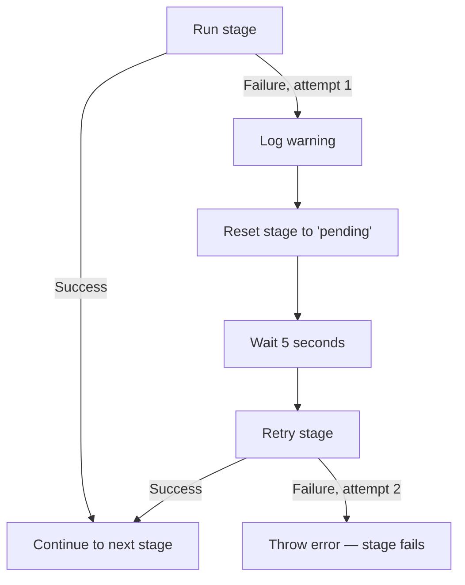
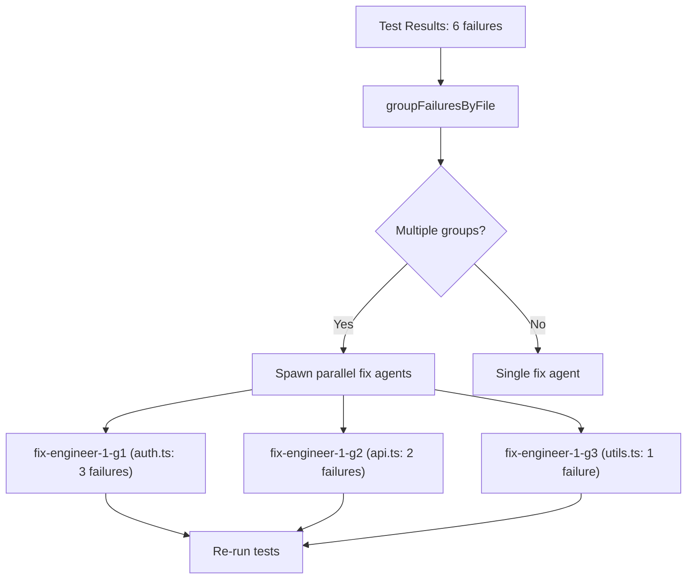

# 10 -- Testing, Resilience Hardening & Tier 3 Features

This document covers all features and improvements added after the initial 9 docs were written. It includes the **Testing & Resilience Hardening** phase (C2-C4, I1-I3, R1-R4) and the **Tier 3 Growth Features** (P3-02 through P3-09).

---

## 1. Agent Timeout Watchdog (C2)

**Problem**: Agents could hang indefinitely if the Claude CLI process stalled — no output, no exit, consuming a slot forever.

**Solution**: `AgentProcess` now has an inactivity watchdog timer that kills the agent if no stdout/stderr is received within a configurable window.

### Configuration

```typescript
// AgentProcessConfig
{
  timeoutMs?: number;  // Default: 30 minutes (1800000ms). Set to 0 to disable.
}

// SpawnOptions (agent-manager.ts)
{
  timeoutMs?: number;  // Passed through to AgentProcess
}
```

### How it works

```
Agent starts → watchdog timer starts (30 min)
    │
    ├── stdout data received → timer resets
    ├── stderr data received → timer resets
    │
    └── No output for 30 min → SIGTERM → 5s grace → SIGKILL
                                   │
                                   └── agent.status = 'error'
                                       agent.error = 'Agent killed due to inactivity timeout'
```

- Timer resets on every chunk of stdout or stderr data
- On timeout: emits `error-output` event, calls `kill()` (SIGTERM, then SIGKILL after 5s)
- `AgentProcess.timedOut` boolean is set — `AgentManager` uses this to distinguish timeout from other exit codes
- Timer is stopped on process exit or manual kill

**Files**: `agent-process.ts`, `agent-manager.ts`

---

## 2. Stage Retry in MayDay (C3)

**Problem**: A transient failure in any MayDay stage (network blip, Claude API rate limit) would crash the entire pipeline with no recovery.

**Solution**: Each stage in `executeMaydayPipeline` is wrapped in `runStageWithRetry()` — up to 2 attempts with a 5-second backoff between.

### Retry flow



### Implementation

```typescript
private async runStageWithRetry(
  stage: StageName,
  fn: () => Promise<void>,
  maxAttempts = 2,
): Promise<void>
```

- Only applies to MayDay pipeline stages (not manual CLI stage runs)
- Stage status is reset to `pending` before retry
- The retry count is not configurable from CLI yet (hardcoded at 2)

**Files**: `pipeline.ts`

---

## 3. Structured Test Result Parsing (C4)

**Problem**: Test results were parsed with fragile regexes against agent output text. This missed failures, couldn't extract file paths, and didn't work for non-Playwright frameworks.

**Solution**: Test runner agents now output structured JSON. The parser auto-detects the format and extracts per-test pass/fail with error messages and file paths.

### Supported JSON formats

| Framework | JSON Format | Detection Key |
|-----------|------------|---------------|
| **Playwright** | Playwright JSON reporter | `json.suites` array |
| **Vitest** | Vitest JSON reporter | `json.testResults` array |
| **pytest** | pytest-json-report | `json.tests` + `json.summary` |
| **go test** | NDJSON (`go test -json`) | Line-by-line JSON objects |

### Parse chain

```
.swarm/test-results.json exists?
    ├── Yes → try JSON.parse()
    │         ├── Success → auto-detect format → parsePlaywrightJson / parseVitestJson / parsePytestJson
    │         └── Parse error → try NDJSON (go test) → parseGoTestJson
    │
    ├── .swarm/test-results.txt exists? → parseTestOutputRegex (fallback)
    │
    └── Neither → find last test-runner agent → parseTestOutputRegex on agent.output
```

### TestEvaluation structure

```typescript
interface TestFailure {
  testName: string;  // "Login > should redirect to dashboard"
  file: string;      // "e2e/login.spec.ts"
  error: string;     // "Expected: 200, Received: 401" (truncated to 500 chars)
}

interface TestEvaluation {
  passed: boolean;
  failureCount: number | null;
  failures: TestFailure[];  // Structured per-test failures
  summary: string;          // "12 passed, 3 failed (Playwright JSON)"
  output: string | null;    // Truncated raw output for display
}
```

**Files**: `pipeline.ts`

---

## 4. Stack-Aware Test Frameworks

**Problem**: The test stage always assumed Playwright E2E tests, even for Go backends, Python APIs, or Rust libraries.

**Solution**: `getTestFrameworks(stack)` resolves the appropriate test framework(s) based on the project's tech stack.

### Framework map

| Stack | Primary Framework | Secondary | Category | Run Command |
|-------|------------------|-----------|----------|-------------|
| `react` | Vitest | Playwright | unit + e2e | `npx vitest run --reporter=json` / `npx playwright test --reporter=json` |
| `node` | Vitest + Supertest | — | integration + api | `npx vitest run --reporter=json` |
| `go` | `go test` | — | unit | `go test -json ./...` |
| `python` | pytest | — | unit | `pytest --json-report` |
| `rust` | `cargo test` | — | unit | `cargo test` |
| `swift` | `swift test` | — | unit | `swift test` |
| `custom` | Vitest (fallback) | — | unit | `npx vitest run` |

### TestFrameworkConfig

```typescript
interface TestFrameworkConfig {
  kind: TestFrameworkKind;     // 'playwright' | 'vitest' | 'go-test' | 'pytest' | ...
  name: string;                // Human-readable name
  testDir: string;             // Directory for test files
  testFilePattern: string;     // e.g. '*.spec.ts', '*_test.go'
  installCmd: string;          // Framework install command (empty for built-ins)
  runCmd: string;              // Run with JSON output
  runCmdHuman: string;         // Run with human-readable output
  category: 'e2e' | 'unit' | 'integration' | 'api';
}
```

### Impact on prompts

- **Phase 1 (Tester)**: Prompt now describes the correct framework, test dir, file patterns, and includes stack-specific guidance (e.g., table-driven tests for Go, Supertest for Node APIs, pytest fixtures for Python)
- **Phase 2 (Runner)**: Prompt tells the engineer which framework to install and the exact run command with JSON output
- **Fix prompts**: Use the stack's test run command instead of hardcoded `npx playwright test`

**Files**: `pipeline.ts`, `types.ts`

---

## 5. Fix Loop Intelligence (I1 -- I3)

### 5.1 Per-Failure Targeting (I1)

**Problem**: Fix engineers received ALL test failures in one prompt — unfocused, often fixing one thing and breaking another.

**Solution**: Failures are grouped by source file. When multiple groups exist, parallel targeted fix agents are spawned — one per file group.



### 5.2 Regression Detection (I2)

After each fix iteration, the new failures are compared against the previous set:

```typescript
const fixedTests = previousFailedTests.filter(t => !currentFailedTests.includes(t));
const newFailures = currentFailedTests.filter(t => !previousFailedTests.includes(t));
const sameFailures = currentFailedTests.filter(t => previousFailedTests.includes(t));
```

- **New regressions** → logged as warning
- **Same failures persisting** → `stuckCount` incremented
- **Progress made** → `stuckCount` reset to 0
- **Stuck for 3+ iterations** → fix loop aborted with clear error message

### 5.3 Fix History (I3)

Each iteration records a `FixHistoryEntry`:

```typescript
interface FixHistoryEntry {
  iteration: number;
  failedTests: string[];     // Tests that were failing before this fix
  fixedTests: string[];      // Tests that this iteration fixed
  newFailures: string[];     // Regressions introduced
  approach: string;          // 'standard' | 'broader-context'
  agentId: string;
  cost: number;
  timestamp: number;
}
```

History is:
- Stored in `MaydayState.fixHistory[]`
- Included in fix prompts (last 5 entries) so agents know what was already tried
- Used to switch approach: after 2 stuck iterations, `approach` changes to `'broader-context'` which adds instructions to try a different strategy

**Files**: `pipeline.ts`, `types.ts`

---

## 6. Agent Output Memory Cap (R1)

**Problem**: Long-running agents could accumulate megabytes of output in `agent.output`, bloating `state.json` and slowing WebSocket broadcasts.

**Solution**: Ring-buffer style cap on in-memory output.

| Layer | Cap | Purpose |
|-------|-----|---------|
| `agent.output` in memory | 50 KB | Tail of last 50KB for pipeline evaluation |
| `state.json` per agent | 2 KB | `getStateOutput()` returns last 2KB for dashboard display |
| `.swarm/logs/{agentId}.jsonl` | Unlimited | Full output persisted on disk |

```typescript
// AgentManager constants
const MAX_OUTPUT_BYTES = 50 * 1024;     // 50KB in-memory
const MAX_STATE_OUTPUT_BYTES = 2 * 1024; // 2KB in state.json

// Ring-buffer append
private appendOutput(agent: Agent, chunk: string): void {
  agent.output += chunk;
  if (agent.output.length > MAX_OUTPUT_BYTES) {
    agent.output = agent.output.slice(-MAX_OUTPUT_BYTES);
  }
}
```

**Files**: `agent-manager.ts`

---

## 7. Enhanced Guardrails (R3)

Three new check types added to the guardrails engine:

| Check Type | Value Format | Description |
|------------|-------------|-------------|
| `min-length` | `"200"` | Minimum character count for the entire file |
| `word-count` | `"Functional Requirements:20"` | Minimum words in a specific section (`section:minWords`) |
| `required-patterns` | `"Given,When,Then"` | ALL comma-separated patterns must match |

### Example in guardrails.yaml

```yaml
rules:
  - name: Custom depth checks
    target: REQUIREMENTS.md
    checks:
      - type: min-length
        value: "500"
        message: "Requirements document is too short"
        severity: warning
      - type: word-count
        value: "Functional Requirements:30"
        message: "Functional Requirements needs more detail"
      - type: required-patterns
        value: "Given,When,Then,As a"
        message: "Missing user story and acceptance criteria patterns"
```

**Files**: `guardrails.ts`, `types.ts`

---

## 8. State Recovery (R4)

**Problem**: A corrupted `state.json` (disk full, crash mid-write) meant losing all pipeline state with no recovery path.

**Solution**: Backup-before-write + automatic recovery + manual `swarm recover` command.

### Backup mechanism

```
save() called
    │
    ├── Copy state.json → state.json.bak
    ├── Write state to state.json.tmp
    └── Rename state.json.tmp → state.json (atomic)
```

### Recovery chain (constructor)

```
Try state.json → parseable? → Use it
    │
    └── Parse error → Try state.json.bak → parseable? → Use it (log recovery)
                           │
                           └── Also corrupt → Create empty pipeline state
```

### CLI command

```bash
swarm recover   # Copies state.json.bak → state.json
```

**Files**: `state.ts`, `commands/recover.ts`, `bin/swarm.ts`

---

## 9. Multi-Model Per Stage (P3-06)

Configure different Claude models per persona to optimize cost vs quality.

### Configuration

```yaml
# .swarm/config.yaml
model: opus               # Default model for all personas
models:
  analyst: haiku           # Cheap model for requirements gathering
  architect: sonnet        # Mid-tier for architecture
  lead: sonnet             # Mid-tier for task planning
  engineer: opus           # Best model for code generation
  tester: haiku            # Cheap model for test plan writing
```

### Resolution order

```typescript
private modelFor(persona: Persona): string {
  return this.config.models?.[persona] ?? this.config.model;
}
```

Every `agentManager.spawn()` call in the pipeline now passes `model: this.modelFor(persona)`, covering:
- Stage agents (analyst, architect, lead, tester)
- Single and parallel engineer agents
- Orchestrator and sub-engineers
- Test runner
- Fix engineers (all use engineer model)

**Files**: `types.ts` (`SwarmConfig.models`), `pipeline.ts`

---

## 10. Webhooks (P3-03)

Fire HTTP POST notifications on pipeline events to Slack, Discord, or any URL.

### Configuration

```yaml
# .swarm/config.yaml
webhooks:
  - url: https://hooks.slack.com/services/T.../B.../xxx
    format: slack
    events: [stage-complete, mayday-complete, mayday-error]
  - url: https://discord.com/api/webhooks/123/abc
    format: discord
    events: [mayday-complete, budget-warning]
  - url: https://my-server.com/swarm-webhook
    format: generic
    secret: my-hmac-secret   # Signs payload with X-Swarm-Signature header
```

### Events

| Event | Fired when |
|-------|-----------|
| `stage-complete` | Any pipeline stage finishes successfully |
| `stage-error` | A stage fails (after retries) |
| `pipeline-complete` | Full pipeline run finishes |
| `mayday-complete` | MayDay finishes (success or max iterations) |
| `mayday-error` | MayDay throws an unhandled error |
| `agent-error` | Any agent exits with error |
| `budget-warning` | Cost exceeds budget threshold |

### Payload formats

**Generic** (default):
```json
{
  "event": "mayday-complete",
  "timestamp": 1711929600000,
  "project": "my-app",
  "data": {
    "feature": "add user authentication",
    "fixIterations": 2,
    "testsPassed": true,
    "cost": "$4.2340",
    "prUrl": "https://github.com/user/repo/pull/42"
  }
}
```

**Slack**: Wrapped in Block Kit format with emoji indicators.
**Discord**: Wrapped in Discord webhook content format.

### HMAC signing

When `secret` is set, the payload body is signed with HMAC-SHA256 and sent in the `X-Swarm-Signature: sha256=<hex>` header.

**Files**: `core/webhooks.ts`, `types.ts`, `pipeline.ts`

---

## 11. Persistent Audit Trail (P3-05)

Structured event log of all pipeline actions in `.swarm/audit.jsonl`.

### Entry format

```json
{"timestamp":1711929600000,"action":"agent-spawned","agentId":"abc-123","agentName":"analyst-react","persona":"analyst"}
{"timestamp":1711929660000,"action":"agent-done","agentId":"abc-123","agentName":"analyst-react","cost":1.2340}
{"timestamp":1711929661000,"action":"stage-complete","stage":"analyze","cost":1.2340}
```

### Actions logged

| Action | Source | Data |
|--------|--------|------|
| `agent-spawned` | AgentManager event | agentId, name, persona |
| `agent-done` | AgentManager event | agentId, name, cost |
| `agent-error` | AgentManager event | agentId, name, error detail |
| `stage-complete` | Pipeline | stage, cost |
| `stage-error` | Pipeline | stage, error detail |
| `pipeline-start` | Pipeline | feature request |
| `pipeline-complete` | Pipeline | total cost |
| `mayday-start` | Pipeline | feature request |
| `mayday-complete` | Pipeline | total cost |
| `budget-exceeded` | CostTracker | spent, limit |

### CLI command

```bash
swarm audit                          # Show last 50 entries
swarm audit -n 100                   # Show last 100 entries
swarm audit --action agent-done      # Filter by action
swarm audit --stage build            # Filter by stage
swarm audit --since 24               # Last 24 hours
swarm audit --json                   # Output as JSON
```

**Files**: `core/audit.ts`, `commands/audit.ts`, `commands/shared.ts`, `bin/swarm.ts`

---

## 12. Custom Personas Plugin System (P3-07)

Define custom personas in `.swarm/personas/` with YAML definitions.

### Persona definition file

```yaml
# .swarm/personas/security-reviewer.yaml
name: security-reviewer
description: Reviews code for security vulnerabilities
prompt: |
  You are a security review specialist. Analyze the codebase for:
  - OWASP Top 10 vulnerabilities
  - Authentication and authorization flaws
  - Input validation gaps
  - Secrets in code

  Output a SECURITY-REVIEW.md with findings ranked by severity.
artifact: SECURITY-REVIEW.md
disallowedTools:
  - Edit
  - Write
  - Bash
```

### Prompt reference (external file)

```yaml
# .swarm/personas/devops.yaml
name: devops
description: Infrastructure and deployment specialist
prompt: devops-prompt.md    # Relative to .swarm/personas/
artifact: INFRA.md
allowedTools:
  - Read
  - Bash
  - Glob
  - Grep
```

### Interface

```typescript
interface CustomPersonaDefinition {
  name: string;
  prompt: string;            // Inline or path to .md file
  artifact?: string;         // Expected output filename
  allowedTools?: string[];
  disallowedTools?: string[];
  description?: string;      // Shown in dashboard spawn dialog
}
```

### Resolution priority

```
PromptLoader.load(persona, stack):
  1. Check customPersonas map (loaded from .swarm/personas/)
  2. Check PROMPT_FILENAME_MAP (built-in personas)
  3. Search dirs: bundled → custom → ~/.claude/prompts/ → ~/.claude/prompt/
```

**Files**: `prompts/loader.ts`, `commands/shared.ts`

---

## 13. GitHub Action (P3-02)

Composite GitHub Action at `.github/actions/swarm/` that runs MayDay on issues or PR comments.

### Usage

```yaml
# .github/workflows/swarm.yml
name: Swarm MayDay
on:
  issue_comment:
    types: [created]

jobs:
  swarm:
    if: contains(github.event.comment.body, '/swarm')
    runs-on: ubuntu-latest
    steps:
      - uses: actions/checkout@v4
      - uses: ./.github/actions/swarm
        with:
          prompt: ${{ github.event.comment.body }}
          stack: auto           # Auto-detects from project files
          model: sonnet
          max-budget: '20'
          max-iterations: '3'
          create-pr: 'true'
          anthropic-api-key: ${{ secrets.ANTHROPIC_API_KEY }}
```

### Inputs

| Input | Required | Default | Description |
|-------|----------|---------|-------------|
| `prompt` | Yes | — | Feature request for MayDay |
| `stack` | No | `auto` | Tech stack (auto-detected if not set) |
| `model` | No | `sonnet` | Claude model |
| `max-budget` | No | `20` | Max USD to spend |
| `max-iterations` | No | `3` | Max fix-loop iterations |
| `from-stage` | No | — | Skip to specific stage |
| `working-directory` | No | `.` | Working directory |
| `create-pr` | No | `true` | Auto-create PR on completion |
| `anthropic-api-key` | No | — | API key (or use env var) |

### Outputs

| Output | Description |
|--------|-------------|
| `cost` | Total USD spent |
| `status` | `complete` or `error` |
| `pr-url` | URL of created PR |

### Auto-detection

Stack is detected from project files: `go.mod` → go, `Cargo.toml` → rust, `requirements.txt`/`pyproject.toml` → python, `Package.swift` → swift, `package.json` with react → react, else → node.

**Files**: `.github/actions/swarm/action.yml`

---

## 14. Quality Scoring (P3-08)

Heuristic quality evaluation of pipeline artifacts — scored 0-100 on multiple dimensions.

### Scoring rubrics

**REQUIREMENTS.md**:
| Dimension | What it measures | 100 score |
|-----------|-----------------|-----------|
| Completeness | Required sections present | 7/7 sections |
| User Stories | As a/I want/So that patterns | 5+ stories |
| Acceptance Criteria | Given/When/Then patterns | 5+ criteria |
| Depth | Word count | 2000+ words |

**SPEC.md**:
| Dimension | What it measures | 100 score |
|-----------|-----------------|-----------|
| Completeness | Required sections present | 7/7 sections |
| Diagrams | Mermaid code blocks | 3+ diagrams |
| ADRs | ADR-N patterns | 3+ ADRs |
| Depth | Word count | 3000+ words |

**TASKS.md**:
| Dimension | What it measures | 100 score |
|-----------|-----------------|-----------|
| Task Count | Checkbox items | 15+ tasks |
| Parallelization | [P] markers ratio | 50%+ parallel |
| File Paths | Backtick file references | 80%+ coverage |
| Acceptance Criteria | AC: markers | 80%+ coverage |

**TESTPLAN.md**:
| Dimension | What it measures | 100 score |
|-----------|-----------------|-----------|
| Test Cases | TC-NNN patterns | 10+ cases |
| Coverage | Required sections | 4/4 sections |
| Test File Paths | .spec.ts references | 5+ paths |

### How scores are displayed

After each stage completes, `finishStage()` runs `quality.scoreArtifact()`:

```
[quality] REQUIREMENTS.md: 82/100
  Completeness: 100/100 — 7/7 required sections present
  User Stories: 75/100 — 3 user stories found
  Acceptance Criteria: 50/100 — 1 Given/When/Then criteria found
  Depth: 100/100 — 2847 words
```

Scores are stored in `PipelineState.qualityScores[]` and available in the dashboard via WebSocket.

### LLM-based scoring (optional)

`QualityScorer.scoreLLM()` can run a secondary Claude call (using Haiku for cost) to evaluate quality. This is opt-in and not called by default due to additional cost.

**Files**: `core/quality.ts`, `pipeline.ts`, `types.ts` (`QualityScoreInfo`)

---

## 15. Multi-Pipeline / Feature Isolation (P3-04)

Support multiple concurrent pipeline runs in a single project, each with its own state.

### Architecture

```
.swarm/
├── state.json                    # "default" pipeline
├── pipelines/
│   ├── auth-feature.json         # Named pipeline
│   ├── api-refactor.json         # Named pipeline
│   └── login-page.json           # Named pipeline
└── ...
```

### StateManager namespace support

```typescript
const state = new StateManager(swarmDir);                // default namespace
const state = new StateManager(swarmDir, 'auth-feature'); // named namespace

state.switchTo('api-refactor');  // Switch in-place (flushes current, loads new)
state.getNamespace();            // Returns current namespace

StateManager.listPipelines(swarmDir);  // ['default', 'auth-feature', 'api-refactor', ...]
```

### Configuration

```yaml
# .swarm/config.yaml
activePipeline: auth-feature   # Which pipeline to use by default
```

**Files**: `state.ts`, `types.ts` (`SwarmConfig.activePipeline`)

---

## 16. Multi-Repo Support (P3-09)

Configuration support for coordinating agents across multiple repositories.

### Configuration

```yaml
# .swarm/config.yaml
repos:
  frontend: /Users/dev/my-app-frontend
  backend: /Users/dev/my-app-backend
  shared: /Users/dev/my-app-shared-types
```

The `repos` map is available in `SwarmConfig` for pipeline stages to reference. Full cross-repo agent coordination (spawning agents with different `cwd` per repo, unified artifact sharing) is infrastructure-ready but not yet fully wired into the pipeline orchestration.

**Files**: `types.ts` (`SwarmConfig.repos`)

---

## 17. Updated Type Definitions

### New types added to `types.ts`

```typescript
// Fix history for intelligent fix loop
interface FixHistoryEntry {
  iteration: number;
  failedTests: string[];
  fixedTests: string[];
  newFailures: string[];
  approach: string;
  agentId: string;
  cost: number;
  timestamp: number;
}

// Quality scoring
interface QualityScoreInfo {
  stage: StageName;
  artifact: string;
  overall: number;
  dimensions: Array<{ name: string; score: number; detail: string }>;
  timestamp: number;
}

// Test framework configuration
type TestFrameworkKind = 'playwright' | 'vitest' | 'jest' | 'go-test' | 'pytest' | 'swift-test' | 'cargo-test';
interface TestFrameworkConfig {
  kind: TestFrameworkKind;
  name: string;
  testDir: string;
  testFilePattern: string;
  installCmd: string;
  runCmd: string;
  runCmdHuman: string;
  category: 'e2e' | 'unit' | 'integration' | 'api';
}

// Guardrail check types expanded
type GuardrailCheckType = 'section-exists' | 'pattern-match' | 'command'
                        | 'min-length' | 'word-count' | 'required-patterns';
```

### SwarmConfig additions

```typescript
interface SwarmConfig {
  // ... existing fields ...
  models?: Partial<Record<Persona, string>>;  // Per-persona model overrides
  activePipeline?: string;                     // Multi-pipeline namespace
  repos?: Record<string, string>;              // Multi-repo paths
  webhooks?: WebhookConfig[];                  // Webhook configs
}
```

### MaydayState additions

```typescript
interface MaydayState {
  // ... existing fields ...
  fixHistory?: FixHistoryEntry[];  // Fix loop history
}
```

### PipelineState additions

```typescript
interface PipelineState {
  // ... existing fields ...
  qualityScores?: QualityScoreInfo[];  // Per-artifact quality scores
}
```

---

## 18. New CLI Commands

| Command | Description |
|---------|-------------|
| `swarm recover` | Restore state.json from state.json.bak |
| `swarm audit` | View/filter the audit trail |
| `swarm audit -n 100` | Show last 100 entries |
| `swarm audit --action agent-done` | Filter by action type |
| `swarm audit --stage build` | Filter by pipeline stage |
| `swarm audit --since 24` | Show entries from last N hours |
| `swarm audit --json` | Output as JSON |

---

## 19. File Inventory

### New files created

| File | Purpose |
|------|---------|
| `core/webhooks.ts` | WebhookManager with Slack/Discord/generic formatting |
| `core/audit.ts` | AuditLog — JSONL writer + query engine |
| `core/quality.ts` | QualityScorer — heuristic artifact scoring |
| `commands/audit.ts` | `swarm audit` CLI command |
| `commands/recover.ts` | `swarm recover` CLI command |
| `.github/actions/swarm/action.yml` | GitHub Action for CI/CD |

### Significantly modified files

| File | Changes |
|------|---------|
| `agent-process.ts` | Timeout watchdog (timer, timedOut flag, resetWatchdog/stopWatchdog) |
| `agent-manager.ts` | Output memory cap (appendOutput, getStateOutput, MAX_OUTPUT_BYTES) |
| `pipeline.ts` | Stage retry, structured test parsing, stack-aware frameworks, fix loop intelligence, multi-model, webhooks, quality scoring |
| `state.ts` | Backup-before-write, recovery from backup, multi-pipeline namespaces |
| `guardrails.ts` | min-length, word-count, required-patterns check types |
| `types.ts` | FixHistoryEntry, QualityScoreInfo, TestFrameworkConfig, SwarmConfig.models/webhooks/repos/activePipeline |
| `prompts/loader.ts` | Custom persona loading from .swarm/personas/ |
| `commands/shared.ts` | AuditLog wiring, PromptLoader swarmDir parameter |
| `bin/swarm.ts` | registerRecover, registerAudit |
