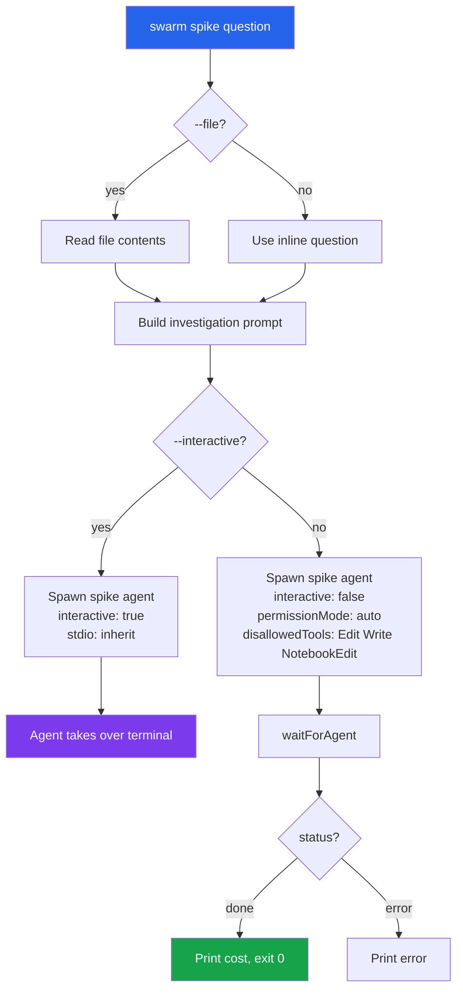
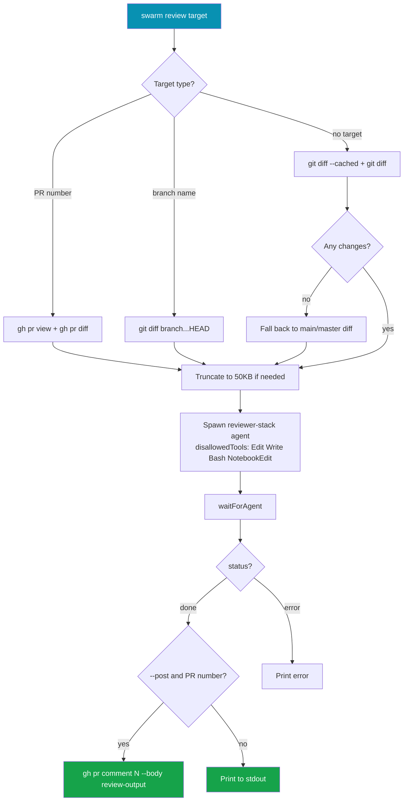
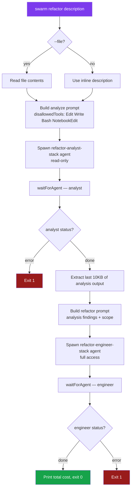
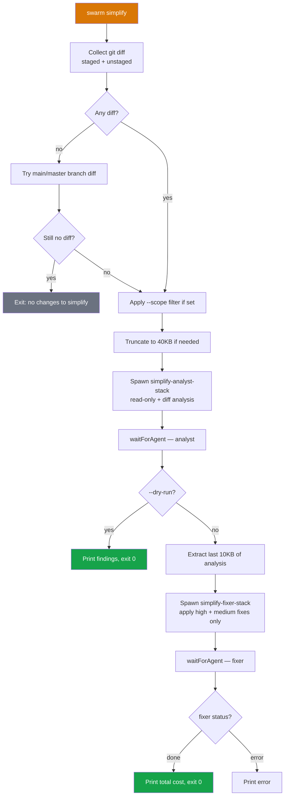
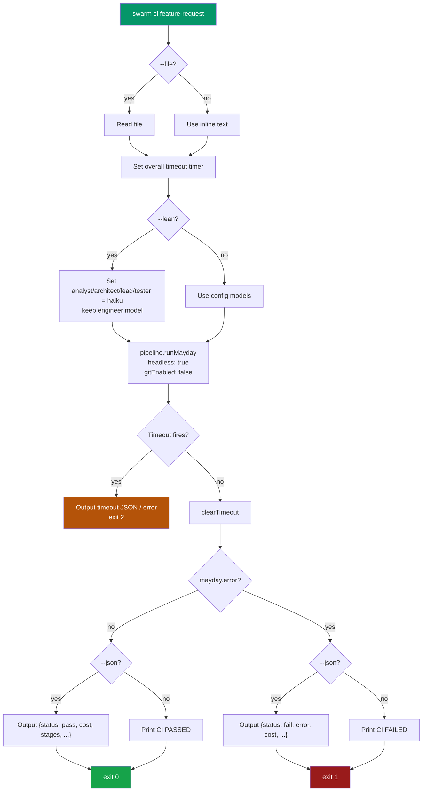
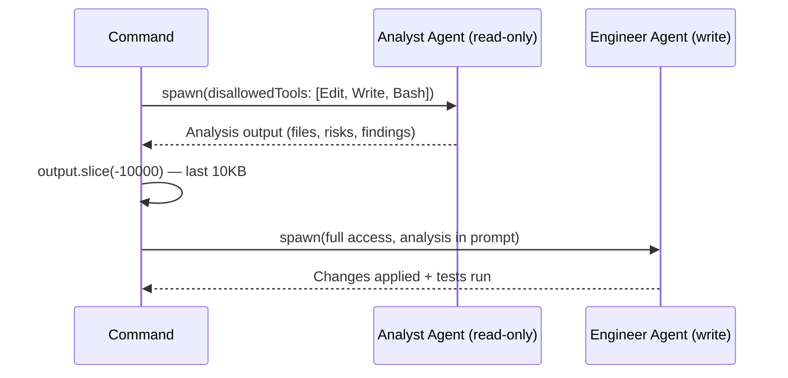

# 12 -- Quick Workflows: Fix, Spike, Review, Refactor, Simplify, CI

Quick workflows are single-purpose commands that bypass the full 5-stage pipeline and target a specific developer task. Each command auto-initializes a `.swarm/` directory if one does not exist, wires up `AgentManager` via `createContext()`, and runs one or two focused engineer agents with tailored prompts.

---

## 1. Overview

| Command | Purpose | Default Model | Agents Spawned | Modifies Code |
|---------|---------|--------------|----------------|---------------|
| `fix` | Fix a bug (with optional GitHub issue fetch) | from config (opus) | 1 (`fix-engineer-{stack}`) | Yes |
| `spike` | Explore / investigate the codebase | `haiku` | 1 (`spike-{stack}`) | No (read-only in headless mode) |
| `review` | Review staged changes, a branch diff, or a GitHub PR | `sonnet` | 1 (`reviewer-{stack}`) | No |
| `refactor` | Analyze scope then apply targeted code refactoring | from config | 2 (`refactor-analyst`, `refactor-engineer`) | Yes |
| `simplify` | Detect dead code, duplication, and over-engineering then auto-fix | `haiku` | 2 (`simplify-analyst`, `simplify-fixer`) | Yes (unless `--dry-run`) |
| `ci` | Headless MayDay pipeline for CI/CD, exits with status code | from config | Full MayDay pipeline | Yes |

All commands share the same auto-init pattern: if `requireSwarmDir()` throws (no `.swarm/` found), the command calls `autoInit()` with a stack detected from the current working directory.

---

## 2. Fix

### 2.1 What It Does

`swarm fix` skips the analysis, architecture, and planning stages and immediately spawns a single engineer agent to repair a bug. The agent reads the codebase, identifies the root cause, applies a minimal fix, and runs existing tests to verify no regressions.

Bug descriptions can come from three sources:
- **Inline text**: `swarm fix "login button throws null error"`
- **File**: `swarm fix bug.txt --file`
- **GitHub issue**: `swarm fix --issue 123` (fetches title, body, labels, and up to 5 recent comments via `gh` CLI)

Before spawning the agent, `fix` captures `git diff HEAD` to include any uncommitted context in the prompt.

### 2.2 Execution Flow

```mermaid
flowchart TD
    A[swarm fix] --> B{Source?}
    B -- --issue N --> C[gh issue view N --json]
    B -- description text --> D[Read inline / file]
    C --> E[Build bug prompt + issue context + labels]
    D --> E
    E --> F[git diff HEAD — capture uncommitted changes]
    F --> G[Spawn fix-engineer-stack agent\npermissionMode: auto]
    G --> H[waitForAgent]
    H --> I{status?}
    I -- done --> J[Print cost, exit 0]
    I -- error --> K[Print error, exit 1]

    style A fill:#dc2626,color:#fff
    style J fill:#16a34a,color:#fff
    style K fill:#991b1b,color:#fff
```

### 2.3 CLI Options

| Flag | Default | Description |
|------|---------|-------------|
| `[description]` | — | Bug description text or file path |
| `-s, --stack <stack>` | from config | Tech stack override (`react`, `node`, `go`, `python`, `rust`, `swift`) |
| `-m, --model <model>` | from config | Model override (`sonnet`, `opus`, `haiku`) |
| `-f, --file` | `false` | Treat argument as a file path to read |
| `-i, --issue <number>` | — | GitHub issue number to fix (fetches via `gh` CLI) |
| `-b, --budget <amount>` | from config | Max budget in USD |
| `-n, --max-iterations <n>` | `3` | Max fix-retest iterations |
| `--fix-budget <amount>` | `10` | Max USD to spend on fix iterations |
| `-y, --yes` | `false` | Skip cost confirmation |
| `--no-git` | `false` | Skip git branch creation and auto-commits |

### 2.4 Agent Configuration

The engineer agent is spawned in non-interactive, auto-permission mode:

```typescript
agentManager.spawn({
  name: `fix-engineer-${stack}`,
  persona: 'engineer',
  stack,
  prompt,           // Bug description + issue context + git diff
  model: config.model,
  interactive: false,
  permissionMode: 'auto',
});
```

### 2.5 Examples

```bash
# Fix from inline description
swarm fix "Login button throws TypeError: Cannot read property 'id' of null"

# Fix from GitHub issue
swarm fix --issue 42

# Fix from file with model override
swarm fix bugs/auth-regression.txt --file --model sonnet

# Fix with budget cap
swarm fix "Payment webhook not firing" --budget 5
```

---

## 3. Spike

### 3.1 What It Does

`swarm spike` runs a quick, read-only investigation of the codebase. It is designed for exploration tasks where you need answers but do not want any code changes. In headless mode (default), the agent is explicitly blocked from editing files via `disallowedTools: ['Edit', 'Write', 'NotebookEdit']`. In interactive mode (`--interactive`), the agent takes over the terminal for a live conversation.

The default model is `haiku` for fast, cheap exploration.

### 3.2 Execution Flow



### 3.3 CLI Options

| Flag | Default | Description |
|------|---------|-------------|
| `<question>` | required | Question or exploration task (text or file path) |
| `-s, --stack <stack>` | from config | Tech stack override |
| `-m, --model <model>` | `haiku` | Model override |
| `-f, --file` | `false` | Treat argument as a file path to read |
| `-b, --budget <amount>` | `3` | Max budget in USD |
| `-i, --interactive` | `false` | Interactive mode — converse with the agent in terminal |

### 3.4 Headless vs Interactive

| Mode | `interactive` | `permissionMode` | `disallowedTools` | Use case |
|------|--------------|-----------------|-------------------|----------|
| Headless (default) | `false` | `auto` | `Edit`, `Write`, `NotebookEdit` | Automated investigation, CI |
| Interactive | `true` | default | none | Live Q&A with the agent |

### 3.5 Examples

```bash
# Quick codebase question
swarm spike "Where is authentication middleware applied?"

# Investigate from a file
swarm spike questions/architecture-review.txt --file

# Interactive conversation
swarm spike "Walk me through the WebSocket message flow" --interactive

# Use a larger model for complex investigation
swarm spike "Identify all race conditions in the pipeline" --model sonnet
```

---

## 4. Review

### 4.1 What It Does

`swarm review` performs an AI-assisted code review. The reviewer agent is blocked from modifying files (`disallowedTools: ['Edit', 'Write', 'Bash', 'NotebookEdit']`) and produces a structured output with four mandatory sections: **Summary**, **Issues**, **Suggestions**, and a **Verdict** (`APPROVE` / `REQUEST_CHANGES` / `COMMENT`).

The command supports three review targets:
- **No target**: reviews staged and unstaged changes; falls back to `main...HEAD` or `master...HEAD`
- **Branch name**: diffs the branch against `HEAD`
- **PR number**: fetches the full diff and PR metadata via `gh pr diff` and `gh pr view`

Diffs larger than 50 KB are truncated automatically.

### 4.2 Execution Flow



### 4.3 CLI Options

| Flag | Default | Description |
|------|---------|-------------|
| `[target]` | current changes | PR number, branch name, or omit for staged/unstaged diff |
| `-s, --stack <stack>` | from config | Tech stack override |
| `-m, --model <model>` | `sonnet` | Model override |
| `--post` | `false` | Post review as PR comment via `gh pr comment` (requires `gh` CLI) |
| `-b, --budget <amount>` | `3` | Max budget in USD |

### 4.4 Review Output Structure

The agent is instructed to produce a response with this exact structure:

```
## Summary
One paragraph describing what the changes do.

## Issues
Severity (critical/warning/nit), file, line range, description, suggestion.

## Suggestions
Code quality improvements, better patterns, naming, readability.

## Verdict
APPROVE | REQUEST_CHANGES | COMMENT — one-line justification.
```

### 4.5 Examples

```bash
# Review current staged/unstaged changes
swarm review

# Review a GitHub PR
swarm review 87

# Review a PR and post the review as a comment
swarm review 87 --post

# Diff against a feature branch
swarm review feat/auth-refactor

# Use opus for deeper analysis
swarm review --model opus
```

---

## 5. Refactor

### 5.1 What It Does

`swarm refactor` runs a two-phase workflow:

1. **Analyze** (read-only): a first engineer agent scans the codebase, lists files to change, estimates complexity, and identifies risks — without touching any files.
2. **Apply** (write mode): a second engineer agent reads the analysis output and applies the changes, then verifies by running existing tests.

The `--scope` option restricts both agents to a specific directory or file path.

### 5.2 Execution Flow



### 5.3 CLI Options

| Flag | Default | Description |
|------|---------|-------------|
| `<description>` | required | What to refactor and why (text or file path) |
| `-s, --stack <stack>` | from config | Tech stack override |
| `-m, --model <model>` | from config | Model override |
| `-f, --file` | `false` | Treat argument as a file path to read |
| `-b, --budget <amount>` | from config | Max budget in USD |
| `--scope <path>` | — | Limit refactoring to a specific directory or file |
| `--no-git` | `false` | Skip git branch creation and auto-commits |
| `-y, --yes` | `false` | Skip cost confirmation |

### 5.4 Agent Configuration

```typescript
// Phase 1 — read-only analysis
agentManager.spawn({
  name: `refactor-analyst-${stack}`,
  persona: 'engineer',
  disallowedTools: ['Edit', 'Write', 'Bash', 'NotebookEdit'],
  permissionMode: 'auto',
});

// Phase 2 — apply changes (full access)
agentManager.spawn({
  name: `refactor-engineer-${stack}`,
  persona: 'engineer',
  permissionMode: 'auto',
  // disallowedTools not set — full write access
});
```

The analyst's output is piped to the engineer via `analyst.output.slice(-10000)` (last 10 KB).

### 5.5 Examples

```bash
# Refactor a specific concern
swarm refactor "Extract database queries into a repository layer"

# Scope to a directory
swarm refactor "Convert callbacks to async/await" --scope src/services

# Refactor from a spec file
swarm refactor refactor-plan.md --file

# Use a specific model
swarm refactor "Eliminate god objects in core/" --scope src/core --model opus
```

---

## 6. Simplify

### 6.1 What It Does

`swarm simplify` audits recently changed code for quality issues — dead code, unnecessary abstractions, duplication, over-engineering, and inconsistent patterns — then auto-applies the high- and medium-severity fixes. It runs a two-phase workflow similar to `refactor`:

1. **Analyze** (read-only): detects issues in the git diff (staged, unstaged, or branch diff vs `main`/`master`), assigns severity levels (`high`, `medium`, `low`), and suggests specific fixes.
2. **Fix** (write mode): applies only `high` and `medium` severity fixes with full confidence; skips `low` (nits); runs tests after each change and reverts any fix that breaks tests.

`--dry-run` stops after phase 1.

### 6.2 Severity Rules

| Severity | Auto-applied? | Condition |
|----------|--------------|-----------|
| `high` | Yes | Definite problem — always applied |
| `medium` | Yes | If the fix is straightforward and clearly correct |
| `low` | No | Nits — skipped |

### 6.3 Execution Flow



### 6.4 CLI Options

| Flag | Default | Description |
|------|---------|-------------|
| `-s, --stack <stack>` | from config | Tech stack override |
| `-m, --model <model>` | `haiku` | Model override |
| `--scope <path>` | — | Limit to specific directory or file |
| `--dry-run` | `false` | Report only — do not apply changes |
| `-b, --budget <amount>` | `3` | Max budget in USD |

### 6.5 Diff Collection Strategy

The command collects changes in priority order:

```
1. git diff --cached     (staged changes)
2. git diff              (unstaged changes)
   → combined if both exist
3. git diff main...HEAD  (fallback if no working-tree changes)
4. git diff master...HEAD (fallback if main doesn't exist)
```

The diff is capped at 40 KB. The analyst also reads full source files for context beyond the truncated diff.

### 6.6 Examples

```bash
# Simplify all current changes
swarm simplify

# Dry run — report only, no changes
swarm simplify --dry-run

# Limit to a specific module
swarm simplify --scope src/api

# Use sonnet for more thorough analysis
swarm simplify --model sonnet --budget 5

# Scope and dry-run for a pre-commit check
swarm simplify --scope packages/cli/src --dry-run
```

---

## 7. CI

### 7.1 What It Does

`swarm ci` is a headless wrapper around the full MayDay pipeline designed for CI/CD environments. It runs `pipeline.runMayday()` with `headless: true`, suppresses interactive output, optionally emits machine-readable JSON to stdout, and exits with a POSIX status code:

| Exit code | Meaning |
|-----------|---------|
| `0` | Pipeline passed (no `mayday.error`) |
| `1` | Pipeline failed (tests didn't pass or stage error) |
| `2` | Unhandled exception or overall timeout |

Git branch creation is disabled (`pipeline.gitEnabled = false`). Chalk colors are suppressed when `--json` is set.

### 7.2 Execution Flow



### 7.3 CLI Options

| Flag | Default | Description |
|------|---------|-------------|
| `<feature-request>` | required | Feature request text or file path |
| `-s, --stack <stack>` | from config | Tech stack override |
| `-m, --model <model>` | from config | Model override |
| `-p, --parallel <n>` | `3` | Max parallel engineer agents |
| `-n, --max-iterations <n>` | `3` | Max fix-retest iterations |
| `-b, --budget <amount>` | `10` | Max total budget in USD |
| `--fix-budget <amount>` | `10` | Max fix-loop budget in USD |
| `-f, --file` | `false` | Treat argument as a file path to read |
| `--lean` | `false` | Use `haiku` for docs stages (analyst, architect, lead, tester), keep engineer model |
| `--from <stage>` | — | Start from a specific stage (`analyze`, `architect`, `plan`, `build`, `test`) |
| `--timeout <minutes>` | `30` | Overall timeout in minutes; exits with code 2 on breach |
| `--json` | `false` | Output results as JSON to stdout |

### 7.4 JSON Output Schema

When `--json` is set, the command emits a single JSON line to stdout on completion:

```typescript
// Success or failure
interface CiJsonOutput {
  status: 'pass' | 'fail' | 'error' | 'timeout';
  cost: number;         // Total USD spent
  durationMs: number;   // Wall-clock time
  stages: {
    [stageName: string]: {
      status: string;
      artifact: string | null;
      cost: number | null;
    };
  };
  error: string | null; // mayday.error or exception message
}
```

Example output:

```json
{
  "status": "pass",
  "cost": 1.24,
  "durationMs": 183421,
  "stages": {
    "analyze":   { "status": "done", "artifact": "REQUIREMENTS.md", "cost": 0.12 },
    "architect": { "status": "done", "artifact": "SPEC.md",         "cost": 0.18 },
    "plan":      { "status": "done", "artifact": "TASKS.md",        "cost": 0.09 },
    "build":     { "status": "done", "artifact": null,              "cost": 0.71 },
    "test":      { "status": "done", "artifact": "TESTPLAN.md",     "cost": 0.14 }
  },
  "error": null
}
```

### 7.5 Lean Mode

`--lean` overrides per-stage model config so that documentation-heavy stages use `haiku` while the engineer stage retains its configured model:

```typescript
config.models = {
  analyst: 'haiku', architect: 'haiku', lead: 'haiku', tester: 'haiku',
  engineer: config.models?.engineer ?? config.model,
};
```

This can significantly reduce cost on large feature requests where the analysis stages are cheap and the engineering stage dominates.

### 7.6 Examples

```bash
# Basic CI run
swarm ci "Add OAuth2 login with Google"

# CI with JSON output (for log parsing)
swarm ci "Add user profile page" --json

# Read feature request from a spec file
swarm ci feature.md --file --json

# Lean mode to reduce cost on docs stages
swarm ci "Migrate to new API schema" --lean --budget 15

# Resume from a specific stage after a partial run
swarm ci "Build checkout flow" --from build

# Use in a GitHub Actions workflow
swarm ci "$FEATURE_REQUEST" --json --timeout 45 --budget 20
```

### 7.7 GitHub Actions Integration

`swarm ci` is designed for use in the bundled `.github/actions/swarm/` GitHub Action. The `--json` flag makes results parseable in subsequent workflow steps:

```yaml
- name: Run Swarm CI
  id: swarm
  run: |
    swarm ci "${{ inputs.feature_request }}" \
      --json \
      --timeout 45 \
      --budget 20 \
      --lean \
      > swarm-result.json
  continue-on-error: true

- name: Parse result
  run: |
    cat swarm-result.json | jq '.status'
```

---

## 8. Shared Patterns

### 8.1 Auto-Init

Every quick workflow command calls `requireSwarmDir()` and, if it throws, falls back to `autoInit()`:

```typescript
let swarmDir: string;
try {
  swarmDir = requireSwarmDir();
} catch {
  const stack = opts.stack || autoDetectStack(cwd);
  swarmDir = autoInit(projectName, stack, cwd);
}
```

This means all quick workflow commands work in any git repository without a prior `swarm init`.

### 8.2 Context and Cleanup

All commands call `createContext(swarmDir, config)` which returns `{ agentManager, pipeline, state, cleanup }`. The `cleanup()` function is always called in a `finally` block — it kills running agents, stops the WebSocket server, and flushes state.

### 8.3 Two-Phase Commands

`refactor` and `simplify` follow the same two-phase pattern:



The analyst's output is truncated to its last 10 KB before being injected into the engineer's prompt to stay within context limits.

### 8.4 Source File Reference

| File | Key exports |
|------|-------------|
| `packages/cli/src/commands/fix.ts` | `registerFix()` |
| `packages/cli/src/commands/spike.ts` | `registerSpike()` |
| `packages/cli/src/commands/review.ts` | `registerReview()` |
| `packages/cli/src/commands/refactor.ts` | `registerRefactor()` |
| `packages/cli/src/commands/simplify.ts` | `registerSimplify()` |
| `packages/cli/src/commands/ci.ts` | `registerCi()` |
| `packages/cli/src/commands/shared.ts` | `createContext()` — wires AgentManager, Pipeline, StateManager |
| `packages/cli/src/core/config.ts` | `requireSwarmDir()`, `autoInit()`, `autoDetectStack()`, `loadConfig()` |
| `packages/cli/src/core/git.ts` | `isGhInstalled()` |
