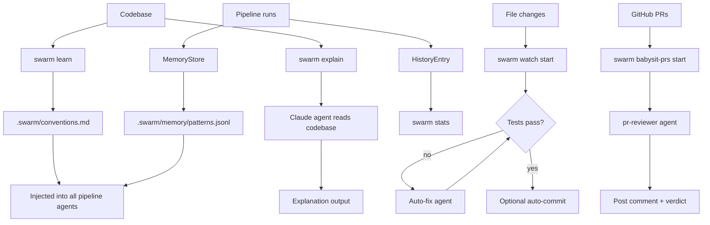
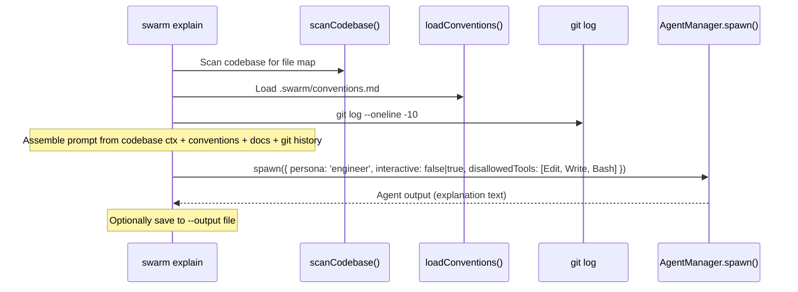
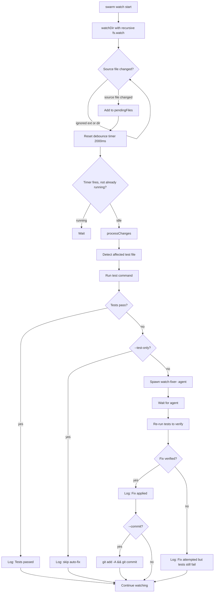
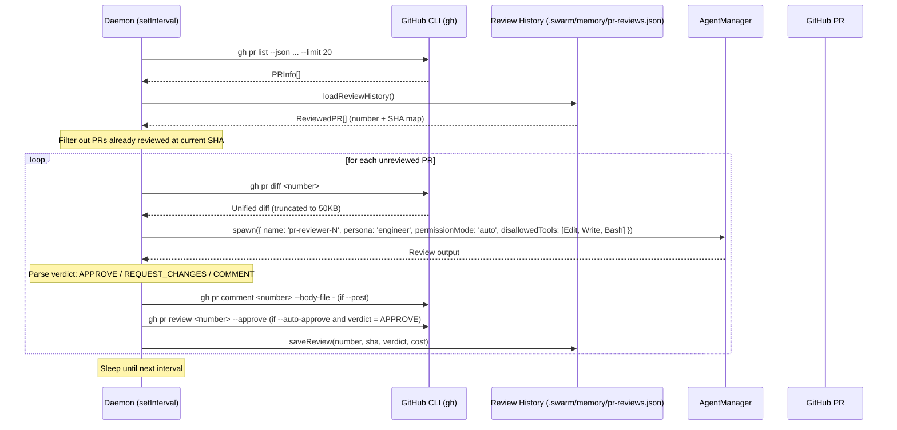
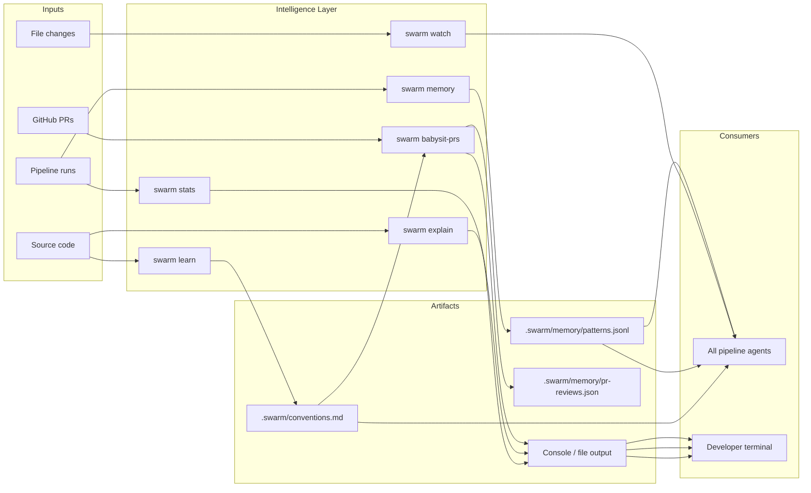

# 13 -- Intelligence and Memory: Learn, Memory, Explain, Stats, Watch, Babysit-PRs

This document covers the six intelligence and memory commands available in the Swarm CLI. These commands help Swarm understand your codebase, accumulate knowledge across pipeline runs, provide explanations, track costs, watch for regressions, and automate PR reviews.

---

## 1. Overview

Swarm's intelligence layer operates across two dimensions: **static analysis** (learn, explain) and **runtime memory** (memory, stats). Two additional commands provide continuous automation: **watch** for local development and **babysit-prs** for GitHub PR review.



---

## 2. swarm learn

### 2.1 Purpose

`swarm learn` scans the project source code and extracts coding conventions — naming patterns, file structure, import style, test patterns, component patterns, error handling, and tooling configuration. The extracted conventions are saved to `.swarm/conventions.md` and automatically injected into the system prompt of every pipeline agent.

This allows Swarm-generated code to match your project's existing style without manual configuration.

### 2.2 How It Works

```mermaid
flowchart TD
    A[swarm learn] --> B{.swarm/ exists?}
    B -- no --> C[autoInit: create .swarm/]
    B -- yes --> D{conventions.md exists?}
    C --> D

    D -- yes, no flags --> E[Print existing conventions and exit]
    D -- no or --refresh --> F[extractConventions cwd]
    D -- --merge flag --> G[Load existing + extractConventions]

    F --> H{conventions empty?}
    H -- yes --> I[Warn: no conventions detected]
    H -- no --> J[buildConventionPrompt]

    G --> J

    J --> K{--show flag?}
    K -- yes --> L[Print to stdout, no save]
    K -- no, --merge --> M[Append after separator in conventions.md]
    K -- no, full write --> N[Write header + conventions to conventions.md]
```

`extractConventions()` runs seven static analyzers against the source tree (up to depth 3, skipping `node_modules`, `dist`, `.git`, etc.):

| Analyzer | Detects |
|----------|---------|
| Naming | File naming (kebab-case, PascalCase, camelCase), variable naming, interface/type prefixes |
| Structure | Feature-based vs layer-based org, barrel exports, co-located vs separate test dirs |
| Imports | Path aliases (`@/`, `~/`), ESM vs CJS, `.js` extensions, `import type` usage |
| Tests | `.spec.ts` vs `.test.ts`, Vitest/Jest/Playwright/Testing Library, BDD vs test() style |
| Components | Functional vs class components, hooks, Tailwind/CSS-in-JS/CSS Modules, props typing |
| Error handling | Custom error classes, Result type, promise chains, try/catch |
| Config | `.env` files, TypeScript strict mode, path aliases, ESLint, Prettier, Biome |

The output is a structured Markdown document placed at `.swarm/conventions.md`. This file is free-form and can be manually edited. The `--merge` flag preserves manual edits by appending new scan results after a separator.

### 2.3 CLI Options

```
swarm learn [options]
```

| Flag | Default | Description |
|------|---------|-------------|
| `-s, --stack <stack>` | auto-detected | Tech stack override |
| `--refresh` | `false` | Re-scan even if `conventions.md` already exists (overwrites) |
| `--merge` | `false` | Append new scan results after a separator, preserving manual edits |
| `--show` | `false` | Print detected conventions to stdout without writing to disk |

### 2.4 Usage Examples

```bash
# First-time scan — saves to .swarm/conventions.md
swarm learn

# Print what would be detected, without saving
swarm learn --show

# Re-scan after major refactor (overwrites existing file)
swarm learn --refresh

# Add new patterns without losing manual notes
swarm learn --merge

# Override stack detection
swarm learn --stack node
```

### 2.5 Pipeline Integration

Conventions are injected automatically. `loadConventions(swarmDir)` is called in `commands/explain.ts` and `commands/babysit-prs.ts`. The Pipeline core also reads conventions and prepends them as a system-prompt section for every agent spawn.

The injected text is wrapped as:

```
PROJECT CONVENTIONS — Follow these patterns EXACTLY when writing code:

<content of conventions.md>

When in doubt, match the style of existing code in the project.
```

### 2.6 Source Files

| File | Role |
|------|------|
| `packages/cli/src/commands/learn.ts` | `registerLearn()`, `loadConventions()` |
| `packages/cli/src/core/convention-extractor.ts` | `extractConventions()`, `buildConventionPrompt()`, seven analyzer functions |

---

## 3. swarm memory

### 3.1 Purpose

`swarm memory` manages a persistent cross-run knowledge store. After each pipeline run, Swarm automatically records what worked, what failed, which tests are flaky, and which approaches should be avoided. Agents in subsequent runs receive this context and use it to avoid repeating past mistakes.

Memory is stored as newline-delimited JSON in `.swarm/memory/patterns.jsonl`. Entries auto-expire after 30 days (shorter for fix-specific patterns). The file is capped at 1MB; when the cap is exceeded, low-confidence and expired entries are pruned automatically.

### 3.2 MemoryEntry Interface

```typescript
export type MemoryKind =
  | 'fix-pattern'   // A specific fix approach and its outcome
  | 'flaky-test'    // A test known to intermittently fail
  | 'approach'      // A general engineering approach (positive or negative)
  | 'performance'   // Stage performance observations (cost, duration)
  | 'manual'        // User-added note
  | 'success';      // Summary of a successful pipeline run

export interface MemoryEntry {
  id: string;           // 'mem-<timestamp>-<random6>'
  kind: MemoryKind;
  content: string;      // Human-readable description injected into agent prompts
  createdAt: string;    // ISO timestamp
  expiresAt: string;    // ISO timestamp — entry ignored after this date
  confidence: number;   // 0-100: HIGH >=80, MEDIUM >=50, LOW <50
  source: string;       // 'pipeline-auto' | 'manual' | run ID
  tags: string[];       // Test names, file paths, stage names for filtered queries
}
```

### 3.3 Automatic Recording

The pipeline records entries automatically at these points:

| Event | Kind | Confidence | TTL |
|-------|------|-----------|-----|
| Pipeline succeeds | `success` | 90 | 30 days |
| Stage takes > 2 minutes | `performance` | 70 | 30 days |
| Pipeline fails at a stage | `approach` | 80 | 30 days |
| Fix approach fails tests | `fix-pattern` | 75 | 14 days |
| Test detected as flaky | `flaky-test` | 60 | 14 days |

### 3.4 Agent Injection

`MemoryStore.buildMemoryContext(tags?, maxEntries?)` builds an LLM-ready context block from the top-15 non-expired entries (sorted by confidence descending, optionally filtered by tags). The context is injected into agent system prompts as:

```
CROSS-RUN MEMORY — Lessons learned from previous pipeline runs:

- [FIX PATTERN] (HIGH confidence) Approach "X" failed to fix tests: ...
- [FLAKY TEST] (MEDIUM confidence) Test "Y" is flaky ...

Use this knowledge to avoid repeating past mistakes and follow approaches that worked.
```

### 3.5 Subcommands

```
swarm memory <subcommand>
```

#### `swarm memory list`

List all active (non-expired) memories.

| Flag | Default | Description |
|------|---------|-------------|
| `-k, --kind <kind>` | all | Filter by `fix-pattern`, `flaky-test`, `approach`, `performance`, `manual`, `success` |
| `-t, --tag <tag>` | none | Filter by tag or content match |

#### `swarm memory add`

Manually add a memory note.

```
swarm memory add <note> [options]
```

| Flag | Default | Description |
|------|---------|-------------|
| `-k, --kind <kind>` | `manual` | Memory kind |
| `-c, --confidence <n>` | `80` | Confidence score 0-100 |
| `-t, --tags <tags>` | none | Comma-separated tags |

#### `swarm memory show`

Print the memory context exactly as it would be injected into agents (useful for debugging what agents see).

#### `swarm memory remove <id>`

Remove a specific memory entry by its ID.

#### `swarm memory clear`

Delete all stored memories (irreversible).

### 3.6 Usage Examples

```bash
# List all memories
swarm memory list

# Filter to fix-pattern memories only
swarm memory list --kind fix-pattern

# Filter by tag (file path, test name, or stage)
swarm memory list --tag "auth.test.ts"

# Manually add a note agents will see
swarm memory add "Never use React.memo on components with frequently-changing props" --kind approach

# Add a flaky test note
swarm memory add "LoginFlow test is flaky on CI — retry once before failing" --kind flaky-test --tags "LoginFlow"

# Preview what agents will see
swarm memory show

# Remove a specific entry
swarm memory remove mem-1712345678-abc123

# Start fresh
swarm memory clear
```

### 3.7 Source Files

| File | Role |
|------|------|
| `packages/cli/src/commands/memory.ts` | `registerMemory()` — all subcommands |
| `packages/cli/src/core/memory-store.ts` | `MemoryStore` class, `MemoryEntry` interface, `recordPipelineSuccess()`, `recordPipelineFailure()`, `recordFlakyTest()` |

---

## 4. swarm explain

### 4.1 Purpose

`swarm explain` spawns a Claude agent to read the codebase and produce a human-readable explanation. It supports three modes: full project overview, targeted file/directory explanation, and free-form question answering. Output can be saved to a file or explored interactively.

The agent uses the `haiku` model by default for speed and cost efficiency, runs in read-only mode (Edit, Write, Bash, and NotebookEdit tools are disallowed), and incorporates any existing `conventions.md`.

### 4.2 Modes

| Mode | Trigger | What the agent produces |
|------|---------|------------------------|
| Full overview | No `[target]` argument | Architecture, key patterns, data flow, entry points, testing |
| File explanation | `[target]` is an existing file path | Purpose, key exports, design decisions, non-obvious behavior |
| Directory explanation | `[target]` is an existing directory | Contents, relationships, public API, module role |
| Question answering | `[target]` is a string that is not a path | Answer with file/line citations |

### 4.3 Explain Flow



### 4.4 Depth Levels

| Level | Behavior |
|-------|----------|
| `shallow` | 1-2 paragraphs. What it does and key entry points only. |
| `medium` (default) | 2-4 sections. Architecture, key patterns, data flow, important files. |
| `deep` | Comprehensive. Every major module, data flow, patterns, configuration, testing, deployment, with code examples. |

### 4.5 CLI Options

```
swarm explain [target] [options]
```

| Flag | Default | Description |
|------|---------|-------------|
| `-s, --stack <stack>` | from config | Tech stack override |
| `-m, --model <model>` | `haiku` | Model override (haiku is default for speed) |
| `--diagram` | `false` | Request Mermaid diagrams in the explanation |
| `--depth <level>` | `medium` | Detail level: `shallow`, `medium`, `deep` |
| `-o, --output <file>` | none | Save explanation to a file |
| `-b, --budget <amount>` | `3` | Max budget in USD |
| `-i, --interactive` | `false` | Interactive mode — opens two-way terminal Q&A session |

### 4.6 Usage Examples

```bash
# Full project overview at medium depth
swarm explain

# Deep dive with architecture diagrams
swarm explain --depth deep --diagram

# Explain a specific file
swarm explain src/core/pipeline.ts

# Explain a directory
swarm explain src/commands/

# Ask a question about the codebase
swarm explain "How does the fix loop determine which tests failed?"

# Save explanation to a markdown file
swarm explain --depth deep --diagram -o ARCHITECTURE.md

# Use sonnet for better analysis quality
swarm explain --model sonnet --depth deep

# Interactive follow-up Q&A in terminal
swarm explain src/core/state.ts --interactive
```

### 4.7 Source Files

| File | Role |
|------|------|
| `packages/cli/src/commands/explain.ts` | `registerExplain()`, `buildExplainPrompt()` |
| `packages/cli/src/core/codebase-scanner.ts` | `scanCodebase()` — file map context for the agent |
| `packages/cli/src/commands/learn.ts` | `loadConventions()` — injected into the explain prompt |

---

## 5. swarm stats

### 5.1 Purpose

`swarm stats` reads the pipeline run history from `StateManager` and reports cost and performance statistics across a configurable time window. It surfaces per-stage cost breakdowns, weekly spend trends, and actionable recommendations for reducing cost or improving reliability.

### 5.2 Stats Interface

```typescript
interface Stats {
  totalRuns: number;
  passed: number;
  failed: number;
  successRate: number;               // 0-100 integer
  totalCost: number;                 // USD
  avgCostPerRun: number;             // USD
  avgDurationMs: number;
  avgFixIterations: number;
  stageCosts: Array<{
    stage: string;
    totalCost: number;
    avgCost: number;
    avgDurationMs: number;
    count: number;
  }>;
  weeklySpend: Array<{
    week: string;                    // ISO date of week start (Sunday)
    cost: number;
    runs: number;
  }>;
  recommendations: string[];
}
```

### 5.3 Computed Metrics

`computeStats(entries)` derives all fields from the `HistoryEntry[]` array. Key calculations:

- **passed**: runs where every stage has status `done`, `skipped`, or `pending` (no `error` or `failed` stages)
- **stageCosts**: aggregated from `HistoryEntry.stageBreakdowns` — only `done` stages are counted
- **weeklySpend**: grouped by Sunday-anchored week start date
- **avgFixIterations**: mean of `HistoryEntry.fixIterations` (0 for non-MayDay runs)

### 5.4 Automatic Recommendations

The stats engine generates recommendations when thresholds are crossed:

| Condition | Recommendation |
|-----------|---------------|
| Top stage > 35% of total spend | Switch to cheaper model for that stage |
| Average fix iterations > 2 | Run `swarm learn` to improve code quality |
| Success rate < 50% (3+ runs) | Check `FAILURE-REPORT.md` for patterns |
| Average cost per run > $10 | Try `--lean` mode to save ~70% |

### 5.5 CLI Options

```
swarm stats [options]
```

| Flag | Default | Description |
|------|---------|-------------|
| `--period <days>` | `30` | Look-back window in days |
| `--json` | `false` | Output raw JSON instead of formatted tables |

### 5.6 Usage Examples

```bash
# Stats for the last 30 days (default)
swarm stats

# Stats for the last 7 days
swarm stats --period 7

# Stats for the last 90 days
swarm stats --period 90

# Machine-readable JSON output (for dashboards, scripts)
swarm stats --json

# Pipe JSON into jq to extract cost recommendations
swarm stats --json | jq '.recommendations[]'
```

### 5.7 Sample Output

```
Swarm Stats — last 30 days

  Overview
    Runs: 12 | Passed: 9 | Failed: 3
    Success rate: 75%
    Total cost: $24.50 | Avg per run: $2.04
    Avg duration: 8.2m
    Avg fix iterations: 1.3

  Cost by Stage
    build      $14.20 (58%) ██████████████  avg 5.1m
    test        $5.80 (24%) ██████          avg 2.3m
    architect   $2.40 (10%) ██              avg 1.1m
    analyze     $1.20 ( 5%) █               avg 0.5m
    lead        $0.90 ( 4%) █               avg 0.4m

  Recommendations
    → "build" accounts for 58% of total spend — consider using a cheaper model for this stage.
```

### 5.8 Source Files

| File | Role |
|------|------|
| `packages/cli/src/commands/stats.ts` | `registerStats()`, `computeStats()`, `Stats` interface |
| `packages/cli/src/core/state.ts` | `StateManager.listHistory()` — source of `HistoryEntry[]` |
| `packages/cli/src/types.ts` | `HistoryEntry` type definition |

---

## 6. swarm watch

### 6.1 Purpose

`swarm watch start` is a continuous local CI loop. It uses `fs.watch()` to monitor source file changes, runs the appropriate test suite, and — when tests fail — spawns a Swarm engineer agent to apply a fix. An optional `--commit` flag auto-commits when a fix restores green tests.

This gives developers an autonomous safety net: write code, save, and let Swarm catch and fix regressions in the background.

### 6.2 Watch Loop Flow



### 6.3 Stack-Aware Test Commands

`resolveTestCommand(stack)` maps stacks to their default test runner:

| Stack | Default command |
|-------|----------------|
| `react` | Auto-detected (vitest / jest / react-scripts) |
| `node` | Auto-detected (vitest / jest / mocha) |
| `go` | `go test ./...` |
| `python` | `pytest -v` |
| `rust` | `cargo test` |
| `swift` | `swift test` |
| `custom` | Auto-detected |

For JS stacks, `findAffectedTestCmd()` narrows the test scope to only files co-located with the changed source (e.g., `user.test.ts` when `user.ts` changes). For Go, it narrows to the affected package(s). This makes watch cycles significantly faster on large codebases.

### 6.4 TestRun Interface

```typescript
interface TestRun {
  changedFiles: string[];  // Relative paths of files that triggered this run
  testCmd: string;         // Exact command that was executed
  passed: boolean;
  output: string;          // Last 5KB of test output
  timestamp: number;
  fixApplied: boolean;     // Whether a fix agent was spawned
}
```

### 6.5 WatchStatus Interface

```typescript
export interface WatchStatus {
  running: boolean;
  totalRuns: number;
  passed: number;
  failed: number;
  autoFixed: number;
}
```

### 6.6 Ignored Paths

Watch ignores the following directories (always):
`node_modules`, `.git`, `dist`, `build`, `.swarm`, `.next`, `__pycache__`, `.venv`, `venv`, `target`, `.build`, `coverage`, `.cache`, `.turbo`

Only files with extensions `.ts`, `.tsx`, `.js`, `.jsx`, `.go`, `.py`, `.rs`, `.swift` trigger a test run.

### 6.7 Subcommands

#### `swarm watch start`

Start the file watcher daemon.

| Flag | Default | Description |
|------|---------|-------------|
| `-s, --stack <stack>` | auto-detected | Tech stack override |
| `-m, --model <model>` | `sonnet` | Model for auto-fix agents |
| `--test-only` | `false` | Run tests on change but do not auto-fix failures |
| `--commit` | `false` | Auto-commit after a successful auto-fix |
| `--scope <path>` | project root | Watch only a specific subdirectory |
| `-d, --debounce <ms>` | `2000` | Milliseconds to wait after last change before running tests |
| `-b, --budget <amount>` | `3` | Max budget per auto-fix agent in USD |

#### `swarm watch stop`

Prints a reminder to press Ctrl+C in the running terminal. (The watch loop handles SIGINT itself.)

### 6.8 Usage Examples

```bash
# Start watching with auto-fix enabled
swarm watch start

# Watch but only run tests — no auto-fix
swarm watch start --test-only

# Watch a specific subdirectory
swarm watch start --scope src/auth/

# Use haiku for faster, cheaper fixes
swarm watch start --model haiku

# Auto-commit when fixes succeed
swarm watch start --commit

# Reduce debounce for rapid iteration
swarm watch start --debounce 500

# Watch a Python project
swarm watch start --stack python
```

### 6.9 Session Summary

When stopped with Ctrl+C, the watcher prints a session summary:

```
Watch stopped. 8 test run(s) in this session.
  Passed: 6 | Failed: 2 | Auto-fixed: 1
```

### 6.10 Source Files

| File | Role |
|------|------|
| `packages/cli/src/commands/watch.ts` | `registerWatch()`, `resolveTestCommand()`, `findAffectedTestCmd()`, `WatchStatus` |

---

## 7. swarm babysit-prs

### 7.1 Purpose

`swarm babysit-prs start` is a background daemon that polls GitHub for open PRs, reviews each unreviewed PR using a Claude agent, posts the review as a comment, and optionally auto-approves PRs that pass. It uses SHA-based deduplication so each commit on a PR is reviewed at most once.

The command requires the GitHub CLI (`gh`) to be installed and authenticated.

### 7.2 Review Cycle Flow



### 7.3 Review Interfaces

```typescript
interface PRInfo {
  number: number;
  title: string;
  body: string;
  headRefOid: string;          // Current HEAD commit SHA — used for deduplication
  author: { login: string };
  labels: Array<{ name: string }>;
  additions: number;
  deletions: number;
}

interface ReviewedPR {
  number: number;
  sha: string;                 // headRefOid at time of review
  reviewedAt: string;          // ISO timestamp
  verdict: string;             // 'APPROVE' | 'REQUEST_CHANGES' | 'COMMENT'
  cost: number;                // USD cost of the review agent
}
```

### 7.4 Review Prompt Structure

Each review prompt instructs the agent to produce a structured review with these sections:

| Section | Content |
|---------|---------|
| `## Summary` | Brief description of what the PR does |
| `## Issues` | Bugs, security issues, performance problems with severity, file, and suggestion |
| `## Convention Violations` | Deviations from `.swarm/conventions.md` if present |
| `## Suggestions` | Improvements for readability, maintainability, performance |
| `## Verdict` | `APPROVE`, `REQUEST_CHANGES`, or `COMMENT` with one-line justification |

The agent receives the full PR diff (truncated to 50KB if larger), the PR description, author, change counts, and any project conventions from `.swarm/conventions.md`.

### 7.5 Verdict Parsing

The daemon extracts the verdict from the agent's output using case-insensitive regex:

```typescript
if (output.match(/verdict[:\s]*APPROVE/i))          verdict = 'APPROVE';
else if (output.match(/verdict[:\s]*REQUEST_CHANGES/i)) verdict = 'REQUEST_CHANGES';
else                                                    verdict = 'COMMENT';
```

### 7.6 Deduplication

Each reviewed PR is stored as `{ number, sha }` in `.swarm/memory/pr-reviews.json`. A PR is only reviewed again if its HEAD commit SHA changes (i.e., new commits are pushed). The history is capped at 200 entries.

### 7.7 Subcommands

#### `swarm babysit-prs start`

Start the PR review daemon.

| Flag | Default | Description |
|------|---------|-------------|
| `-i, --interval <minutes>` | `5` | Poll interval in minutes |
| `-m, --model <model>` | `sonnet` | Model for review agents |
| `-l, --label <label>` | none | Only review PRs with this label |
| `--auto-approve` | `false` | Automatically approve PRs where verdict is APPROVE |
| `--post` | `true` | Post review as a PR comment |
| `--once` | `false` | Run a single review cycle and exit (no daemon loop) |
| `-b, --budget <amount>` | `3` | Max budget per review in USD |

#### `swarm babysit-prs status`

Show the last 10 reviewed PRs with verdicts and cost summary.

#### `swarm babysit-prs stop`

Prints instructions to press Ctrl+C or use `kill $(pgrep -f "swarm babysit-prs")`.

### 7.8 Usage Examples

```bash
# Start the daemon, review all open PRs every 5 minutes
swarm babysit-prs start

# Run one review cycle and exit (useful in CI)
swarm babysit-prs start --once

# Only review PRs labeled "ready-for-review"
swarm babysit-prs start --label ready-for-review

# Auto-approve when verdict is APPROVE
swarm babysit-prs start --auto-approve

# Use opus for higher-quality reviews
swarm babysit-prs start --model opus

# Run every 15 minutes, skip posting comments (dry run)
swarm babysit-prs start --interval 15 --no-post

# Check review history and cost summary
swarm babysit-prs status

# Run in CI as a one-shot reviewer on every push
swarm babysit-prs start --once --label ci-review --model haiku
```

### 7.9 Requirements

- GitHub CLI (`gh`) must be installed: `brew install gh` / `https://cli.github.com`
- `gh` must be authenticated: `gh auth login`
- The working directory must be inside a GitHub-hosted git repository

### 7.10 Source Files

| File | Role |
|------|------|
| `packages/cli/src/commands/babysit-prs.ts` | `registerBabysitPrs()`, `runReviewCycle()`, `PRInfo`, `ReviewedPR` |
| `packages/cli/src/core/git.ts` | `isGhInstalled()` — checks for `gh` on PATH |
| `packages/cli/src/commands/learn.ts` | `loadConventions()` — injected into review prompts |

---

## 8. Cross-Command Data Flow



All six commands are additive: they improve agent quality over time without requiring manual configuration. Running `swarm learn` and letting `swarm memory` accumulate history is the primary mechanism by which Swarm becomes more reliable and cost-efficient on a specific codebase.

---

## Appendix: Source File Reference

| File | Key exports |
|------|-------------|
| `packages/cli/src/commands/learn.ts` | `registerLearn()`, `loadConventions()` |
| `packages/cli/src/commands/memory.ts` | `registerMemory()` |
| `packages/cli/src/commands/explain.ts` | `registerExplain()`, `buildExplainPrompt()` |
| `packages/cli/src/commands/stats.ts` | `registerStats()`, `computeStats()`, `Stats` |
| `packages/cli/src/commands/watch.ts` | `registerWatch()`, `WatchStatus` |
| `packages/cli/src/commands/babysit-prs.ts` | `registerBabysitPrs()`, `getReviewHistory()` |
| `packages/cli/src/core/convention-extractor.ts` | `extractConventions()`, `buildConventionPrompt()` |
| `packages/cli/src/core/memory-store.ts` | `MemoryStore`, `MemoryEntry`, `MemoryKind`, `recordPipelineSuccess()`, `recordPipelineFailure()`, `recordFlakyTest()` |
