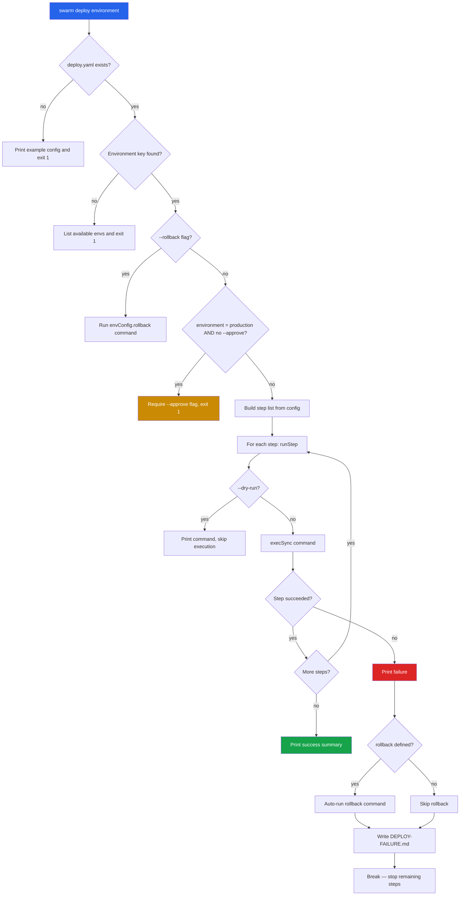
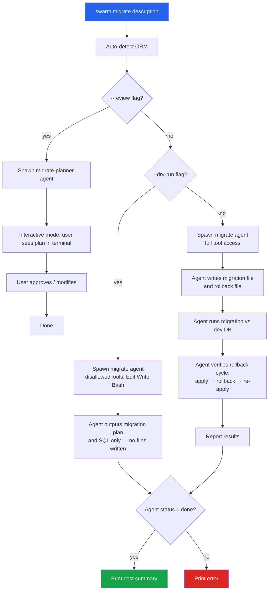
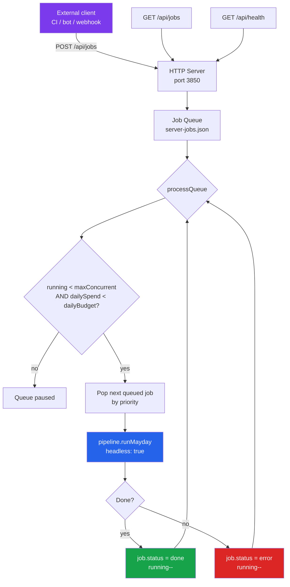
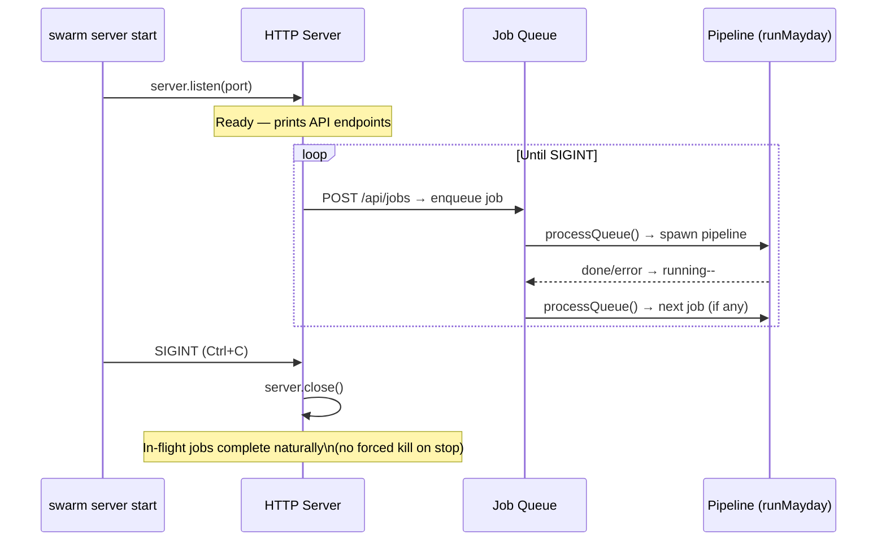

# 14 -- Deployment and Infrastructure: Deploy, Migrate, Server

## 1. Overview

This document covers three Swarm CLI commands that extend the agent orchestration model into production infrastructure workflows:

- **`swarm deploy`** — Executes staged deployment pipelines (build → deploy → healthcheck → smoke test) defined in `.swarm/deploy.yaml`. Supports dry-run, production approval gates, and automatic rollback on failure.
- **`swarm migrate`** — AI-assisted database migration generation. Auto-detects the ORM/framework, spawns an engineer agent to write the migration and rollback, and optionally runs a live test cycle.
- **`swarm server`** — Runs Swarm as a shared HTTP server with a priority job queue, exposing a REST API that allows teams or CI pipelines to submit feature-request jobs without direct CLI access.

All three commands follow the same action-handler pattern as the rest of the Swarm CLI: `requireSwarmDir()` + `loadConfig()` + `createContext()` → command-specific logic.

---

## 2. Deploy Command

### 2.1 Purpose

`swarm deploy` reads a YAML file at `.swarm/deploy.yaml` and executes the steps defined for the target environment in sequence: build → deploy (or promote) → healthcheck → smoketest. If any step fails, an auto-rollback is attempted and a `DEPLOY-FAILURE.md` report is written to the project root.

### 2.2 Configuration: `.swarm/deploy.yaml`

Each top-level key in `deploy.yaml` is an environment name. Each environment maps to a `DeployEnv` object:

```typescript
interface DeployEnv {
  build?:       string;  // Shell command to build the artifact
  deploy?:      string;  // Shell command to deploy the artifact
  healthcheck?: string;  // Command to verify the deployment is live
  smoketest?:   string;  // End-to-end test command (e.g., Playwright)
  promote?:     string;  // Image promotion command (e.g., kubectl set image)
  rollback?:    string;  // Command run automatically on failure, or via --rollback
}

interface DeployConfig {
  [env: string]: DeployEnv;
}
```

Example `.swarm/deploy.yaml`:

```yaml
staging:
  build: "docker build -t app:staging ."
  deploy: "kubectl apply -f k8s/staging/"
  healthcheck: "curl -f http://staging.internal/health"
  smoketest: "npx playwright test --config=e2e/staging.config.ts"
  rollback: "kubectl rollout undo deployment/app-staging"

production:
  promote: "kubectl set image deployment/app app=app:staging"
  healthcheck: "curl -f http://prod.internal/health"
  rollback: "kubectl rollout undo deployment/app"
```

### 2.3 Deployment Flow



### 2.4 Step Execution

Each step runs via Node's `execSync` with:
- `stdio: 'pipe'` — output captured, not forwarded to terminal
- `cwd: process.cwd()` — runs in the project directory
- `timeout: 300000` — 5-minute per-step timeout

On failure, the last 500 characters of `stderr` (or `stdout`) are shown alongside the spinner failure message.

### 2.5 Failure Report

On any step failure, Swarm writes `DEPLOY-FAILURE.md` to the project root:

```
# Deployment Failure Report

Environment: staging
Failed step: Healthcheck
Command: `curl -f http://staging.internal/health`
Timestamp: 2026-04-02T12:00:00.000Z

## Steps
- Build: pass (12340ms)
- Deploy: pass (8231ms)
- Healthcheck: fail (5001ms)

## Rollback executed automatically
```

### 2.6 CLI Options

```
swarm deploy <environment>
```

| Flag | Default | Description |
|------|---------|-------------|
| `<environment>` | (required) | Target environment key from `deploy.yaml` (e.g., `staging`, `production`) |
| `--approve` | `false` | Required for `production` environment; acts as an explicit confirmation gate |
| `--dry-run` | `false` | Print each step command without executing it; all steps report as `skip` |
| `--skip-tests` | `false` | Omit the `smoketest` step even if defined in config |
| `--rollback` | `false` | Run only the `rollback` command for the specified environment |

### 2.7 CLI Examples

```bash
# Deploy to staging
swarm deploy staging

# Dry run — see what would execute without running anything
swarm deploy staging --dry-run

# Deploy to production (approval gate required)
swarm deploy production --approve

# Deploy to production, skip smoke tests
swarm deploy production --approve --skip-tests

# Rollback the last production deployment
swarm deploy production --rollback
```

---

## 3. Migrate Command

### 3.1 Purpose

`swarm migrate` spawns an AI engineer agent to generate a safe database migration for the detected ORM or framework. It automatically inspects the project for known ORM indicators (config files, `package.json` dependencies, `requirements.txt`, `go.mod`) before constructing a prompt. Supports three execution modes: standard (generate + test), dry-run (plan only, no file writes), and review (interactive approval before generation).

### 3.2 ORM Detection

Detection runs before the agent is spawned. The priority order is:

1. **File presence**: checks for well-known config files (e.g., `prisma/schema.prisma`, `drizzle.config.ts`, `alembic.ini`, `manage.py`)
2. **`package.json` dependencies**: scans `dependencies` and `devDependencies` for ORM package names
3. **`requirements.txt`**: scans for `django`, `alembic`, `sqlalchemy`
4. **`go.mod`**: scans for `goose`, `golang-migrate`

Supported ORMs and their indicators:

| ORM | Config files | Package deps |
|-----|-------------|--------------|
| Prisma | `prisma/schema.prisma` | `prisma`, `@prisma/client` |
| TypeORM | `ormconfig.json`, `ormconfig.ts` | `typeorm` |
| Knex | `knexfile.js`, `knexfile.ts` | `knex` |
| Drizzle | `drizzle.config.ts` | `drizzle-orm` |
| Sequelize | `.sequelizerc` | `sequelize` |
| Django | `manage.py` | — |
| SQLAlchemy | `alembic.ini` | `sqlalchemy`, `alembic` |
| goose | — | `goose` (go.mod) |

If no ORM is detected, the agent is instructed to analyze the project and determine the migration framework itself.

### 3.3 Migration Flow



### 3.4 Execution Modes

| Mode | Flag | Agent tools | Files written | DB tested |
|------|------|-------------|---------------|-----------|
| Standard | (none) | Full access | Yes | Yes (apply + rollback cycle) |
| Dry run | `--dry-run` | No file/shell tools | No | No |
| Review | `--review` | No file writes, interactive | No (plan phase) | No |

In **dry-run** mode, `disallowedTools` blocks `Edit`, `Write`, `NotebookEdit`, and `Bash`, so the agent can only read files and output its plan.

In **review** mode, the agent runs interactively (`stdio: 'inherit'`) with `disallowedTools: ['Edit', 'Write', 'NotebookEdit']`. The user sees the migration plan in the terminal and can converse with the agent before any files are created.

### 3.5 Safety Checks

The agent prompt includes explicit safety instructions. The agent is required to flag:

- **Destructive operations** (DROP TABLE, DROP COLUMN) — require explicit confirmation
- **Data loss risk** — suggest a data preservation strategy
- **Large table operations** — warn about lock duration
- **Foreign key constraint changes** — validate referential integrity

The agent is also required to produce a rollback/down migration alongside the forward migration.

### 3.6 Auto-Init

If no `.swarm/` directory exists, `migrate` calls `autoInit()` with the auto-detected stack. This means `migrate` can be run in any project without having first run `swarm init`.

### 3.7 CLI Options

```
swarm migrate <description>
```

| Flag | Default | Description |
|------|---------|-------------|
| `<description>` | (required) | Natural-language description of the migration (e.g., `"add user preferences table"`) |
| `-s, --stack <stack>` | from config | Tech stack override |
| `-m, --model <model>` | `sonnet` | Model override (note: defaults to `sonnet`, not `opus`) |
| `--dry-run` | `false` | Plan only — no files written, no commands executed |
| `--review` | `false` | Interactive plan review; agent waits for user approval before generating |
| `-b, --budget <amount>` | `5` | Max budget in USD for the agent run |

### 3.8 CLI Examples

```bash
# Generate a migration for a new table
swarm migrate "add user preferences table"

# See what would be generated without writing any files
swarm migrate "add user preferences table" --dry-run

# Review the plan interactively before generating
swarm migrate "rename email column to email_address" --review

# Use a faster/cheaper model for simple migrations
swarm migrate "add index on orders.created_at" --model haiku

# Override stack detection
swarm migrate "add audit log table" --stack node

# Set a strict budget cap
swarm migrate "migrate users table to partitioned schema" --budget 10
```

---

## 4. Server Command

### 4.1 Purpose

`swarm server` runs Swarm as a persistent HTTP server with a priority job queue. It accepts feature requests via a REST API and executes them as MayDay pipeline runs, up to a configurable concurrency limit and daily budget cap. This allows teams to submit work from CI pipelines, Slack bots, or custom tooling without direct CLI access.

### 4.2 Architecture



### 4.3 Job Interface

```typescript
interface Job {
  id: string;           // "job-{timestamp}-{random4}" e.g. "job-1743600000000-a3f2"
  prompt: string;       // Feature request text (passed to runMayday)
  priority: 'high' | 'normal' | 'low';
  status: 'queued' | 'running' | 'done' | 'error';
  submittedAt: number;  // Epoch ms
  startedAt?: number;   // Set when job starts executing
  finishedAt?: number;  // Set on completion or failure
  cost?: number;        // USD cost (tracked via pipeline state)
  error?: string;       // Error message if status = 'error'
  submittedBy?: string; // Caller identifier (defaults to 'anonymous')
}
```

### 4.4 Priority Queue

Jobs are inserted into the queue by priority:

- **`high`** jobs are inserted before the first `normal`/`low` queued job (front-of-line)
- **`normal`** and **`low`** jobs are appended to the tail

The queue is persisted to `.swarm/server-jobs.json` (last 500 entries) on every mutation.

### 4.5 REST API

#### `POST /api/jobs` — Submit a job

Request body:

```json
{
  "prompt": "Add OAuth2 Google login",
  "priority": "high",
  "submittedBy": "ci-pipeline"
}
```

| Field | Required | Default | Description |
|-------|----------|---------|-------------|
| `prompt` | Yes | — | Feature request text, passed directly to `pipeline.runMayday()` |
| `priority` | No | `"normal"` | `"high"` \| `"normal"` \| `"low"` |
| `submittedBy` | No | `"anonymous"` | Caller identifier for logging |

Response `201`:

```json
{
  "id": "job-1743600000000-a3f2",
  "prompt": "Add OAuth2 Google login",
  "priority": "high",
  "status": "queued",
  "submittedAt": 1743600000000,
  "submittedBy": "ci-pipeline"
}
```

#### `GET /api/jobs` — List all jobs

Response `200`:

```json
{
  "jobs": [ /* Job[] */ ],
  "running": 1,
  "dailySpend": 12.40,
  "dailyBudget": 50
}
```

#### `GET /api/health` — Server health check

Response `200`:

```json
{
  "status": "ok",
  "running": 1,
  "queued": 3
}
```

### 4.6 Budget Management

The server tracks `dailySpend` in memory. When `dailySpend >= dailyBudget`, `processQueue()` returns early and logs a warning instead of starting new jobs. The counter resets automatically at midnight (local time) via a scheduled `setTimeout` that recalculates the ms until the next midnight boundary.

### 4.7 Subcommands

`swarm server` has three subcommands:

#### `swarm server start` — Start the server

| Flag | Default | Description |
|------|---------|-------------|
| `-p, --port <port>` | `3850` | HTTP port to listen on |
| `--max-concurrent <n>` | `2` | Maximum number of pipeline jobs running simultaneously |
| `--budget <amount>` | `50` | Daily spend cap in USD; queue pauses when reached |

#### `swarm server submit` — Submit a job to a running server

```
swarm server submit <prompt>
```

| Flag | Default | Description |
|------|---------|-------------|
| `<prompt>` | (required) | Feature request text |
| `-p, --port <port>` | `3850` | Port of the running server |
| `--priority <level>` | `normal` | `high` \| `normal` \| `low` |

#### `swarm server jobs` — List jobs on a running server

```
swarm server jobs
```

| Flag | Default | Description |
|------|---------|-------------|
| `-p, --port <port>` | `3850` | Port of the running server |

Prints the last 20 jobs with status, ID, prompt excerpt, and cost.

### 4.8 CLI Examples

```bash
# Start the server on default port with default settings
swarm server start

# Start on a custom port with higher concurrency and budget
swarm server start --port 4000 --max-concurrent 5 --budget 200

# Submit a job from another terminal or CI script
swarm server submit "Add rate limiting to the API"

# Submit a high-priority job
swarm server submit "Fix production login bug" --priority high

# Submit to a server on a custom port
swarm server submit "Refactor payment module" --port 4000

# Check the job queue
swarm server jobs

# Check jobs on a non-default port
swarm server jobs --port 4000
```

### 4.9 Server Lifecycle



On `SIGINT`, the HTTP server stops accepting new connections via `server.close()` and the process exits. In-flight MayDay pipeline runs are not explicitly killed — they will complete or time out via the pipeline's own agent watchdog (30-minute inactivity timeout).

### 4.10 Auto-Init

Like `migrate`, the `server start` command calls `autoInit()` when no `.swarm/` directory is found, using `autoDetectStack()` on the current working directory.

---

## 5. Source File Reference

| File | Key exports |
|------|------------|
| `packages/cli/src/commands/deploy.ts` | `registerDeploy()`, `loadDeployConfig()` |
| `packages/cli/src/commands/migrate.ts` | `registerMigrate()`, `detectORM()`, `buildMigratePrompt()` |
| `packages/cli/src/commands/server.ts` | `registerServer()` (includes `start`, `submit`, `jobs` subcommands) |
| `packages/cli/src/core/pipeline.ts` | `Pipeline.runMayday()` — called headlessly by `server start` |
| `packages/cli/src/core/config.ts` | `requireSwarmDir()`, `autoDetectStack()`, `autoInit()`, `loadConfig()` |
| `packages/cli/src/commands/shared.ts` | `createContext()` — wires AgentManager, Pipeline, cleanup handlers |
