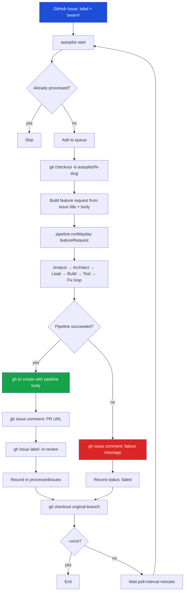
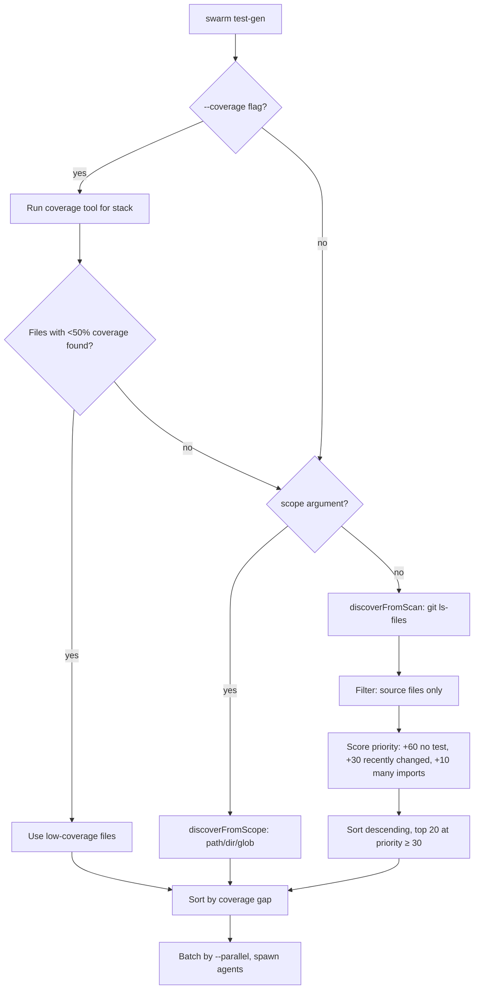
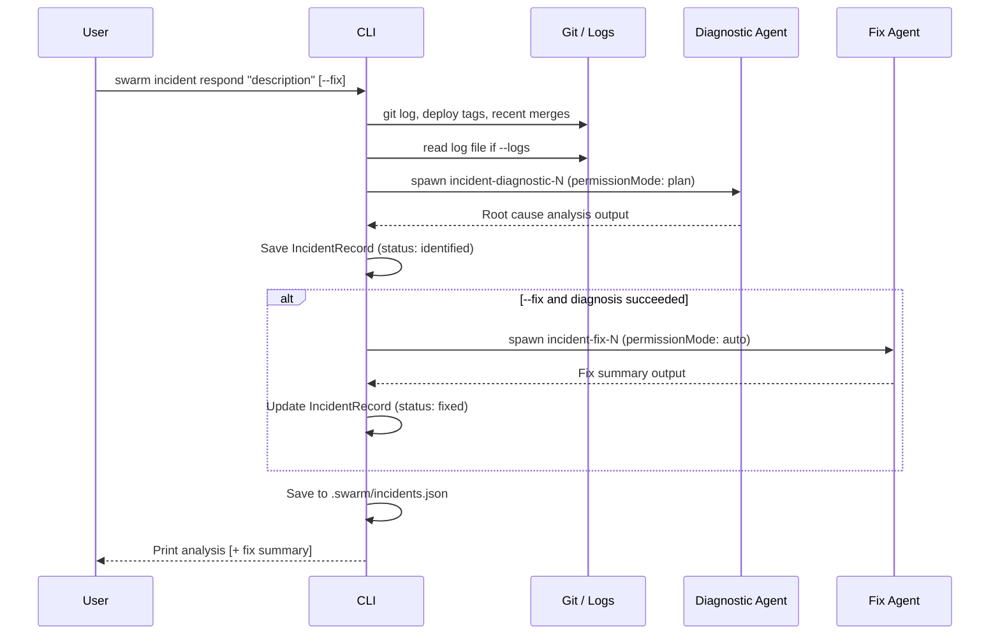
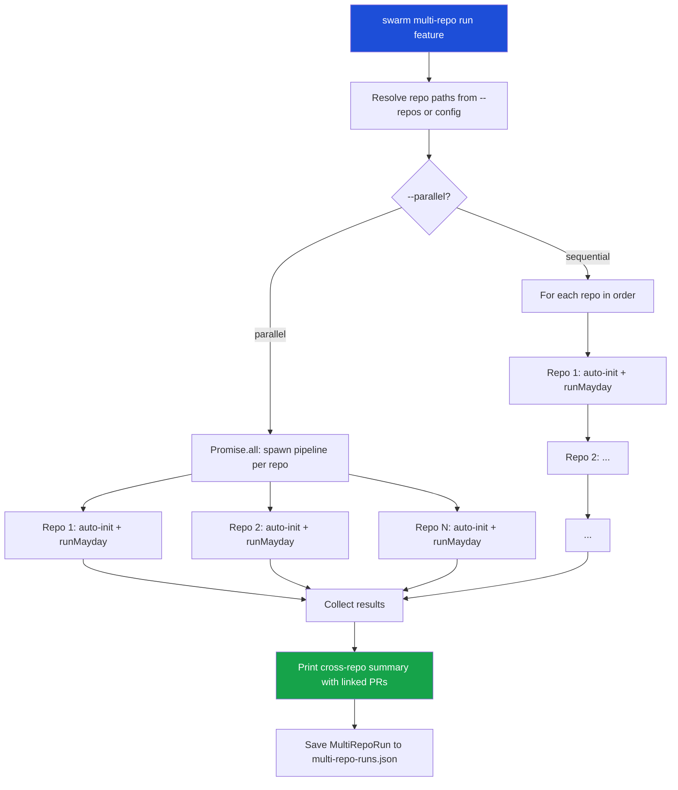

# 15 -- Autopilot and Automation

This document covers Swarm's automation-oriented commands: `autopilot`, `test-gen`, `deps`, `risk`, `incident`, `pr`, `health`, `benchmark`, `pm`, and `multi-repo`. These commands extend the core pipeline with continuous delivery, quality monitoring, and project management capabilities.

---

## 1. Command Overview

| Command | Purpose |
|---------|---------|
| `autopilot` | Watches GitHub issues and runs the full MayDay pipeline for each one, creating PRs automatically |
| `test-gen` | Generates tests for untested source files using engineer agents |
| `deps` | Checks, updates, and audits project dependencies across npm, pip, and Go |
| `risk` | Scores regression risk for changed files across 6 dimensions |
| `incident` | Production incident response — root cause analysis and optional fix generation |
| `pr` | Creates smart PRs enriched with risk scores, CODEOWNERS reviewers, and pipeline context |
| `health` | Runs a multi-metric codebase health check and saves history |
| `benchmark` | Performance regression detection — runs benchmarks and compares against a saved baseline |
| `pm` | Syncs pipeline state to GitHub Issues, Linear, or Jira; imports tickets as feature requests |
| `multi-repo` | Orchestrates MayDay pipelines across multiple repositories for cross-repo features |

---

## 2. Autopilot

### 2.1 Overview

`swarm autopilot` is a daemon that polls GitHub for open issues carrying a configured label (default: `swarm`) and autonomously builds features for each one. For every matching issue, it:

1. Creates a dedicated git branch (`autopilot/<number>-<slug>`)
2. Runs the full MayDay pipeline (Analyst → Architect → Lead → Engineer → Tester + fix loop)
3. Creates a PR with the issue body, pipeline summary, and cost information
4. Comments on the GitHub issue with the PR URL
5. Swaps the label from `swarm` to `in-review`

The daemon loops on a configurable interval until stopped.

### 2.2 Issue-to-PR Flow



### 2.3 State Interface

Autopilot state is persisted to `.swarm/autopilot-state.json`.

```typescript
export interface AutopilotIssue {
  number: number;
  title: string;
  body: string;
  labels: string[];
  author: string;
  url: string;
  updatedAt: string;
  status: 'running' | 'done' | 'failed';
  prUrl?: string;
  cost?: number;
  error?: string;
  startedAt?: number;
  completedAt?: number;
  duration?: number;
}

export interface AutopilotState {
  running: boolean;
  label: string;             // GitHub label to watch
  pollInterval: number;      // Minutes between polls
  maxConcurrent: number;     // Max parallel pipelines (sequential in practice)
  budgetPerIssue: number;    // Max USD per issue
  processedIssues: AutopilotIssue[];  // Capped at 200 most recent
  queue: AutopilotIssue[];   // Currently in-flight
  stats: {
    totalProcessed: number;
    successful: number;
    failed: number;
    totalCost: number;
  };
}
```

### 2.4 Subcommands

**`swarm autopilot start`** — Start the daemon.

| Flag | Default | Description |
|------|---------|-------------|
| `-l, --label <label>` | `swarm` | GitHub label to watch for new issues |
| `-i, --interval <minutes>` | `10` | Poll interval in minutes |
| `-c, --max-concurrent <n>` | `1` | Max concurrent pipelines |
| `-b, --budget <amount>` | `10` | Max budget per issue (USD) |
| `--auto-assign` | off | Assign the created PR to the issue author |
| `--dry-run` | off | Process issues but do not create PRs |
| `-s, --stack <stack>` | from config | Tech stack override |
| `--once` | off | Process one cycle then exit (non-daemon mode) |

**`swarm autopilot stop`** — Mark the daemon as stopped in state. To kill a running process: `kill $(pgrep -f "swarm autopilot")`.

**`swarm autopilot status`** — Show running status, queue, stats, and recent processed issues.

### 2.5 Examples

```bash
# Start daemon watching label "swarm" every 10 minutes
swarm autopilot start

# Watch a different label, smaller budget, single pass
swarm autopilot start --label feature-request --budget 5 --once

# Dry run to preview what would be processed
swarm autopilot start --dry-run --once

# Check on the daemon
swarm autopilot status

# Stop the daemon gracefully
swarm autopilot stop
```

### 2.6 Key Behaviors

- Issues are de-duplicated by `number + updatedAt`. If an issue is edited after processing, it re-enters the queue.
- The original git branch is restored after each issue, whether the pipeline succeeds or fails.
- Up to 200 processed issues are retained in `.swarm/autopilot-state.json`. Older entries are dropped.
- If `.swarm/` does not exist when `autopilot start` runs, it auto-initializes via `autoInit()`.

---

## 3. test-gen

### 3.1 Overview

`swarm test-gen` generates test files for source files that lack coverage. It uses engineer agents (one per file, in parallel batches) to write framework-appropriate tests. Optionally runs the generated tests and spawns a fix agent if they fail.

### 3.2 Discovery Strategy



### 3.3 Stack and Framework Support

| Stack | Default Framework | Run Command |
|-------|------------------|-------------|
| `react` | vitest | `npx vitest run` |
| `node` | vitest | `npx vitest run` |
| `go` | go-test | `go test ./...` |
| `python` | pytest | `python -m pytest` |
| `rust` | cargo-test | `cargo test` |
| `swift` | swift-test | `swift test` |

### 3.4 Options

| Flag | Default | Description |
|------|---------|-------------|
| `-m, --model <model>` | `sonnet` | Model for test-generation agents |
| `-f, --framework <framework>` | auto-detected | Override test framework |
| `--coverage` | off | Analyze coverage first; target low-coverage files |
| `--verify` | off | Run generated tests after writing; spawn a fix agent on failure |
| `-b, --budget <amount>` | `5` | Max USD per file |
| `--dry-run` | off | Show candidates without generating |
| `-p, --parallel <n>` | `3` | Max parallel agents |
| `-s, --stack <stack>` | from config | Stack override |

### 3.5 Examples

```bash
# Generate tests for all untested source files
swarm test-gen

# Generate tests for a specific directory
swarm test-gen src/core/

# Target coverage gaps and verify generated tests pass
swarm test-gen --coverage --verify

# Generate with higher parallelism and run/fix loop
swarm test-gen --parallel 5 --verify --model opus

# Dry run to preview candidates
swarm test-gen --dry-run
```

### 3.6 Agent Behavior

Each spawned agent receives:
- The full source file content (capped at 30 KB)
- The expected test file path
- Conventions loaded from `.swarm/conventions.md` (set by `swarm learn`)
- Instructions to write to the test file only, never modify the source file

The `--verify` fix pass is a single attempt. It runs the framework's test command, captures failures, and spawns one `test-gen-fixer` agent to correct the test files.

---

## 4. deps

### 4.1 Overview

`swarm deps` provides dependency management across npm, pip, and Go projects. It auto-detects the package manager from `package.json`, `requirements.txt`/`pyproject.toml`, or `go.mod`.

### 4.2 Subcommands

**`swarm deps check`** — Scan and display outdated dependencies in a color-coded table sorted by upgrade risk.

| Flag | Default | Description |
|------|---------|-------------|
| `--json` | off | Output raw JSON |

**`swarm deps update`** — Apply dependency updates.

| Flag | Default | Description |
|------|---------|-------------|
| `-l, --level <level>` | `minor` | Update level: `patch`, `minor`, or `major` |
| `--dry-run` | off | Show planned changes without applying |
| `--verify` | off | Run tests after each minor update; fail loudly on breakage |
| `-m, --model <model>` | `sonnet` | Model for major-update engineer agents |
| `-b, --budget <amount>` | `5` | Max budget (USD) for major-update agents |

**`swarm deps audit`** — Check for known security vulnerabilities using `npm audit`, `pip-audit`, or `govulncheck`.

| Flag | Default | Description |
|------|---------|-------------|
| `--json` | off | Output raw JSON |

### 4.3 Update Strategy

| Level | Strategy |
|-------|---------|
| `patch` | Batch-install all patch updates in one command |
| `minor` | Update one-by-one; optionally run tests after each |
| `major` | Spawn an engineer agent per package to read changelogs and fix breaking changes |

### 4.4 Examples

```bash
# See what's outdated
swarm deps check

# Apply safe patch and minor updates
swarm deps update --level minor --verify

# Preview major updates
swarm deps update --level major --dry-run

# Security audit
swarm deps audit

# Full check as JSON for CI scripting
swarm deps check --json
```

---

## 5. risk

### 5.1 Overview

`swarm risk` scores each changed file on a 0-100 composite regression risk scale using six dimensions. If no files are given, it auto-detects changed files via `git diff --name-only main...HEAD`.

### 5.2 Risk Dimensions

```typescript
export interface RiskDimension {
  name: string;
  score: number;   // 0-100
  weight: number;  // fraction that contributes to overall
  detail: string;
}

export interface RiskScore {
  file: string;
  overall: number;  // 0-100 weighted composite
  level: 'low' | 'medium' | 'high' | 'critical';
  dimensions: RiskDimension[];
}
```

| Dimension | Weight | What it measures |
|-----------|--------|-----------------|
| File Risk | 25% | Criticality of the file path (auth, middleware, DB, billing, etc.) |
| Coverage | 20% | Whether the file has corresponding tests |
| Blast Radius | 20% | How many other files import this file |
| Change History | 15% | How frequently the file has been modified (churn) |
| Complexity | 10% | Approximate complexity via line count and branching |
| Novelty | 10% | Whether the file is newly created (higher risk) |

**Level thresholds**: `low` < 40, `medium` < 60, `high` < 80, `critical` >= 80.

### 5.3 Options

| Flag | Default | Description |
|------|---------|-------------|
| `--json` | off | Output as JSON |
| `--threshold <n>` | `0` | Only show files with `overall >= n` |
| `--fail-above <n>` | off | Exit code 1 if any file exceeds this score (CI use) |

### 5.4 Examples

```bash
# Score all changes since main
swarm risk

# Score specific files
swarm risk src/core/auth.ts src/routes/payment.ts

# CI gate: fail if any file scores above 75
swarm risk --fail-above 75

# Show only high-risk files
swarm risk --threshold 60

# Machine-readable output
swarm risk --json
```

---

## 6. incident

### 6.1 Overview

`swarm incident respond` triggers a two-phase production incident response:

1. **Diagnosis** — a read-only (`plan` permission mode) engineer agent analyzes git history, recent merges, deploy tags, and optionally log files to produce a root cause analysis.
2. **Fix** (optional, `--fix`) — a second agent implements the minimal fix described by the diagnosis.

All incidents are persisted to `.swarm/incidents.json`.

### 6.2 Incident Flow



### 6.3 IncidentRecord Interface

```typescript
export interface IncidentRecord {
  id: string;                // 8-char UUID prefix
  description: string;
  severity: string;          // P1, P2, P3, P4
  status: 'investigating' | 'identified' | 'fixed' | 'resolved';
  startedAt: number;         // epoch ms
  resolvedAt?: number;
  rootCause?: string;        // First 5000 chars of diagnostic output
  fix?: string;              // First 5000 chars of fix output
  cost: number;              // Total USD for all agents
  agentIds: string[];
}
```

### 6.4 Subcommands and Options

**`swarm incident respond <description>`**

| Flag | Default | Description |
|------|---------|-------------|
| `--severity <level>` | `P3` | Severity label (P1, P2, P3, P4) |
| `--logs <path>` | off | Path to log file (local path or URL string) |
| `-m, --model <model>` | `sonnet` | Model override |
| `-b, --budget <amount>` | `10` | Max budget (USD) |
| `--fix` | off | Attempt to implement the recommended fix |

**`swarm incident history`** — List all past incidents in reverse chronological order.

**`swarm incident status`** — Show any currently open (investigating/identified) incidents plus the last 3 resolved.

### 6.5 Examples

```bash
# Diagnose a P1 outage with application logs
swarm incident respond "API returning 500 on /checkout since 14:30 UTC" \
  --severity P1 \
  --logs /var/log/app/error.log

# Diagnose and immediately attempt a fix
swarm incident respond "Memory leak causing OOM restarts" \
  --severity P2 \
  --fix \
  --model opus

# Review incident history
swarm incident history

# Show active incidents (useful in monitoring scripts)
swarm incident status
```

---

## 7. pr

### 7.1 Overview

`swarm pr` creates a GitHub PR from the current branch enriched with:
- Pipeline state from `.swarm/state.json` (if it exists)
- Per-file regression risk scores (`--risk`)
- Suggested reviewers from CODEOWNERS or `git blame` (`--reviewers`)
- Auto-generated title from the branch name

### 7.2 PR Body Contents

When pipeline state is available, `buildSmartPRBody()` from `core/git.ts` generates a body that includes pipeline stage summaries, test results, and cost information alongside the changed-file list and risk table.

### 7.3 Options

| Flag | Default | Description |
|------|---------|-------------|
| `-t, --title <title>` | auto-generated | PR title (derived from branch name if omitted) |
| `-b, --base <branch>` | `main` | Base branch to target |
| `-d, --draft` | off | Create as a draft PR |
| `-r, --risk` | off | Compute and include risk scores for changed files |
| `--reviewers` | off | Auto-assign reviewers via CODEOWNERS / git blame |
| `-l, --label <labels>` | off | Comma-separated labels to apply |

### 7.4 Examples

```bash
# Minimal PR from current branch
swarm pr

# With risk scores and draft status
swarm pr --risk --draft

# Assign reviewers and add labels
swarm pr --reviewers --label "needs-review,backend"

# Explicit title and base
swarm pr --title "Add OAuth2 Google login" --base develop

# Full enrichment
swarm pr --risk --reviewers --label "feature"
```

---

## 8. health

### 8.1 Overview

`swarm health` runs a static analysis pass over the project and produces a weighted health score (0-100) across 7 metrics. Reports are automatically saved to `.swarm/health-history.json` (capped at 50 entries).

### 8.2 Health Metrics

```typescript
export interface HealthMetric {
  name: string;
  score: number;        // 0-100
  status: 'good' | 'warning' | 'poor';
  detail: string;
  suggestion?: string;
}

export interface HealthReport {
  overall: number;       // weighted average
  metrics: HealthMetric[];
  timestamp: number;
  projectName: string;
}
```

| Metric | Weight | How it's scored |
|--------|--------|----------------|
| Dependencies | 15% | Deduct: 15 per major outdated, 5 per minor, 2 per patch |
| Vulnerabilities | 20% | Deduct: 25 per critical, 15 per high, 5 per moderate, 1 per low |
| Dead Code | 10% | % of exported TypeScript symbols referenced at least once |
| Complexity | 15% | Deduct 10 per file exceeding 500 lines |
| Type Safety | 15% | Deduct 1 per `any` usage in TypeScript |
| Bundle Size | 10% | 100 for <1 MB dist/; deduct 5 per MB over 1 MB |
| Documentation | 15% | README.md recency; 100 if updated within 30 days |

**Status thresholds**: `good` >= 80, `warning` >= 50, `poor` < 50.

### 8.3 Options

| Flag | Default | Description |
|------|---------|-------------|
| `--json` | off | Output as JSON |
| `--watch` | off | Re-run periodically |
| `--interval <minutes>` | `60` | Interval for `--watch` mode |
| `--threshold <score>` | `60` | Exit code 1 if health drops below this score |

### 8.4 Examples

```bash
# One-time health check
swarm health

# CI gate: fail if health drops below 70
swarm health --threshold 70

# Continuous monitoring every 30 minutes
swarm health --watch --interval 30

# Machine-readable output
swarm health --json
```

---

## 9. benchmark

### 9.1 Overview

`swarm benchmark` detects the project's benchmark tool, runs it, measures bundle size and CLI startup time, and compares against a saved baseline to detect regressions or improvements.

### 9.2 Auto-Detection

| Stack | Condition | Command |
|-------|-----------|---------|
| Node — npm script | `package.json` has `bench` or `benchmark` script | `npm run bench` |
| Node — Vitest | `node_modules/vitest` exists | `npx vitest bench --reporter=json` |
| Node — jest-bench | `node_modules/jest-bench` exists | `npx jest --config jest.bench.config.js` |
| Go | `go.mod` exists | `go test -bench=. -benchmem ./...` |
| Python | `setup.py`, `pyproject.toml`, or `requirements.txt` exists | `pytest --benchmark-only --benchmark-json=.swarm/pytest-bench.json` |

If no benchmark command is found, `run` still measures bundle size and startup time.

### 9.3 Key Interfaces

```typescript
export interface BenchmarkResult {
  name: string;
  opsPerSec?: number;
  avgMs?: number;
  minMs?: number;
  maxMs?: number;
  samples?: number;
}

export interface BenchmarkReport {
  results: BenchmarkResult[];
  bundleSize?: { totalBytes: number; files: number };
  startupTimeMs?: number;
  timestamp: number;
  gitSha: string;
  regressions: Array<{ name: string; baseline: number; current: number; changePercent: number }>;
  improvements: Array<{ name: string; baseline: number; current: number; changePercent: number }>;
}
```

Baseline is saved to `.swarm/benchmark-baseline.json`. History is kept at `.swarm/benchmark-history.json` (last 20 runs).

### 9.4 Subcommands

**`swarm benchmark run`** — Run benchmarks and compare with baseline.

| Flag | Default | Description |
|------|---------|-------------|
| `--cmd <command>` | auto-detected | Custom benchmark command |
| `--threshold <percent>` | `10` | Regression threshold (% change) |
| `--fail-on-regression` | off | Exit code 1 if regression detected |
| `--json` | off | Output as JSON |
| `--save` | off | Save results as new baseline |

**`swarm benchmark baseline`** — Save current results as the new baseline.

**`swarm benchmark compare`** — Explicit comparison against the saved baseline (equivalent to `run` without `--save`).

**`swarm benchmark status`** — Show baseline metadata and run history summary.

### 9.5 Examples

```bash
# Run and compare with baseline
swarm benchmark run

# Set a new baseline after a major optimization
swarm benchmark baseline

# CI gate: fail if any benchmark regresses >5%
swarm benchmark run --fail-on-regression --threshold 5

# Use a custom benchmark command
swarm benchmark run --cmd "node scripts/perf.js"

# Show baseline info
swarm benchmark status
```

---

## 10. pm

### 10.1 Overview

`swarm pm` connects Swarm to project management tools. It supports three providers:

| Provider | Authentication |
|----------|---------------|
| GitHub Issues | `gh` CLI (already authenticated) |
| Linear | `SWARM_LINEAR_API_KEY` environment variable |
| Jira | `SWARM_JIRA_URL` + `SWARM_JIRA_TOKEN` environment variables |

### 10.2 Stage-to-Status Mapping

The current pipeline stage is mapped to PM statuses automatically:

| Pipeline Stage | PM Status |
|----------------|-----------|
| `analyze` | In Progress |
| `architect` | In Progress |
| `plan` | In Review |
| `build` | In Development |
| `test` / `evaluate` | Testing |
| `complete` | Done |
| `error` | Blocked |

### 10.3 Interfaces

```typescript
export type PmProvider = 'github' | 'linear' | 'jira';

export interface PmTicketMapping {
  ticketId: string;
  title: string;
  pmStatus: string;
  pipelineStage: StageName | 'complete' | 'error' | null;
  lastSyncAt: number;
  url?: string;
}

export interface PmSyncState {
  lastSyncAt: number | null;
  provider: PmProvider;
  project: string | null;
  tickets: PmTicketMapping[];
}
```

Sync state is persisted to `.swarm/pm-sync.json`.

### 10.4 Subcommands

**`swarm pm sync`** — Sync the current pipeline stage to the PM tool as issue/ticket status updates.

| Flag | Default | Description |
|------|---------|-------------|
| `--provider <provider>` | `github` | `github`, `linear`, or `jira` |
| `--project <project>` | auto-detect | Repo (`owner/repo`) for GitHub; project key for Jira; team key for Linear |

For GitHub: applies `swarm:<status>` labels to issues that carry a `swarm:*` label. Creates the label if needed.

**`swarm pm import <ticket-id>`** — Fetch a ticket from the PM tool and format it as a Swarm feature request. Extracts acceptance criteria from `## Acceptance Criteria` sections and checkbox items.

| Flag | Default | Description |
|------|---------|-------------|
| `--provider <provider>` | `github` | PM provider |
| `--project <project>` | auto-detect | Project identifier |
| `--run` | off | Immediately start a MayDay pipeline with the imported ticket |

**`swarm pm status`** — Show last sync time, current pipeline stage, and tracked ticket mappings.

### 10.5 Examples

```bash
# Sync pipeline state to GitHub Issues
swarm pm sync

# Sync to Jira project
SWARM_JIRA_URL=https://acme.atlassian.net \
SWARM_JIRA_TOKEN=<base64-email:token> \
swarm pm sync --provider jira --project ACME

# Sync to Linear
SWARM_LINEAR_API_KEY=<key> swarm pm sync --provider linear

# Import a GitHub issue and view the formatted request
swarm pm import 42

# Import a Jira ticket and immediately launch MayDay
swarm pm import ACME-789 --provider jira --run

# Show PM sync state
swarm pm status
```

---

## 11. multi-repo

### 11.1 Overview

`swarm multi-repo` runs the MayDay pipeline simultaneously (or sequentially) against multiple repositories. It is designed for polyrepo organizations where a single feature spans multiple services.

Repos are specified via `--repos` (comma-separated labels or paths) or via a `repos` map in `.swarm/config.yaml`:

```yaml
# .swarm/config.yaml
repos:
  frontend: ../my-frontend
  backend: ../my-backend
  infra: ../my-infra
```

### 11.2 MultiRepoRun Interface

```typescript
export interface MultiRepoRun {
  id: string;
  feature: string;
  repos: Array<{
    label: string;
    path: string;
    status: 'pending' | 'running' | 'done' | 'failed';
    prUrl?: string;
    cost: number;
    error?: string;
  }>;
  startedAt: number;
  completedAt?: number;
  totalCost: number;
}
```

Run history is persisted to `.swarm/multi-repo-runs.json`.

### 11.3 Cross-Repo Feature Flow



Each repo receives a contextual prompt that includes the list of sibling repos and a note to focus only on changes relevant to that repository.

### 11.4 Subcommands

**`swarm multi-repo run <feature>`**

| Flag | Default | Description |
|------|---------|-------------|
| `--repos <repos>` | from config | Comma-separated repo labels (from config) or absolute/relative paths |
| `-m, --model <model>` | `sonnet` | Model for all pipelines |
| `-b, --budget <amount>` | `20` | Max budget per repo (USD) |
| `--parallel` | off | Run all repos in parallel (default: sequential) |
| `--dry-run` | off | Plan but don't execute pipelines |

**`swarm multi-repo status`** — Show per-repo pipeline state (reads each repo's `.swarm/state.json`) plus the last 5 multi-repo runs.

**`swarm multi-repo sync`** — Detect and compare API contract files (OpenAPI, GraphQL schema, Protobuf, shared TypeScript types) across repos. Reports mismatches by file name and size diff.

### 11.5 Examples

```bash
# Run a feature across all configured repos (sequential)
swarm multi-repo run "Add distributed tracing headers to all services"

# Run in parallel across specific repos
swarm multi-repo run "Upgrade authentication to OAuth2" \
  --repos frontend,backend \
  --parallel

# Dry run to preview
swarm multi-repo run "Migrate from REST to gRPC" --dry-run

# Check per-repo status
swarm multi-repo status

# Check for API contract drift
swarm multi-repo sync
```

---

## 12. Shared Patterns

### Auto-initialization

All automation commands (`autopilot`, `test-gen`, `deps`, `incident`) will auto-initialize a `.swarm/` directory if one is not present. They call `autoDetectStack(cwd)` and `autoInit(projectName, stack, cwd)` to bootstrap configuration without requiring `swarm init` to have been run first.

### GitHub CLI Dependency

Commands that interact with GitHub (`autopilot`, `pr`, `pm sync` for GitHub) require the `gh` CLI to be installed and authenticated. They check via `isGhInstalled()` from `core/git.ts` and exit with a clear error message if it is missing.

### Cost Tracking

All agent-spawning automation commands read the accumulated `agent.cost.totalUsd` after `waitForAgent()` completes. Costs are recorded in per-command persistence files (`.swarm/autopilot-state.json`, `.swarm/incidents.json`, `.swarm/multi-repo-runs.json`) and surfaced in status commands.

### Context Lifecycle

Commands that spawn agents follow the standard context pattern:

```typescript
const { agentManager, pipeline, cleanup } = createContext(swarmDir, config);
try {
  // ... run agents
} finally {
  cleanup(); // kills agents, stops WS server, flushes state
}
```

---

## Appendix: Source File Reference

| File | Key exports |
|------|-------------|
| `packages/cli/src/commands/autopilot.ts` | `registerAutopilot()`, `loadAutopilotState()`, `saveAutopilotState()` |
| `packages/cli/src/commands/test-gen.ts` | `registerTestGen()` |
| `packages/cli/src/commands/deps.ts` | `registerDeps()` |
| `packages/cli/src/commands/risk.ts` | `registerRisk()` |
| `packages/cli/src/commands/incident.ts` | `registerIncident()`, `IncidentRecord` |
| `packages/cli/src/commands/pr.ts` | `registerPr()` |
| `packages/cli/src/commands/health.ts` | `registerHealth()`, `checkHealth()`, `HealthReport`, `HealthMetric` |
| `packages/cli/src/commands/benchmark.ts` | `registerBenchmark()`, `BenchmarkReport`, `BenchmarkResult` |
| `packages/cli/src/commands/pm.ts` | `registerPm()`, `PmSyncState`, `PmTicketMapping`, `PmProvider` |
| `packages/cli/src/commands/multi-repo.ts` | `registerMultiRepo()`, `MultiRepoRun` |
| `packages/cli/src/core/risk-scorer.ts` | `RiskScorer`, `RiskScore`, `RiskDimension` |
| `packages/cli/src/types.ts` | `AutopilotState`, `AutopilotIssue` |
