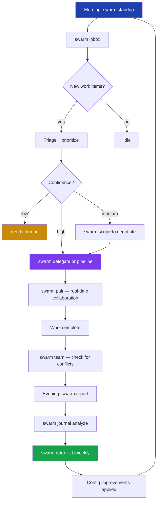
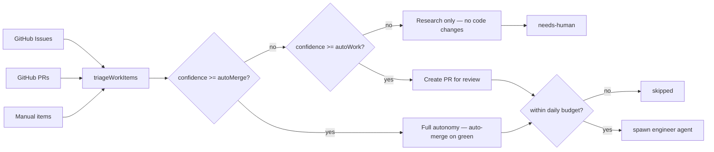
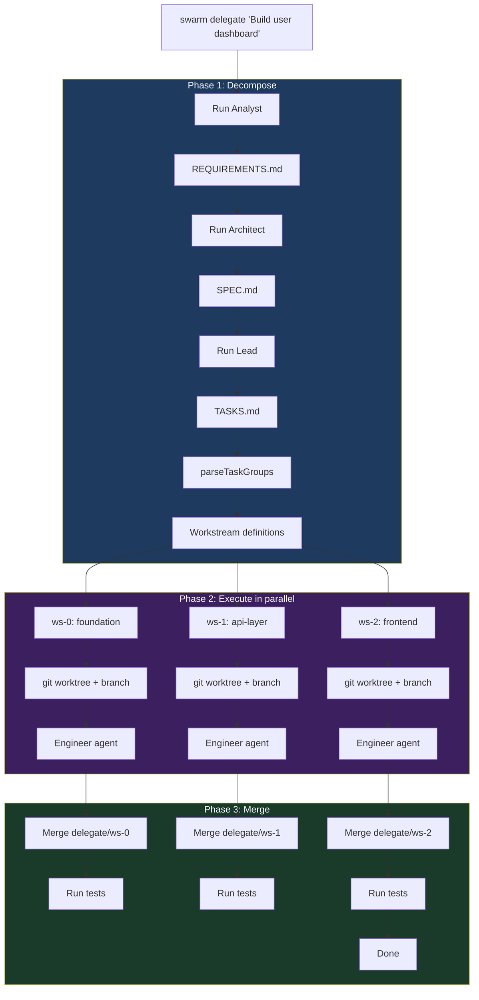

# 17 -- Autonomous Employee: Inbox, Standup, Journal, Scope, Context, Pair, Delegate, Report, Team, Retro

Wave 3 transforms Swarm from a pipeline runner into a persistent autonomous employee. These ten commands provide the full daily operating loop of a software engineer: polling a work queue, reporting status, tracking decisions, negotiating scope, understanding the codebase, collaborating in real time, delegating large features, measuring impact, coordinating with teammates, and improving over time.

---

## 1. Daily Workflow Overview



---

## 2. `swarm inbox` — Self-Directed Work Queue

### Overview

`swarm inbox` runs a polling daemon that aggregates work from multiple sources (GitHub issues, pull requests awaiting review, and manual additions), triages each item by priority and confidence, and autonomously processes items within a daily budget.

Each work item is classified by type (`bug-fix`, `feature`, `maintenance`, `incident`, `review`) and scored on two axes:
- **Priority (0-100)**: derived from source, label weights, and recency
- **Confidence (0-100)**: how certain the agent is that it can complete the item autonomously

Items above the `autoWork` confidence threshold are executed by an engineer agent. Items above the `autoMerge` threshold can be auto-merged after tests pass. Items below `autoWork` are flagged `needs-human`.

### State

Persisted at `.swarm/inbox-state.json`.

```typescript
export interface InboxState {
  running: boolean;
  paused: boolean;
  label: string;              // GitHub label being watched
  pollInterval: number;       // Minutes between poll cycles
  maxConcurrent: number;      // Max simultaneous work items
  queue: WorkItem[];
  processed: WorkItem[];
  stats: {
    totalProcessed: number;
    successful: number;
    failed: number;
    skipped: number;
    totalCost: number;
    dailyBudget: number;
    dailySpent: number;
  };
  workHours?: { start: string; end: string; timezone: string };
}
```

### WorkItem interface

Defined in `packages/cli/src/core/triage.ts`:

```typescript
export interface WorkItem {
  id: string;
  source: 'github-issue' | 'github-pr' | 'manual';
  title: string;
  body: string;
  url?: string;
  labels: string[];
  author?: string;
  createdAt: string;
  priority: number;            // 0-100
  type: 'bug-fix' | 'feature' | 'maintenance' | 'incident' | 'review';
  status: 'queued' | 'running' | 'done' | 'failed' | 'skipped' | 'needs-human';
  confidence: number;          // 0-100
  estimatedCost: number;       // USD
  estimatedMinutes: number;
  startedAt?: number;
  completedAt?: number;
  result?: {
    cost?: number;
    duration?: number;
    prUrl?: string;
    error?: string;
  };
}
```

### Triage flow



### CLI Options

#### `swarm inbox start`

| Flag | Default | Description |
|------|---------|-------------|
| `-l, --label <label>` | `swarm` | GitHub label to watch for new issues |
| `-i, --interval <minutes>` | `10` | Poll interval in minutes |
| `-b, --budget <amount>` | `25` | Daily spend cap in USD |
| `--max-concurrent <n>` | `1` | Maximum simultaneous work items |
| `-m, --model <model>` | `sonnet` | Claude model for spawned agents |
| `--once` | `false` | Run a single poll cycle and exit |

#### `swarm inbox add`

| Flag | Default | Description |
|------|---------|-------------|
| `-t, --type <type>` | `feature` | Work item type: `bug-fix`, `feature`, `maintenance`, `incident`, `review` |
| `-p, --priority <n>` | `70` | Priority override (0-100) |

### Subcommands

| Subcommand | Description |
|------------|-------------|
| `swarm inbox` | Show queue and stats |
| `swarm inbox start` | Start the polling daemon |
| `swarm inbox stop` | Mark daemon as stopped |
| `swarm inbox pause` | Toggle pause/unpause |
| `swarm inbox add <task>` | Manually enqueue a work item |
| `swarm inbox skip <id>` | Skip a queued item |
| `swarm inbox prioritize <id>` | Move an item to the front of the queue |
| `swarm inbox config` | Show current triage configuration |

### Examples

```bash
# Start the inbox daemon watching the "swarm" label
swarm inbox start

# Start with a larger budget and faster polling
swarm inbox start --budget 50 --interval 5

# Add a manual task at high priority
swarm inbox add "Fix memory leak in session handler" --type bug-fix --priority 90

# Run one cycle and exit (useful in CI)
swarm inbox start --once

# View queue status
swarm inbox

# Skip an item that was auto-queued
swarm inbox skip issue-42

# Pause while you work on something manually
swarm inbox pause
```

---

## 3. `swarm standup` — Async Standup Reports

### Overview

`swarm standup` generates a standup-style status report from Swarm's activity logs. It synthesizes what was completed, what is in progress, costs incurred, blockers detected, and upcoming work — without requiring the engineer to write anything manually. Reports can be saved and posted to Slack or a team channel.

### Options

| Flag | Default | Description |
|------|---------|-------------|
| `--weekly` | `false` | Generate a weekly summary instead of daily |
| `--since <date>` | yesterday | Custom start date (YYYY-MM-DD) |
| `--format <format>` | `markdown` | Output format: `markdown`, `slack`, `json` |
| `--post` | `false` | Save report to `.swarm/standups/` |

### Output formats

- **markdown**: Standard `## Done / In Progress / Cost / Blockers / Next` sections
- **slack**: Emoji-prefixed block-kit-friendly text for posting to Slack
- **json**: Machine-readable report object

### Examples

```bash
# Print today's standup to terminal
swarm standup

# Generate a Slack-formatted report
swarm standup --format slack

# Generate weekly summary and save it
swarm standup --weekly --post

# Report from a custom date range
swarm standup --since 2024-01-15

# Output raw JSON for piping
swarm standup --format json | jq '.cost'
```

### Report sections

A markdown standup report contains:

| Section | Content |
|---------|---------|
| Done | Completed pipeline runs, merged PRs, resolved issues |
| In Progress | Currently running agents and their stage |
| Cost | Total spend for the period |
| Blockers | Failed stages, unresolved errors |
| Next | Queued items and pending stages |

---

## 4. `swarm journal` — Decision Journal

### Overview

`swarm journal` tracks every significant autonomous decision made by Swarm agents (model selection, confidence thresholds, fix approach choices) alongside their eventual outcome (`success`, `failure`, `reverted`). Over time, it runs a learning engine to extract durable rules from these outcomes.

### Data model

Defined in `packages/cli/src/core/decision-journal.ts`:

```typescript
interface DecisionEntry {
  id: string;
  timestamp: number;
  type: string;               // Decision category (e.g., "model-selection", "fix-strategy")
  decision: string;           // Human-readable description of what was decided
  confidence: number;         // 0-1 confidence at decision time
  context: string;            // Relevant context (file paths, task name, etc.)
  outcome?: 'success' | 'failure' | 'reverted';
  outcomeDetail?: string;     // Why it succeeded or failed
}

interface JournalRule {
  id: string;
  rule: string;               // Generated rule string (e.g., "CRITICAL: Do not use X when Y")
  source: string;             // Decision IDs that produced this rule
  appliesTo: string[];        // Decision types this rule applies to
  enabled: boolean;
  createdAt: number;
}
```

### Calibration report

`swarm journal calibrate` produces a calibration report that compares stated confidence against actual success rates:
- **Overconfident**: high confidence + failure
- **Underconfident**: low confidence + success
- **Recommendations**: adjustments to confidence thresholds

### Subcommands

| Subcommand | Description |
|------------|-------------|
| `swarm journal` | Show recent decisions with outcomes |
| `swarm journal recent [-n <count>]` | Show last N decisions (default 20) |
| `swarm journal analyze` | Run learning engine, generate new rules |
| `swarm journal rules` | List all auto-generated rules |
| `swarm journal calibrate` | Accuracy report by decision type |

### Options for `swarm journal recent`

| Flag | Default | Description |
|------|---------|-------------|
| `-n, --limit <count>` | `20` | Number of entries to display |

### Examples

```bash
# View recent decisions
swarm journal

# Show last 50 decisions
swarm journal recent --limit 50

# Run the learning engine
swarm journal analyze

# View derived rules
swarm journal rules

# Check confidence calibration
swarm journal calibrate
```

---

## 5. `swarm scope` — Requirement Negotiation

### Overview

`swarm scope` analyzes a feature request before any pipeline runs, detecting ambiguity, missing context, and hidden scope. It presents multiple implementation options — each with cost and time estimates — and lets the user choose one. The chosen option is written to `SCOPE.md`, which can then be passed to the pipeline.

This prevents scope creep, runaway costs, and agent confusion caused by under-specified requirements.

### Analysis output

```typescript
export interface AmbiguityAnalysis {
  vaguenessScore: number;       // 0-100; higher = more ambiguous
  classification: 'clear-small' | 'clear-large' | 'ambiguous' | 'risky';
  scopeSize: 'small' | 'medium' | 'large' | 'xl';
  estimatedCost: number;        // USD estimate for the chosen option
  estimatedFiles: number;       // Number of files likely affected
  riskFactors: string[];        // e.g. "touches authentication layer"
  missingContext: string[];     // What information is missing
  questions: string[];          // Clarifying questions to ask
  options: ScopeOption[];       // 2-4 implementation options
}

export interface ScopeOption {
  name: string;
  description: string;
  estimatedCost: number;
  estimatedTime: string;        // e.g. "2-4 hours"
  risk: 'low' | 'medium' | 'high';
  tradeoffs: string[];
  recommended: boolean;
}
```

### Options

| Flag | Default | Description |
|------|---------|-------------|
| `-o, --output <path>` | `SCOPE.md` | Output path for the scope document |
| `--no-interactive` | `false` | Print analysis only, skip option selection |

### SCOPE.md structure

The generated file contains:
- **Request** — original feature description
- **Approach** — chosen implementation strategy
- **Will Build** — explicit in-scope items
- **Will NOT Build** — explicit exclusions
- **Assumptions** — unstated dependencies assumed to be true
- **Estimates** — cost, scope size, files affected
- **Risk** — narrative risk assessment and risk factors

### Examples

```bash
# Analyze a feature request interactively
swarm scope "Add user authentication"

# Just show analysis without writing SCOPE.md
swarm scope "Refactor the payment module" --no-interactive

# Write scope document to a custom path
swarm scope "Build a reporting dashboard" --output docs/SCOPE.md

# Chain into pipeline
swarm scope "Add real-time notifications" && swarm pipeline run --scope SCOPE.md
```

---

## 6. `swarm context` — Codebase Intelligence

### Overview

`swarm context` builds and queries a structural index of the codebase. The index captures files, exported symbols, module relationships, dependency graphs, co-change patterns, and a fragility score for each file. This index is used by other Swarm commands to make better decisions about what to touch and what to avoid.

The index is persisted at `.swarm/index/graph.json`.

### Index data model

```typescript
interface CodebaseIndex {
  builtAt: number;
  files: FileEntry[];
  symbols: SymbolEntry[];
  modules: ModuleEntry[];
  fragileFiles: FragileFile[];
  coChangePatterns: CoChangePattern[];
  dependencyGraph: Record<string, string[]>;  // file -> imports
}

interface FragileFile {
  path: string;
  failureRate: number;   // 0-1; historical change failure rate
  reason: string;        // e.g. "high churn + many dependents"
}

interface CoChangePattern {
  files: string[];       // Files that frequently change together
  frequency: number;     // How often they co-change
}
```

### Subcommands

| Subcommand | Description |
|------------|-------------|
| `swarm context` | Show index summary (file count, symbols, age) |
| `swarm context build` | Rebuild the full codebase index |
| `swarm context query <question>` | Search the index by natural language or identifier |
| `swarm context graph [dir]` | Display dependency graph for a directory |
| `swarm context fragile` | List fragile files ranked by failure rate |
| `swarm context stale` | List files modified after the index was last built |

### Examples

```bash
# Build the index for the first time
swarm context build

# Show index summary
swarm context

# Search for a function or concept
swarm context query "authentication middleware"

# View dependency graph for src/core/
swarm context graph src/core

# Find high-risk files before a refactor
swarm context fragile

# Check for stale index entries
swarm context stale
```

### Staleness

The index timestamp is compared against file modification times. If the index is older than 24 hours, `swarm context` displays a staleness warning. The `swarm context stale` subcommand lists exactly which files have been modified since the last build.

---

## 7. `swarm pair` — Real-Time Collaboration

### Overview

`swarm pair` runs a persistent file watcher that emits live suggestions as the developer writes code. It detects bugs, missing tests, insecure patterns, broken imports, and co-change violations in real time — acting as an always-on pair programmer.

### Pairing modes

| Mode | Behavior |
|------|----------|
| `suggest` | Print suggestions to terminal as changes are detected |
| `assist` | Suggestion + brief contextual explanation |
| `silent` | Collect suggestions without printing; show summary on exit |

### Suggestion types

```typescript
export interface PairSuggestion {
  type: 'bug' | 'pattern' | 'test-gap' | 'security' | 'import' | 'co-change';
  severity: 'info' | 'warning' | 'critical';
  file: string;
  line?: number;
  message: string;
  accepted?: boolean;   // Set after session ends (accepted/dismissed)
}
```

### Session summary

On Ctrl+C, the session summary is printed:

```typescript
export interface PairSession {
  startedAt: number;
  mode: 'suggest' | 'assist' | 'silent';
  filesWatched: number;
  changedFiles: string[];
  suggestions: PairSuggestion[];
}
```

### CLI Options

| Flag | Default | Description |
|------|---------|-------------|
| `-f, --focus <dir>` | `.` | Watch only a specific subdirectory |
| `-m, --mode <mode>` | `suggest` | Pairing mode: `suggest`, `assist`, `silent` |

### Subcommands

| Subcommand | Description |
|------------|-------------|
| `swarm pair` | Start pairing session |
| `swarm pair test` | Generate tests for recently changed files |
| `swarm pair commit` | Generate a conventional commit message from current diff |

### Examples

```bash
# Start a pair session
swarm pair

# Focus on a specific directory
swarm pair --focus src/api

# Run silently, show summary on exit
swarm pair --mode silent

# Generate tests for changed files
swarm pair test

# Generate a commit message
swarm pair commit
```

---

## 8. `swarm delegate` — Multi-Agent Task Decomposition

### Overview

`swarm delegate` handles large features too complex for a single agent. It runs the full Analyst → Architect → Lead pipeline to produce `TASKS.md`, parses that file into parallel workstream groups, spawns one engineer agent per workstream on its own git branch and worktree, then merges them back sequentially with test validation at each merge.

### Three-phase execution



### State

Persisted at `.swarm/delegate-state.json`:

```typescript
interface DelegateState {
  featureRequest: string;
  workstreams: Workstream[];
  totalBudget: number;
  totalCost: number;
  status: 'decomposing' | 'running' | 'merging' | 'done' | 'failed';
  startedAt: number;
}

interface Workstream {
  id: string;
  name: string;
  tasks: string[];              // Task IDs + descriptions from TASKS.md
  branch: string;               // e.g. "delegate/api-layer"
  worktreePath?: string;        // Absolute path to git worktree
  status: 'pending' | 'running' | 'done' | 'failed' | 'merging';
  cost: number;
  startedAt?: number;
  completedAt?: number;
  error?: string;
  prUrl?: string;
  dependsOn: string[];          // Other workstream names this depends on
}
```

### Task group parsing

`parseTaskGroups()` reads `TASKS.md` and splits it into parallel groups based on:
- `---` separator lines
- `## Group: <name>` or `### Parallel Group: <name>` headers
- Task ID patterns: `FND-001`, `SVC-002`, etc.

Dependencies between groups are set automatically: `workstream-N` depends on `workstream-(N-1)`.

### CLI Options

| Flag | Default | Description |
|------|---------|-------------|
| `--max-parallel <n>` | `3` | Maximum concurrent workstreams |
| `--budget <amount>` | `50` | Total budget cap in USD |
| `--dry-run` | `false` | Decompose only — do not execute workstreams |

### Subcommands

| Subcommand | Description |
|------------|-------------|
| `swarm delegate "<feature>"` | Decompose and run a large feature |
| `swarm delegate status` | Show all workstreams and their status |
| `swarm delegate merge` | Manually trigger merge of completed workstreams |

### Examples

```bash
# Delegate a large feature
swarm delegate "Build the reporting dashboard with charts and exports"

# Dry-run to preview workstream decomposition
swarm delegate "Add payment processing" --dry-run

# Increase parallelism and budget
swarm delegate "Refactor authentication layer" --max-parallel 5 --budget 100

# Check workstream status mid-run
swarm delegate status

# Manually trigger merge after partial completion
swarm delegate merge
```

---

## 9. `swarm report` — ROI and Impact Reporting

### Overview

`swarm report` generates a structured impact report covering output metrics (issues resolved, PRs created, lines generated), quality metrics (merge rate, revert rate, fix loop success), cost breakdown by command, and a calculated ROI multiplier based on estimated hours saved vs. cost.

### Data sources

The report aggregates data from:
- `.swarm/history.json` — pipeline run history
- `.swarm/activity/*.jsonl` — per-command activity logs
- `.swarm/audit.jsonl` — structured audit events

### Report data model

```typescript
interface ReportData {
  period: { start: string; end: string; label: string };
  output: {
    issuesResolved: number;
    prsCreated: number;
    prsMerged: number;
    linesGenerated: number;
    testsGenerated: number;
    depsUpdated: number;
    incidentsResolved: number;
    reviewsPerformed: number;
  };
  quality: {
    mergeRate: number;
    revertRate: number;
    fixLoopSuccessRate: number;
    securityFindings: number;
    testFailuresPrevented: number;
  };
  cost: {
    total: number;
    byCommand: Array<{ command: string; cost: number }>;
    perIssue: number;
    perPr: number;
    perLine: number;
    budgetUtilization: number;
  };
  roi: {
    estimatedHoursSaved: number;
    hourlyRate: number;
    estimatedValueSaved: number;
    roiMultiple: number;
    breakEvenHours: number;
  };
  trends: {
    velocity: Array<{ period: string; items: number }>;
    costEfficiency: Array<{ period: string; costPerItem: number }>;
    qualityTrend: Array<{ period: string; mergeRate: number }>;
  };
  comparison?: { previousPeriod: ReportData };
}
```

### Hours-saved estimates by command

| Command | Estimated hours saved per run |
|---------|-------------------------------|
| `pipeline` | 4h |
| `mayday` | 3h |
| `test-gen` | 2h |
| `refactor` | 2h |
| `fix` | 1h |
| `deps` | 1h |
| `incident` | 2h |
| `build` | 1.5h |
| `review` | 0.5h |
| `explain` | 0.25h |

### CLI Options

| Flag | Default | Description |
|------|---------|-------------|
| `--period <period>` | `monthly` | Report period: `weekly`, `monthly`, `quarterly` |
| `--format <format>` | `markdown` | Output format: `markdown`, `json`, `html` |
| `--compare` | `false` | Include comparison with previous period |
| `--hourly-rate <rate>` | `75` | Developer hourly rate for ROI calculation (USD) |

### Output

Reports are saved to `.swarm/reports/`:
- Markdown: `report-YYYY-MM.md`
- JSON: `report-YYYY-MM.json`
- HTML: `report-YYYY-MM.html` (dark-themed dashboard)

### Examples

```bash
# Generate monthly report
swarm report

# Weekly report in JSON
swarm report --period weekly --format json

# Monthly report with period comparison
swarm report --compare

# Custom hourly rate for ROI calculation
swarm report --hourly-rate 120

# Generate HTML report for sharing
swarm report --format html

# Quarterly report
swarm report --period quarterly --compare
```

---

## 10. `swarm team` — Team Awareness

### Overview

`swarm team` reads the `team:` section of `.swarm/config.yaml` and cross-references team member activity (open PRs, active branches, ownership areas) with currently running Swarm agents. It detects potential conflicts where a human developer and an autonomous agent are working in the same codebase area.

### Configuration

Team members are declared in `.swarm/config.yaml`:

```yaml
team:
  notifyChannel: "#dev-swarm"
  members:
    - github: octocat
      slack: "@octocat"
      email: octocat@example.com
      areas: [frontend, auth]
    - github: monalisa
      areas: [backend, payments]
```

### Data model

```typescript
interface TeamConfig {
  members: TeamMember[];
  notifyChannel?: string;
}

interface TeamMember {
  github: string;
  slack?: string;
  email?: string;
  areas: string[];          // Codebase ownership areas
}

interface TeamActivity {
  members: MemberActivity[];
  swarmActivity: SwarmTaskActivity[];
  conflicts: Conflict[];
}

interface Conflict {
  file: string;             // Area or branch name causing the conflict
  humanDeveloper: string;   // GitHub handle
  swarmTask: string;        // Swarm agent/task name
}
```

### Conflict detection

Conflicts are detected when:
1. A running Swarm task name overlaps with a team member's declared `areas`
2. A team member's active branch name overlaps with a running Swarm task name

### Subcommands

| Subcommand | Description |
|------------|-------------|
| `swarm team` | Show team awareness summary |
| `swarm team config` | Print team configuration from `.swarm/config.yaml` |
| `swarm team activity` | Show detailed member activity: PRs, branches, and active swarm work |
| `swarm team notify <message>` | Log a notification to `.swarm/notifications.jsonl` |

### Examples

```bash
# Show team overview
swarm team

# Show detailed activity
swarm team activity

# Verify team config is correct
swarm team config

# Send a notification to the log
swarm team notify "Pausing inbox daemon for release freeze"
```

---

## 11. `swarm retro` — Self-Improvement Retrospective

### Overview

`swarm retro` analyzes recent pipeline history, activity logs, decision journal entries, and audit events to produce a structured retrospective. It identifies what went well and what went poorly, generates prioritized action items, and optionally applies config changes automatically to improve future runs.

### Data sources

| Source | Path | Content |
|--------|------|---------|
| Pipeline history | `.swarm/history.json` | Run outcomes, costs, fix iteration counts, stage summaries |
| Activity logs | `.swarm/activity/*.jsonl` | Per-command activity (PRs created, merges, reverts) |
| Decision journal | `.swarm/journal/decisions.jsonl` | Decisions and their outcomes |
| Audit events | `.swarm/audit.jsonl` | Structured pipeline events |

### Report structure

```typescript
interface RetroReport {
  period: { start: string; end: string };
  wentWell: Array<{
    summary: string;
    evidence: string;
  }>;
  wentPoorly: Array<{
    summary: string;
    evidence: string;
    impact: string;
  }>;
  actionItems: Array<{
    description: string;
    configChange?: {
      key: string;
      oldValue: unknown;
      newValue: unknown;
    };
    priority: 'high' | 'medium' | 'low';
  }>;
  metrics: {
    totalRuns: number;
    successRate: number;
    avgCost: number;
    revertRate: number;
    fixIterationAvg: number;
  };
}
```

### Auto-generated action items

The retro engine automatically generates action items when:

| Condition | Recommendation |
|-----------|---------------|
| A stage accounts for >40% of total cost | Switch that stage to a cheaper model |
| Average fix iterations >2.5 | Tighten test coverage or improve prompts |
| Success rate <60% (n≥3) | Run `swarm learn`, review failure patterns |
| Average cost >$8/run | Enable lean mode or set a budget limit |
| Revert rate >20% | Raise confidence thresholds for auto-merge |

### Auto-apply

With `--auto-apply`, config changes recommended in action items are written back to `.swarm/config.yaml` automatically. Only top-level YAML keys are modified.

### CLI Options

| Flag | Default | Description |
|------|---------|-------------|
| `--period <period>` | `biweekly` | Retrospective period: `weekly`, `biweekly`, `monthly` |
| `--auto-apply` | `false` | Automatically apply recommended config changes |
| `--json` | `false` | Output report as JSON |

### Output

Reports are saved to `.swarm/reports/retro-YYYY-MM-DD.md`.

### Examples

```bash
# Run a biweekly retro
swarm retro

# Weekly retro in JSON
swarm retro --period weekly --json

# Monthly retro with auto-apply
swarm retro --period monthly --auto-apply

# Pipe JSON for custom analysis
swarm retro --json | jq '.actionItems[] | select(.priority == "high")'
```

---

## 12. Persistent State Files

| File | Command | Content |
|------|---------|---------|
| `.swarm/inbox-state.json` | `inbox` | Queue, processed items, daily stats |
| `.swarm/delegate-state.json` | `delegate` | Workstream definitions and status |
| `.swarm/index/graph.json` | `context` | Full codebase structural index |
| `.swarm/standups/` | `standup --post` | Saved standup reports |
| `.swarm/reports/` | `report`, `retro` | Impact and retrospective reports |
| `.swarm/journal/decisions.jsonl` | `journal` | Decision log with outcomes |
| `.swarm/notifications.jsonl` | `team notify` | Team notification log |

---

## Appendix: Source File Reference

| File | Key exports |
|------|-------------|
| `packages/cli/src/commands/inbox.ts` | `registerInbox()`, `InboxState`, `loadInboxState()`, `saveInboxState()` |
| `packages/cli/src/commands/standup.ts` | `registerStandup()` |
| `packages/cli/src/commands/journal.ts` | `registerJournal()` |
| `packages/cli/src/commands/scope.ts` | `registerScope()` |
| `packages/cli/src/commands/context.ts` | `registerContext()` |
| `packages/cli/src/commands/pair.ts` | `registerPair()` |
| `packages/cli/src/commands/delegate.ts` | `registerDelegate()`, `DelegateState`, `Workstream` |
| `packages/cli/src/commands/report.ts` | `registerReport()`, `generateReport()`, `ReportData` |
| `packages/cli/src/commands/team.ts` | `registerTeam()`, `buildTeamActivity()`, `loadTeamConfig()`, `TeamConfig`, `TeamActivity` |
| `packages/cli/src/commands/retro.ts` | `registerRetro()`, `analyzeRetro()`, `RetroReport` |
| `packages/cli/src/core/triage.ts` | `triageWorkItems()`, `WorkItem`, `TriageConfig`, `DEFAULT_TRIAGE_CONFIG` |
| `packages/cli/src/core/pair-engine.ts` | `PairEngine`, `PairSuggestion`, `PairSession` |
| `packages/cli/src/core/codebase-index.ts` | `buildIndex()`, `loadIndex()`, `queryIndex()`, `getFragileFiles()` |
| `packages/cli/src/core/ambiguity-detector.ts` | `analyzeAmbiguity()`, `generateScopeDocument()`, `AmbiguityAnalysis`, `ScopeOption` |
| `packages/cli/src/core/decision-journal.ts` | `getRecentDecisions()`, `runLearningEngine()`, `runCalibration()`, `getJournalRules()` |
| `packages/cli/src/core/activity-tracker.ts` | `generateStandupReport()` |
