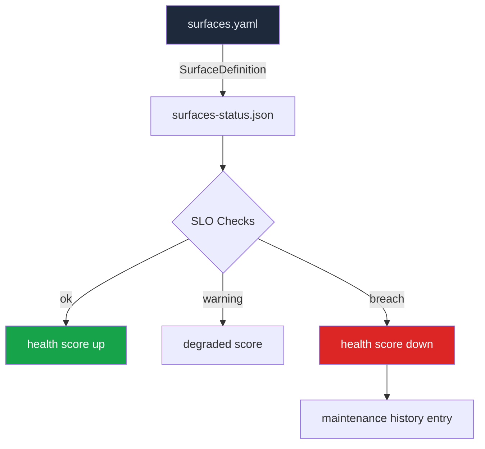
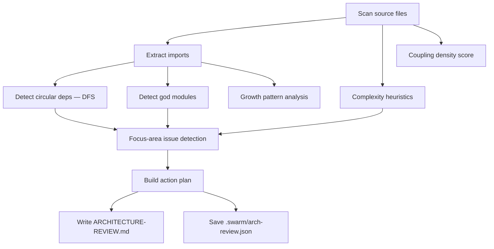
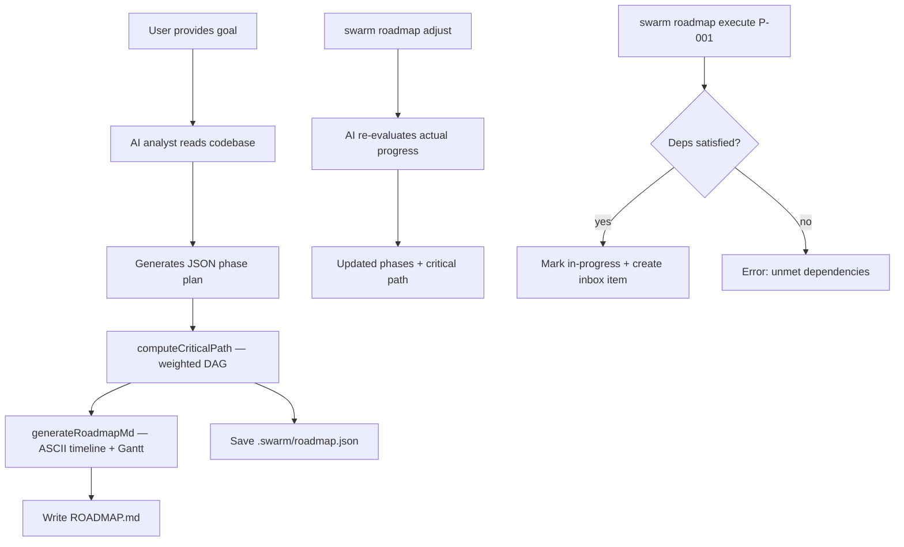
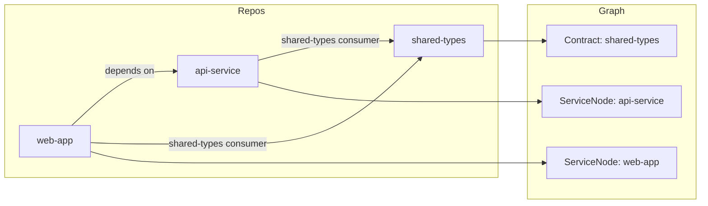
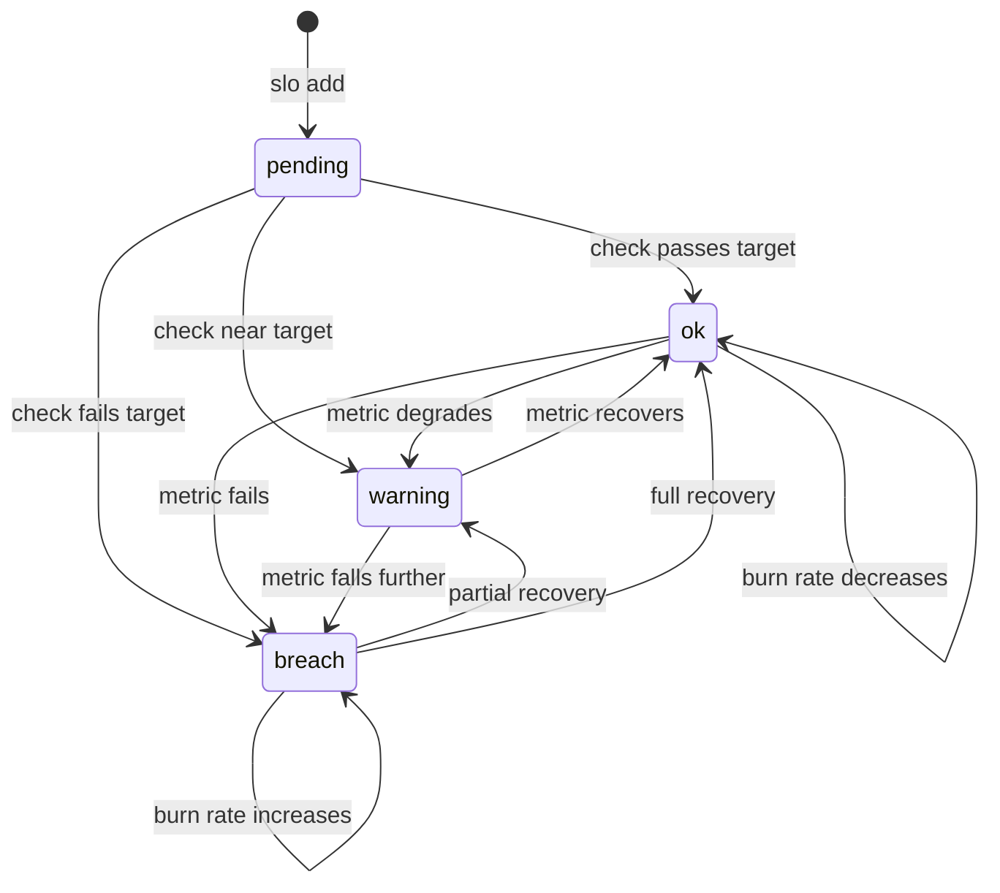

# 18 -- Autonomous Engineering Organization

Wave 4 introduces a suite of commands that elevate Swarm from a pipeline runner into a full autonomous engineering organization. These commands cover surface ownership, architecture health, developer onboarding, mentoring, long-term planning, cross-repo orchestration, SLO tracking, tech debt management, engineering forecasting, and regulatory compliance.

---

## 1. Surface Ownership (`swarm own`)

Surface ownership lets teams declare which areas of the codebase Swarm is responsible for maintaining. Each surface has file paths, SLO targets, optional budget caps, and owner lists. Surfaces are stored in `.swarm/surfaces.yaml`; their runtime health is persisted in `.swarm/surfaces-status.json`.

### 1.1 Surface Model



### 1.2 Key TypeScript Interfaces

```typescript
export interface SurfaceDefinition {
  name: string;
  description: string;
  paths: string[];                       // Glob patterns for owned files
  slos: Record<string, string>;          // SLO name -> target (e.g., "test-coverage": ">50%")
  monitoring?: Record<string, string>;
  owners?: { human: string[]; swarm: boolean };
  budget?: { monthly: number };          // Monthly USD budget cap
}

export interface SurfaceStatus {
  name: string;
  description: string;
  paths: string[];
  slos: Array<{
    name: string;
    target: string;
    current: string;
    status: 'ok' | 'warning' | 'breach';
  }>;
  healthScore: number;                   // 0-100, % of SLOs passing
  lastChecked: number;                   // Epoch ms
  maintenanceHistory: Array<{ action: string; timestamp: number; cost: number }>;
  budgetUsed: number;
  budgetTotal: number;
}

export interface SurfacesState {
  surfaces: SurfaceStatus[];
  totalBudget: number;
  totalSpent: number;
}
```

### 1.3 SLO Evaluation

`own check` evaluates three built-in SLO types by inspecting the filesystem:

| SLO pattern | Evaluated as |
|------------|-------------|
| name contains `test` + `coverage` | Ratio of test files to source files |
| name contains `file` + `max`/`count` | Recursive file count under declared paths |
| name contains `dep` + `health`/`age`/`outdated` | Fraction of 0.x / alpha / beta dependencies in `package.json` |

Unknown SLO names return `warning` with `current: 'unknown'` until a custom evaluator is added.

### 1.4 CLI Options

#### `swarm own register <name>`

| Flag | Default | Description |
|------|---------|-------------|
| `--slo <target>` | `test-coverage:>50%` | SLO target, repeatable, format: `name:target` |
| `--paths <glob>` | `src/**/*` | File path glob, repeatable |
| `--budget <amount>` | none | Monthly budget in USD |
| `--description <desc>` | `Surface: <name>` | Human-readable surface description |

#### `swarm own list`

| Flag | Default | Description |
|------|---------|-------------|
| `--json` | false | Output raw JSON |

#### `swarm own check`

| Flag | Default | Description |
|------|---------|-------------|
| `--surface <name>` | all | Check a specific surface only |
| `--json` | false | Output raw JSON |

### 1.5 Examples

```bash
# Register a surface with custom SLOs and a budget
swarm own register auth-service \
  --description "Authentication service" \
  --paths "src/auth/**/*" \
  --slo "test-coverage:>70%" \
  --slo "max-files:<100" \
  --budget 50

# List all surfaces with health scores
swarm own list

# Check SLOs and update health scores
swarm own check

# Check a specific surface
swarm own check --surface auth-service

# Release ownership
swarm own release auth-service
```

---

## 2. Architecture Review (`swarm architect-review`)

`architect-review` performs a static analysis pass on the codebase — scanning TypeScript, JavaScript, Python, and Go files — to compute coupling scores, complexity scores, detect circular dependencies, identify god modules, and surface architectural issues with prioritized remediation plans.

### 2.1 Analysis Flow



### 2.2 Key TypeScript Interface

```typescript
export interface ArchReviewData {
  summary: string;
  issues: Array<{
    id: string;
    title: string;
    severity: 'critical' | 'high' | 'medium' | 'low';
    category: string;
    evidence: string;
    impact: string;
    solutions: Array<{
      name: string;
      description: string;
      effort: string;
      risk: string;
      recommended: boolean;
    }>;
  }>;
  couplingScore: number;    // 0-100: higher = more tightly coupled
  complexityScore: number;  // 0-100: higher = more complex
  trends: Array<{
    metric: string;
    direction: 'improving' | 'degrading' | 'stable';
    detail: string;
  }>;
  actionPlan: Array<{
    priority: number;
    action: string;
    effort: string;
    impact: string;
  }>;
  timestamp: number;
}
```

### 2.3 Scoring Dimensions

**Complexity score (0–100):** penalizes large average file size, many large files (>300 lines), total file count sprawl, and deep directory nesting.

**Coupling score (0–100):** edge density of the internal import graph, scaled for readability. A score of 0 means no internal dependencies.

**Issue IDs:** `ARCH-CYC` (circular deps), `ARCH-GOD` (god modules), `ARCH-001`+ (focus-area specific).

### 2.4 CLI Options

| Flag | Default | Description |
|------|---------|-------------|
| `-f, --focus <area>` | all | Restrict to `performance`, `scalability`, `maintainability`, or `security` |
| `-d, --dir <path>` | cwd | Project directory to scan |
| `-t, --threshold <n>` | `10` | Minimum connections for god-module detection |

### 2.5 Examples

```bash
# Full architecture review
swarm architect-review

# Focus on security issues only
swarm architect-review --focus security

# Scan a subdirectory with a lower god-module threshold
swarm architect-review --dir packages/api --threshold 8
```

Outputs: `ARCHITECTURE-REVIEW.md` in the project root and `.swarm/arch-review.json`.

---

## 3. Developer Onboarding (`swarm onboard`)

`onboard` runs a five-step guided tour of the codebase for a new developer. Each step spawns an interactive engineer agent that reads real source files and explains what it finds. Progress is saved to `.swarm/onboard-progress.json` so the tour is resumable across sessions.

### 3.1 Onboarding Steps

| Step | Name | What the agent covers |
|------|------|----------------------|
| 1 | Project Overview | Purpose, architecture, repo layout, tech stack, local setup |
| 2 | Development Workflow | Build, test, CI/CD, Git workflow, dev server tips |
| 3 | Key Areas Tour | Core abstractions, data flow, entry points, extension points |
| 4 | Conventions & Patterns | Naming, architectural patterns, error handling, `.swarm/conventions.md` |
| 5 | Common Pitfalls | Gotchas from `CLAUDE.md`, past decisions from `.swarm/journal/`, anti-patterns |

### 3.2 Key TypeScript Interface

```typescript
export interface OnboardData {
  step: number;
  totalSteps: number;          // Always 5
  currentTopic: string;
  content: string;             // Last 2000 chars of most recent agent output
  completed: string[];         // Step names completed
  remaining: string[];         // Step names remaining
  mentorHistory: Array<{
    question: string;
    answer: string;
    timestamp: number;
  }>;
}
```

### 3.3 CLI Options

| Flag | Default | Description |
|------|---------|-------------|
| `-s, --stack <stack>` | from config | Tech stack override |
| `-m, --model <model>` | `sonnet` | Model override |
| `-r, --role <role>` | general | Role focus: `frontend`, `backend`, `fullstack` |
| `-a, --area <name>` | none | Skip steps; deep-dive into a specific area (e.g., `api`, `auth`) |
| `--reset` | false | Reset progress and start from step 1 |
| `-b, --budget <amount>` | `5` | Max budget in USD |
| `--step <number>` | auto-resume | Jump to a specific step (1-5) |

### 3.4 Examples

```bash
# Start onboarding (resumes if partially complete)
swarm onboard

# Onboard a frontend engineer
swarm onboard --role frontend

# Deep-dive into the authentication area
swarm onboard --area auth

# Jump to step 3 (Key Areas Tour)
swarm onboard --step 3

# Reset and restart the tour
swarm onboard --reset
```

---

## 4. AI Mentor (`swarm mentor`)

`mentor` provides educational responses to developer questions, reviews staged code changes, and delivers deep explanations of specific files or directories. Unlike a production pipeline agent, mentor agents have `Edit`, `Write`, and `Bash` tools disabled — they read and explain only.

### 4.1 Modes

| Mode | Invocation | What the agent does |
|------|-----------|---------------------|
| `question` | `swarm mentor "<question>"` | Answers a contextual question about the codebase with the "why" explained |
| `review` | `swarm mentor review` | Educational review of staged git changes or a specific file |
| `explain` | `swarm mentor explain <path>` | Deep-dive explanation of a file or directory |

### 4.2 CLI Options

**Base command `swarm mentor <question>`:**

| Flag | Default | Description |
|------|---------|-------------|
| `-s, --stack <stack>` | from config | Tech stack override |
| `-m, --model <model>` | `sonnet` | Model override |
| `-b, --budget <amount>` | `3` | Max budget in USD |
| `-i, --interactive` | false | Interactive mode with follow-up Q&A |

**`swarm mentor review`:**

| Flag | Default | Description |
|------|---------|-------------|
| `--file <path>` | staged diff | Review a specific file |
| `--commit <sha>` | none | Review a specific commit |

**`swarm mentor explain <path>`:**

| Flag | Default | Description |
|------|---------|-------------|
| `-i, --interactive` | false | Interactive mode |

### 4.3 Examples

```bash
# Ask a question about the codebase
swarm mentor "How does authentication work?"

# Interactive Q&A session
swarm mentor "Explain the pipeline architecture" --interactive

# Educational review of staged changes
swarm mentor review

# Review a specific file
swarm mentor review --file src/core/pipeline.ts

# Review a specific commit
swarm mentor review --commit abc1234

# Deep-dive explanation of a module
swarm mentor explain src/core/agent-manager.ts
```

Mentor history (last 50 interactions) is saved to `.swarm/onboard-progress.json` under the `mentorHistory` field, shared with `swarm onboard`.

---

## 5. Project Roadmap (`swarm roadmap`)

`roadmap` generates, reviews, and executes long-term multi-phase project plans. An AI analyst reads the codebase and decomposes a high-level goal into ordered phases with dependency graphs, risk levels, rollback strategies, and success metrics.

### 5.1 Roadmap Data Flow



### 5.2 Key TypeScript Interface

```typescript
export interface RoadmapData {
  goal: string;
  phases: Array<{
    id: string;                            // e.g., "P-001"
    name: string;
    description: string;
    status: 'pending' | 'in-progress' | 'done' | 'blocked';
    progress: number;                      // 0-100 percentage
    estimatedWeeks: number;
    actualWeeks?: number;
    dependencies: string[];               // Phase IDs that must complete first
    riskLevel: 'low' | 'medium' | 'high';
    rollbackStrategy: string;
    successMetrics: string[];
  }>;
  criticalPath: string[];                 // Ordered phase IDs on longest path
  estimatedTotalWeeks: number;
  estimatedTotalCost: number;
  startedAt?: number;
  status: 'planning' | 'executing' | 'complete' | 'paused';
}
```

### 5.3 Critical Path Algorithm

`computeCriticalPath()` uses memoized DFS on the phase dependency graph. For each phase, it calculates the longest weighted path (by `estimatedWeeks`) to reach it from a root. The critical path is the single ordered sequence with the highest total weight — representing the minimum timeline for completing the goal.

### 5.4 CLI Options

**`swarm roadmap "<goal>"`** — Generate:

| Flag | Default | Description |
|------|---------|-------------|
| `-m, --model <model>` | from config | Model override |

**`swarm roadmap review`** — Show progress table (no options).

**`swarm roadmap adjust`** — Re-plan:

| Flag | Default | Description |
|------|---------|-------------|
| `-m, --model <model>` | from config | Model override |

**`swarm roadmap execute <phaseId>`** — Execute a phase (no options, validates dependency satisfaction).

### 5.5 Examples

```bash
# Generate a roadmap for a high-level goal
swarm roadmap "Migrate from REST to GraphQL"

# Review progress on the current roadmap
swarm roadmap review

# Re-plan remaining phases based on actual progress
swarm roadmap adjust

# Start executing phase P-001
swarm roadmap execute P-001

# Start phase P-003 (will fail if P-001 or P-002 are not done)
swarm roadmap execute P-003
```

Outputs: `ROADMAP.md` (ASCII Gantt chart) and `.swarm/roadmap.json`.

---

## 6. Cross-Repo System Orchestration (`swarm system`)

`system` operates across multiple repositories configured in `.swarm/config.yaml` under the `repos` key. It builds a dependency graph of services, validates contract compatibility, analyzes cross-repo feature impact, and plans coordinated migrations.

### 6.1 System Graph Model



### 6.2 Key TypeScript Interface

```typescript
export interface SystemGraphData {
  services: Array<{
    name: string;
    repo: string;
    type: string;            // frontend-app | api-service | grpc-service | library | ...
    apis: Array<{ path: string; method: string; description: string }>;
    dependencies: string[];  // Repo labels of cross-repo dependencies
    healthStatus: 'healthy' | 'degraded' | 'unknown';
  }>;
  contracts: Array<{
    provider: string;
    consumer: string;
    type: string;            // e.g., "shared-types"
    version: string;
    status: 'compatible' | 'breaking' | 'unknown';
  }>;
  crossRepoPrs: Array<{
    repo: string;
    prNumber: number;
    title: string;
    status: string;
  }>;
}
```

### 6.3 Subcommands

| Subcommand | What it does |
|-----------|--------------|
| `map` | Scans all configured repos, builds service graph, prints service types + dependency arrows + contracts |
| `check` | Validates: shared-type version consistency, API spec coverage, circular deps, missing dep repos |
| `feature <description>` | Heuristic scoring of which repos are affected by a feature description; recommends implementation order |
| `migrate <description>` | Plans coordinated migration in topological dependency order with type-specific guidance |

### 6.4 CLI Options

All `system` subcommands share one option:

| Flag | Default | Description |
|------|---------|-------------|
| `--repos <paths>` | from `config.repos` | Comma-separated repo paths (overrides config) |

### 6.5 Repo Configuration

```yaml
# .swarm/config.yaml
repos:
  api: /path/to/api-service
  web: /path/to/web-app
  shared: /path/to/shared-types
```

### 6.6 Examples

```bash
# Map the system graph
swarm system map

# Validate contract compatibility
swarm system check

# Analyze impact of adding a new auth feature
swarm system feature "add OAuth2 authentication"

# Plan a TypeScript upgrade migration
swarm system migrate "upgrade TypeScript to 5.x"

# Override repos inline
swarm system map --repos /repos/api,/repos/web,/repos/shared
```

Graph is persisted to `.swarm/system/graph.json`; migration plans to `.swarm/system/migration-plan.json`.

---

## 7. SLO Management (`swarm slo`)

`slo` provides a standalone SLO dashboard separate from surface-level SLOs. It tracks named service level objectives with error budgets, burn rates, and trend detection. SLOs are stored in `.swarm/slos.json`.

### 7.1 SLO Lifecycle



### 7.2 Key TypeScript Interface

```typescript
export interface SloData {
  slos: Array<{
    id: string;
    name: string;
    target: string;         // e.g., ">80%", "<200ms"
    current: string;        // Latest measurement string
    status: 'ok' | 'warning' | 'breach';
    trend: 'improving' | 'degrading' | 'stable';
    errorBudget: {
      total: number;        // Starts at 100
      remaining: number;    // Decreases on each breach
      burnRate: number;     // Multiplier; increases on breach, decreases on ok
    };
    source: string;         // Data source label (e.g., "ci", "manual")
    lastChecked: number;    // Epoch ms
  }>;
  alerts: Array<{
    sloId: string;
    message: string;
    severity: string;
    timestamp: number;
  }>;
}
```

### 7.3 Built-in Check Heuristics

| SLO name pattern | Check method |
|-----------------|-------------|
| contains `coverage` or `test` | Reads `coverage/coverage-summary.json`; falls back to counting test files |
| contains `dependency`, `dep`, or `outdated` | Reads lock file modification date |
| contains `error`, `failure`, or `ci` | Reads `.swarm/state.json` history for failure rate |
| other | Returns `manual check needed` with `warning` status |

### 7.4 CLI Options

**`swarm slo add <name>`:**

| Flag | Default | Description |
|------|---------|-------------|
| `--target <value>` | required | Target value string (e.g., `>80%`, `<200ms`) |
| `--source <source>` | `manual` | Data source label |

**`swarm slo check`** — No options.

**`swarm slo remove <name>`** — No options.

### 7.5 Examples

```bash
# View the SLO dashboard
swarm slo

# Add a test coverage SLO
swarm slo add "test-coverage" --target ">80%" --source ci

# Add a dependency freshness SLO
swarm slo add "dep-freshness" --target "<30d" --source lockfile

# Check all SLOs against current metrics
swarm slo check

# Remove an SLO
swarm slo remove "dep-freshness"
```

---

## 8. Tech Debt Management (`swarm evolve`)

`evolve` provides proactive tech debt scanning, prioritized reduction planning, and automated fixing. It scans the codebase with five analysis dimensions and produces a debt score (0 = clean, 100 = critical) with trend tracking.

### 8.1 Debt Categories and Scanners

| Category | What is detected |
|----------|-----------------|
| `code-quality` | Files >300 lines, functions >50 lines, TODO/FIXME/HACK comments, TypeScript `any` types, nesting depth >8 |
| `dependency` | 0.x pinned versions, unused dependencies (no import found in source) |
| `test` | Source files with no corresponding test file |
| `documentation` | Exported symbols without JSDoc, stale README (>90 days old), missing README |
| `architecture` | God modules (imported by >15 files), circular imports (A → B → A) |

### 8.2 Key TypeScript Interface

```typescript
export interface DebtData {
  score: number;                             // 0-100 aggregate debt score
  trend: 'improving' | 'degrading' | 'stable';
  items: Array<{
    id: string;
    type: 'code-quality' | 'architecture' | 'dependency' | 'test' | 'documentation';
    severity: number;                        // 1 (low) to 5 (critical)
    file: string;
    description: string;
    estimatedEffort: string;                 // small | medium | large
    autoFixable: boolean;
    age: number;                             // Days since file last modified
  }>;
  burndown: Array<{ date: string; score: number }>;  // Last 30 scan history
  byType: Array<{ type: string; count: number; totalSeverity: number }>;
}
```

### 8.3 `evolve work` Fix Agent

When `swarm evolve work` is invoked, it takes up to N auto-fixable items (sorted by severity desc) and spawns a single engineer agent with explicit instructions:

- Replace TypeScript `any` types with proper types inferred from usage context
- Add JSDoc comments to exported functions without documentation
- Do not refactor unrelated code; make minimal targeted changes

The agent uses `auto` permission mode and has no tool restrictions.

### 8.4 CLI Options

**`swarm evolve scan`:**

| Flag | Default | Description |
|------|---------|-------------|
| `--type <type>` | all | Scan only a specific type: `code-quality`, `dependency`, `test`, `documentation`, `architecture` |
| `--json` | false | Output raw JSON |

**`swarm evolve plan`:**

| Flag | Default | Description |
|------|---------|-------------|
| `--target <score>` | `20` | Target debt score to plan toward |

**`swarm evolve work`:**

| Flag | Default | Description |
|------|---------|-------------|
| `-n, --count <n>` | `10` | Max items to auto-fix in one run |
| `-m, --model <model>` | `sonnet` | Model override |
| `-b, --budget <amount>` | `5` | Max budget in USD |

### 8.5 Examples

```bash
# Full debt scan
swarm evolve scan

# Scan only code quality issues
swarm evolve scan --type code-quality

# Generate a debt reduction roadmap toward score 15
swarm evolve plan --target 15

# Fix up to 20 auto-fixable items
swarm evolve work --count 20

# Use a cheaper model to control costs
swarm evolve work --model sonnet --budget 3
```

Debt snapshots are saved to `.swarm/debt.json`; history is appended to `.swarm/debt-history.jsonl`.

---

## 9. Engineering Forecast (`swarm forecast`)

`forecast` reads pipeline history from `.swarm/state.json` and applies statistical analysis to predict velocity, estimate feature costs, assess risks, and project codebase health trends. All data is persisted to `.swarm/forecast.json`.

### 9.1 Key TypeScript Interface

```typescript
export interface ForecastData {
  velocity: {
    current: number;         // Items completed last week
    predicted: number;       // Weighted moving average prediction
    confidence: number;      // 0-95%, grows with more data points
    history: Array<{ week: string; items: number }>;  // Last 12 weeks
  };
  costEstimates: Array<{
    feature: string;
    estimatedCost: number;   // USD, adjusted by complexity multiplier
    confidence: number;
    basis: string;           // Human-readable explanation of how estimate was derived
  }>;
  risks: Array<{
    name: string;
    probability: number;     // 0-100%
    impact: string;          // low | medium | high
    mitigation: string;
  }>;
  healthProjection: Array<{
    metric: string;
    current: number;
    projected: number;       // Projected value at timeframe
    timeframe: string;
    warning?: string;        // Present when projection crosses a threshold
  }>;
}
```

### 9.2 Subcommands

| Subcommand | Description |
|-----------|-------------|
| `velocity` | Predict next sprint throughput using a 6-week weighted moving average |
| `risk <description>` | Assess risks of planned work from history patterns and keyword signals |
| `cost <description>` | Estimate USD cost using historical averages with a complexity multiplier |
| `health` | Project pipeline success rate, average cost, duration, and fix iterations 4 weeks out |

### 9.3 Cost Complexity Multipliers

| Signal in description | Adjustment |
|----------------------|-----------|
| Description length >200 chars | +0.3x |
| Contains `refactor`, `rewrite`, `migration` | +0.5x |
| Contains `multiple`, `several`, `many`, `across` | +0.3x |
| Contains `simple`, `small`, `minor`, `quick` | -0.3x |
| Contains `api`, `integration`, `external` | +0.2x |
| Minimum multiplier | 0.3x |

### 9.4 CLI Options

All `forecast` subcommands support:

| Flag | Default | Description |
|------|---------|-------------|
| `--json` | false | Output raw JSON |

### 9.5 Examples

```bash
# Predict next sprint velocity
swarm forecast velocity

# Assess risk before starting a feature
swarm forecast risk "Migrate authentication to OAuth2"

# Estimate cost for a feature
swarm forecast cost "Add real-time notifications with WebSockets"

# Project health metrics 4 weeks out
swarm forecast health

# Export all as JSON for dashboards
swarm forecast velocity --json
```

---

## 10. Compliance Automation (`swarm compliance`)

`compliance` automates regulatory gap analysis against SOC 2, HIPAA, GDPR, and PCI DSS frameworks. Checks are performed by inspecting the filesystem, scanning source patterns, and running shell commands. Custom checks can be added via `.swarm/compliance.yaml`.

### 10.1 Framework Coverage

| Framework | Checks |
|-----------|--------|
| SOC 2 | Audit trail, version control, permission config, state backup, incident response, webhook monitoring |
| HIPAA | Encryption at rest, TLS in transit, audit logging, RBAC, data integrity, breach notification |
| GDPR | Privacy documentation, consent tracking, right to deletion, data portability, retention policy, audit trail |
| PCI DSS | Secret management (.gitignore), strong encryption, vulnerability scanning (npm audit), access logging, network controls, SDLC |

### 10.2 Key TypeScript Interface

```typescript
export interface ComplianceData {
  framework: string;
  overallScore: number;    // 0-100: (passing / applicable) * 100, partial = 0.5
  checks: Array<{
    id: string;            // e.g., "SOC2-001", "HIPAA-003"
    requirement: string;
    category: string;
    status: 'pass' | 'fail' | 'partial' | 'not-applicable';
    evidence?: string;
    remediation?: string;
  }>;
  gaps: Array<{
    requirement: string;
    severity: string;      // "high" for fail, "medium" for partial
    remediation: string;
  }>;
  lastAudit: number;       // Epoch ms
}
```

### 10.3 Custom Checks

Custom checks are defined in `.swarm/compliance.yaml`:

```yaml
checks:
  - id: CUSTOM-001
    requirement: "All API routes require authentication middleware"
    category: "Access Control"
    framework: soc2
    path: "src/routes/index.ts"
    pattern: "requireAuth|authenticate|isAuthenticated"
    description: "Add authentication middleware to all route definitions"

  - id: CUSTOM-002
    requirement: "Secret scanner passes in CI"
    category: "Secret Management"
    framework: pci
    command: "git log --oneline -1 2>/dev/null"
```

### 10.4 CLI Options

**`swarm compliance check`:**

| Flag | Default | Description |
|------|---------|-------------|
| `--framework <fw>` | all four | Run checks for `soc2`, `hipaa`, `gdpr`, or `pci` only |
| `--json` | false | Output raw JSON |

**`swarm compliance report`:**

| Flag | Default | Description |
|------|---------|-------------|
| `--framework <fw>` | required | Framework to generate the report for |
| `--json` | false | Output report as JSON only |

### 10.5 Examples

```bash
# Run all compliance checks
swarm compliance check

# Check a single framework
swarm compliance check --framework soc2

# Generate a GDPR compliance report
swarm compliance report --framework gdpr

# Generate PCI report and export as JSON
swarm compliance report --framework pci --json

# Output all framework results as JSON for CI integration
swarm compliance check --json
```

Outputs: `.swarm/compliance-report.json` and `COMPLIANCE-REPORT.md` in the project root.

---

## 11. Relationship to Pipeline

The Wave 4 commands are standalone — they do not require a pipeline to be running and do not modify `PipelineState`. They share:

- `requireSwarmDir()` — requires `.swarm/` to exist (or auto-initializes for `onboard` and `mentor`)
- `loadConfig()` — reads `.swarm/config.yaml`
- `createContext()` — for commands that spawn agents (`onboard`, `mentor`, `roadmap`, `evolve work`)

Commands that spawn agents (`onboard`, `mentor`, `roadmap`, `evolve work`) use the standard `AgentManager.spawn()` + `waitForAgent()` pattern and register `SIGINT`/`SIGTERM` cleanup via `createContext()`.

---

## Appendix: File Reference

| File | Key exports |
|------|------------|
| `packages/cli/src/commands/own.ts` | `registerOwn()` — `register`, `list`, `release`, `check`, `status` subcommands |
| `packages/cli/src/commands/architect-review.ts` | `registerArchitectReview()` — static analysis pipeline |
| `packages/cli/src/commands/onboard.ts` | `registerOnboard()` — 5-step guided tour |
| `packages/cli/src/commands/mentor.ts` | `registerMentor()` — `question`, `review`, `explain` modes |
| `packages/cli/src/commands/roadmap.ts` | `registerRoadmap()` — `generate`, `review`, `adjust`, `execute` subcommands |
| `packages/cli/src/commands/system.ts` | `registerSystem()` — `map`, `check`, `feature`, `migrate` subcommands |
| `packages/cli/src/commands/slo.ts` | `registerSlo()` — `add`, `check`, `remove` subcommands |
| `packages/cli/src/commands/evolve.ts` | `registerEvolve()` — `scan`, `plan`, `work` subcommands |
| `packages/cli/src/commands/forecast.ts` | `registerForecast()` — `velocity`, `risk`, `cost`, `health` subcommands |
| `packages/cli/src/commands/compliance.ts` | `registerCompliance()` — `check`, `report` subcommands |
| `packages/cli/src/types.ts` | `SurfaceDefinition`, `SurfaceStatus`, `SurfacesState`, `ArchReviewData`, `OnboardData`, `RoadmapData`, `SystemGraphData`, `SloData`, `DebtData`, `ForecastData`, `ComplianceData`, `PluginRegistryData` |
